# AgentDock Pro 概览

AgentDock Pro 在开源框架的基础上，提供企业级能力：更简单的智能体创建方式、更强大的工作流编排，以及面向大规模部署的稳定性与伸缩性。

## 什么是 AgentDock Pro？

AgentDock Pro 是基于开源 AgentDock 框架构建的云平台，在稳定性、可扩展性与高级能力上进行了全面增强，适合需要大规模部署 AI 智能体和复杂工作流的团队与企业。

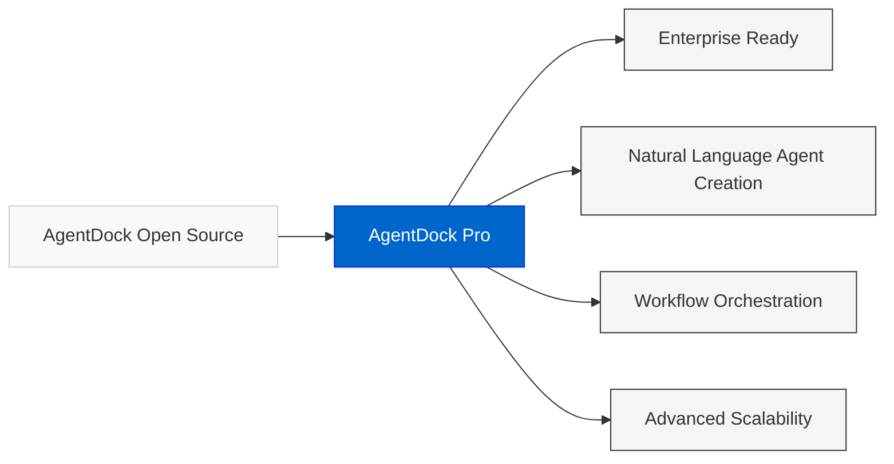

## 关键优势

### 自然语言创建智能体
用「说人话」的方式描述需求，就能创建 AI 智能体，无需写代码。

- **描述你的智能体**：例如 “我需要一个监控市场数据并自动下单交易的智能体”
- **自动工具选择**：系统会根据描述自动配置合适的工具与节点
- **即时原型验证**：创建完成后即可立刻进行对话与测试

[了解「自然语言智能体构建器」→](/docs/roadmap/nl-agent-builder)

### 工作流编排（Workflow Orchestration）
将多个智能体与工具连接成自动化工作流，处理复杂业务场景。

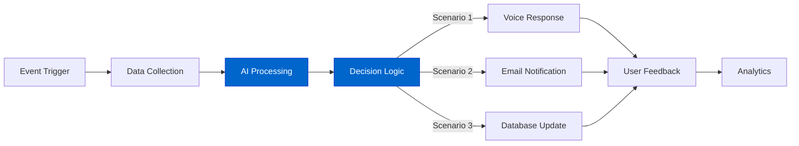

 - **可视化工作流编辑器**：拖拽式界面即可搭建复杂流程
 - **条件分支**：根据数据或智能体输出构建不同路径
 - **事件触发**：支持消息、定时任务或 API 调用触发工作流
 - **第三方集成**：连接常见 SaaS 服务与自家 API

### 持久记忆与知识管理
智能体可以在多轮会话和多次使用之间，持续记住上下文与知识。

- **按用户记忆**：为每个终端用户维护独立的会话记忆
- **知识接入**：接入外部数据源与文档库
- **上下文感知**：智能体能记住并理解历史交互

### 高级可扩展性
在高并发场景下部署大量智能体，仍然保持稳定与高性能。

- **水平扩展**：在高负载下依然保持响应能力
- **资源优化**：根据流量自动扩缩容
- **企业级稳定性**：在压力下持续稳定运行
- **多区域部署**：为全球用户提供低延迟体验

### 统一成本管理
通过积分/额度体系简化你的 AI 成本管理。

- **节省 80–90% 成本**：相较直接调用部分厂商 API
- **统一结算**：集中管理多家 LLM 与第三方服务费用
- **可预测定价**：透明的用量统计与账单
- **降低门槛**：更容易使用高价模型与高级服务

## 哪些人/团队适合使用 AgentDock Pro？

凡是涉及专业知识、重复流程或大量客户交互的行业，几乎都可以通过 AgentDock Pro 获得提升——只要能用自然语言描述的工作，就有机会被我们的 AI 智能体自动化或增强。下面是一些典型场景：

### 企业员工与运营自动化
用 AI 智能体替代重复性的客服、调研与行政工作。

**示例**：构建一个 HR 支持智能体，自动处理 80% 的员工工单（入职、福利、各类申请），每年节省约 15 万美元的运营成本。

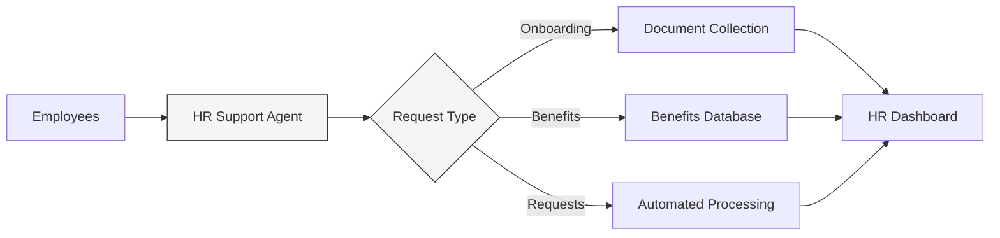

### 交易与自动化代理
创建复杂的交易与监控智能体，根据实时条件自动执行操作。

**示例**： “当标普 500 高开时，从我的 Coinbase 账户买入 500 美元的比特币，并通过 Telegram 通知我。”

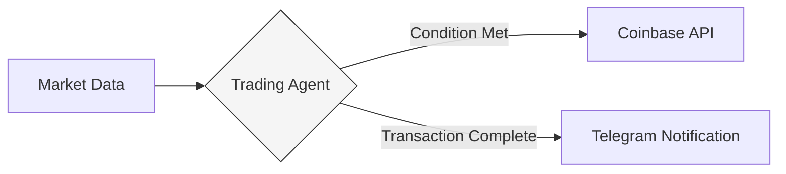

### 教育与辅导
打造个性化学习智能体，为每位学生提供 7x24 小时的学习支持。

**示例**：上线一个订阅制数学辅导服务，由 AI 老师提供无限练习题、分步讲解和个性化学习路径，同时跟踪成千上万名学生的进度。

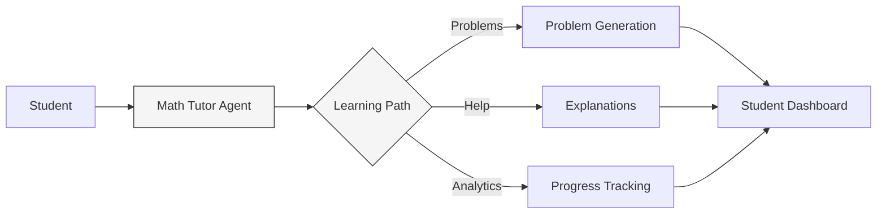

### 医疗服务
部署合规的医疗智能体，负责问诊前信息收集、随访与常规护理管理，并与现有系统集成。

**示例**：构建一个符合隐私法规的预约前筛查智能体，采集患者信息、核验保险并发送相关表单，将行政成本降低约 40%，同时提升患者满意度。

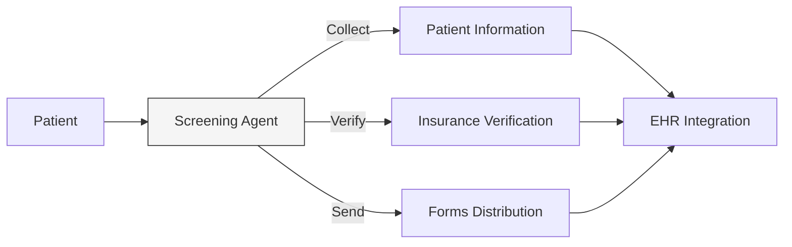

### 法务与合规
在保证安全与保密的前提下，自动化合同审阅、客户接待和日常法律流程。

**示例**：搭建一个符合 GDPR 的合同审阅智能体，数秒内完成合同分析、标记潜在问题并给出修改建议，把高耗时流程变成可规模化的高毛利服务。

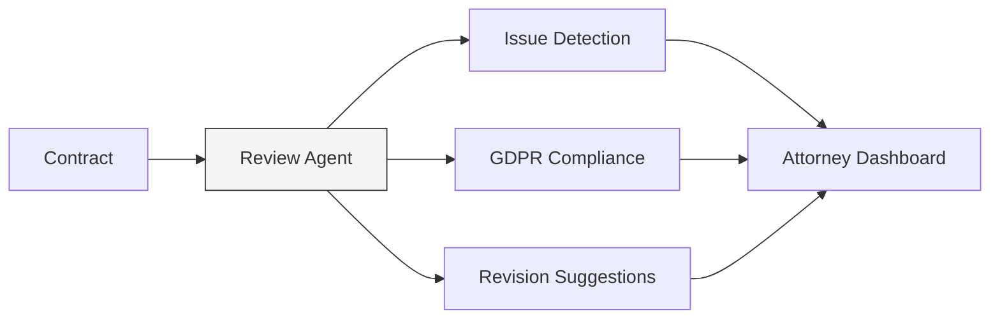

### 保险与金融服务
通过自动化工作流加速理赔、保单推荐与客服处理。

**示例**：部署一个符合 SOC 2 的保险理赔智能体，以人工 5 倍的速度处理标准理赔案件，自动校验材料、计算赔付并更新客户记录，同时保留完整审计日志。

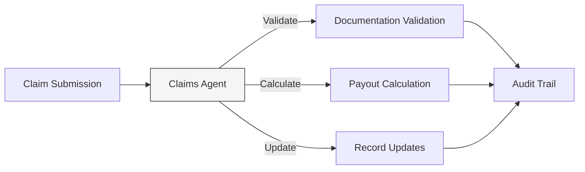

### 语音智能体与语音应用
构建可同时处理大量通话的语音助手与对话界面。

**示例**：为餐厅搭建电话预约系统，在高峰时段同时处理 200+ 通话，完成订位、答疑并推荐增值服务，而无需额外雇佣前台人员。

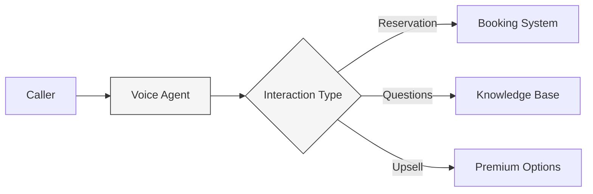

### AI 代理商与咨询公司
为客户快速搭建定制 AI 智能体与自动化方案，在极低运维成本下实现规模化交付。

**示例**：为多家客户构建 AI 助手与自动化流程，基于 AgentDock Pro 的基础设施产生持续订阅收入，而无需从零自建整套系统。

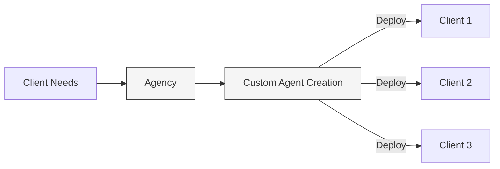

### 各类服务从业者
无论你是教练、管家还是顾问，都可以用 AI 把个人能力放大到同时服务成百上千名客户。

**示例**：打造一个私人健身教练智能体，为数百名客户提供 7x24 小时服务，自动生成训练计划、饮食建议和激励话术，把原本强依赖个人时间的服务，升级为可订阅的产品。

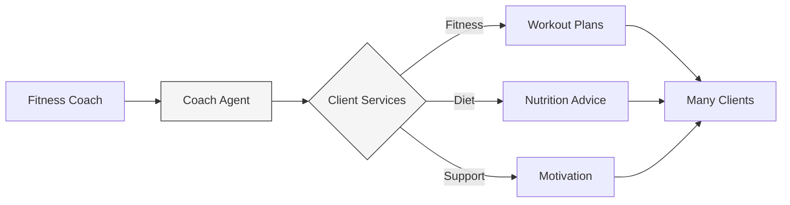

## 从开源版本平滑升级

AgentDock Pro 完全基于开源框架构建，当你准备好从自建环境迁移到云端时，可以非常平滑地完成升级。

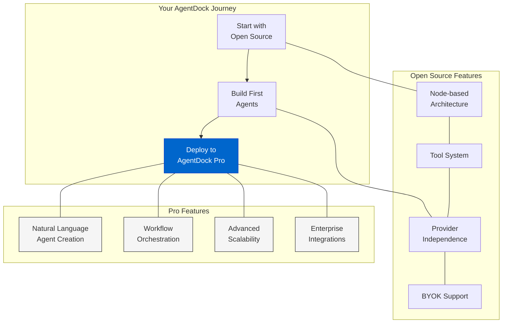

- **Simple migration**: Transfer your open source agents to Pro with minimal changes
- **Familiar concepts**: All core concepts from open source remain the same in Pro
- **Enhanced capabilities**: Add Pro features to your existing agents without rebuilding
- **Flexible deployment**: Use open source for development and Pro for production

## Join the Ecosystem

AgentDock Pro is transforming how businesses build and deploy AI.

**Receive $100 in free credits when you sign up.**

[Sign Up at agentdock.ai →](https://agentdock.ai) 