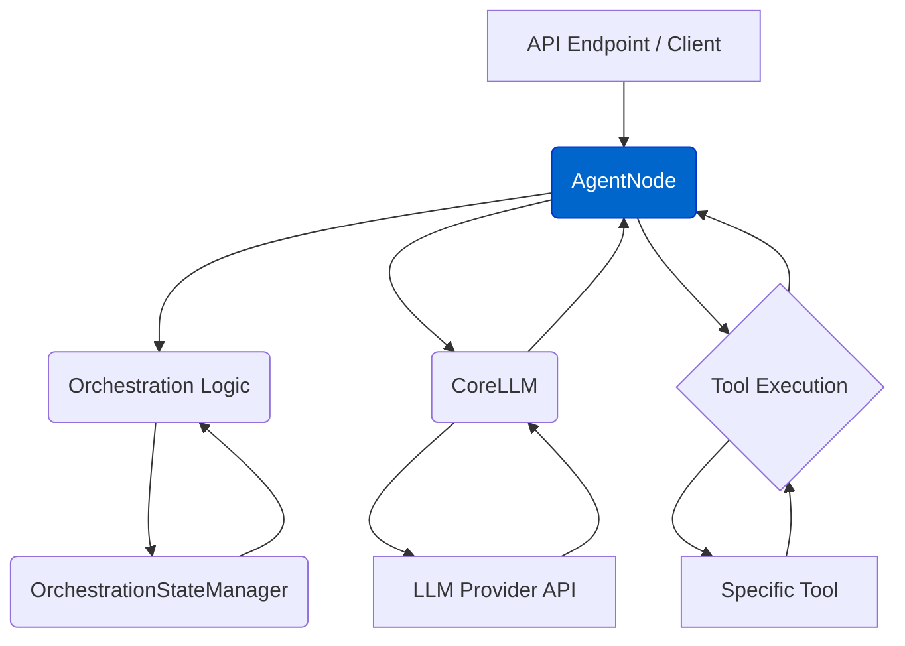

# Agent 节点（`AgentNode`）

`AgentNode` 类（`agentdock-core/src/nodes/agent-node.ts`）是 AgentDock Core 中**对话型智能体的核心编排节点**。  
它基于 Vercel AI SDK 提供的能力，实现了高效的流式输出、多轮对话以及多步工具调用。

## 核心职责

- **消息处理（Message Processing）**：  
  通过核心方法 `handleMessage` 接收并处理一组消息（包含历史对话、系统提示等）。
- **LLM 交互（LLM Interaction）**：  
  使用 `CoreLLM` 与各类大模型通信，基于 Vercel AI SDK 的 `streamText` 实现生成、流式返回和工具调用。
- **工具集成（Tool Integration）**：  
  根据智能体模板和当前编排状态，确定可用工具集，并以模型可理解的形式提供给 LLM。
- **状态管理（State Management）**：  
  通过回调持续更新编排状态，包括 token 使用量、最近使用的工具等。
- **行为配置（Configuration）**：  
  从 `AgentConfig` 中读取智能体的行为规则，同时支持在运行时传入覆盖配置。
- **上下文注入（Context Injection）**：  
  自动向 Prompt 中注入当前时间等上下文信息，提升模型的可用性和安全性。
- **多提供商回退（Provider Fallbacks）**：  
  支持配置备用模型提供商，在主提供商异常时自动回退，提高整体可靠性。

## 关键交互关系



1. 接收带有消息数组和 `sessionId` 的请求。  
2. 调用编排逻辑，确定当前激活的步骤（step），并加载相关状态。  
3. 按照步骤与顺序规则筛选可用工具集合。  
4. 利用历史消息、系统 Prompt 和上下文构造最终的 Prompt。  
5. 调用 `CoreLLM.streamText`，传入消息、Prompt 以及过滤后的工具。  
6. 当 LLM 触发工具调用时，执行相应工具并将结果返回给 LLM。  
7. 持续将生成的文本流式推送给上游调用方。  
8. 在会话结束后更新 token 使用情况和相关状态信息。

## 行为配置方式

`AgentNode` 的行为由智能体模板（`template.json`）进行配置，例如：

```typescript
// AgentNode 配置示例
{
  "type": "AgentNode",
  "config": {
    "provider": "anthropic",
    "apiKey": "YOUR_API_KEY",
    "fallbackApiKey": "BACKUP_API_KEY", // Optional
    "fallbackProvider": "openai", // Optional
    "agentConfig": {
      "personality": "You are a helpful assistant.",
      "nodes": ["search", "deep_research"],
      "nodeConfigurations": {
        "anthropic": {
          "model": "claude-3-5-sonnet-20240620"
        }
      }
    }
  }
}
```

其中：

- `provider` / `fallbackProvider`：指定主/备 LLM 提供商；
- `apiKey` / `fallbackApiKey`：对应提供商的密钥；
- `agentConfig`：定义智能体性格（`personality`）、可用工具节点（`nodes`）以及各提供商的模型配置（`nodeConfigurations`）。

## 响应流式能力（Response Streaming）

`AgentNode.handleMessage` 返回的是 `AgentDockStreamResult`，在标准 `StreamTextResult` 的基础上扩展了：

- **状态追踪（State Tracking）**：  
  自动在会话状态中记录 token 使用量及工具使用情况。
- **错误处理（Error Handling）**：  
  更好地将底层 LLM 提供商的错误向上传递，并附带上下文。
- **工具管理（Tool Management）**：  
  统一管理工具的调用与结果记录。

更多实现细节可参考源码：[`agentdock-core/src/nodes/agent-node.ts`](../../agentdock-core/src/nodes/agent-node.ts)。  
关于流式能力的完整说明，见：[流式响应（Response Streaming）](./core/response-streaming.md)。