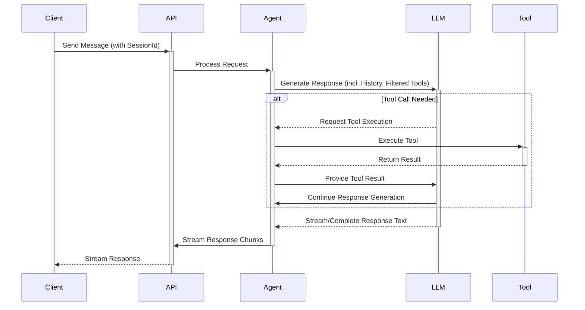
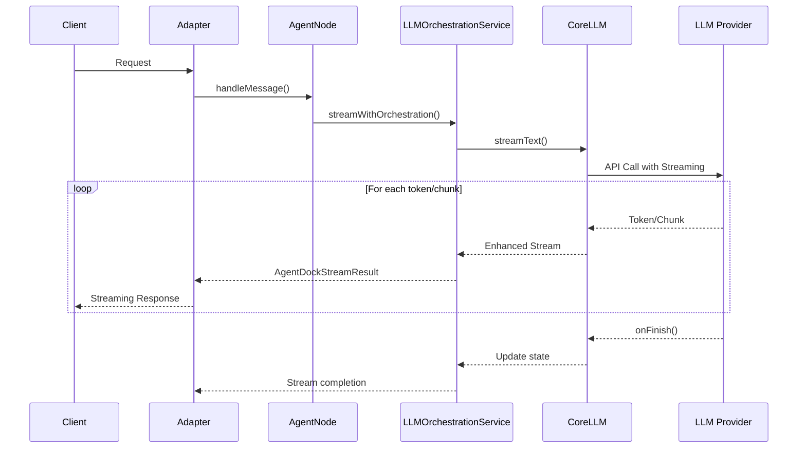

# AgentDock Core 中的请求流转

本文档说明一个请求在 AgentDock Core 中被处理时的**典型执行流程**。

## 请求流程时序图

## 详细步骤说明

1. **请求发起**  
   客户端向后端 API 发送请求（通常是用户消息），并可能携带 `sessionId`。  
2. **API 入口处理**  
   API 路由解析请求体，提取 `sessionId` 与消息内容，并确定目标 `agentId`。  
3. **创建 Agent 实例（`AgentNode`）**  
   根据 `agentId` 加载对应的智能体配置与密钥，实例化 `AgentNode`，并注入核心管理器。  
4. **状态读取 / 初始化**  
   使用会话与编排管理器，为当前 `sessionId` 加载或创建编排状态。  
5. **编排与工具筛选**  
   通过条件判断确定当前激活的步骤 `activeStep`，并按照步骤及顺序规则筛选出可用工具集合。  
6. **LLM 交互（`CoreLLM.streamText`）**  
   准备好 Prompt、回调与工具信息后，调用 `CoreLLM.streamText` 与底层 LLM 进行交互。  
7. **流式响应与工具调用**  
   - LLM 按流式返回文本片段或工具调用请求；  
   - 当收到工具调用请求时，由 `AgentNode` 执行工具并将结果回传给 LLM；  
   - 文本片段被持续推送回客户端。  
8. **状态更新**  
   在交互过程中与结束后，更新 token 使用量、工具历史、步骤索引、时间戳等信息。  
9. **响应结束**  
   流式通道结束，请求在 API 层完成最终收尾。  
10. **资源清理**  
    `AgentNode` 实例被释放，但与会话相关的状态会继续保存在存储层。

更多实现细节可参考源码：[`agentdock-core/src/nodes/agent-node.ts`](../../../agentdock-core/src/nodes/agent-node.ts)。

## 增强的流式处理流程

在标准流式能力之上，AgentDock 通过 `AgentDockStreamResult` 做了扩展：

这一增强流程带来的主要收益：

1. **自动状态管理**：  
   自动记录 token 消耗与工具使用情况，并写入会话状态。  
2. **更好的错误处理**：  
   能够将底层 LLM 的错误携带更多上下文信息向上传递。  
3. **工具编排信息暴露**：  
   在流对象中附带与工具使用、编排相关的额外状态，便于上层进行监控与调试。

关于流式实现的更多细节，可查阅：[流式响应（Response Streaming）](./response-streaming.md)。