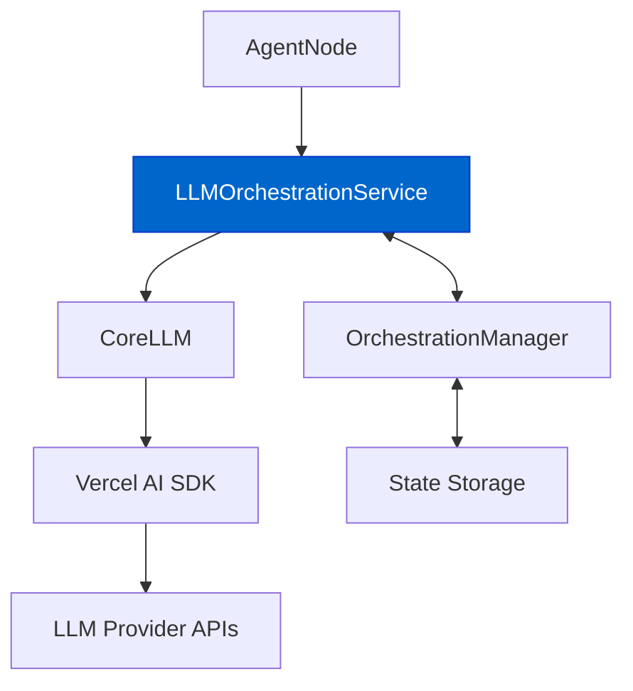

# LLM 编排服务

`LLMOrchestrationService` 充当 `AgentNode` 与 `CoreLLM` 之间的桥梁，为 LLM 交互增加与编排相关的能力。

## Core Responsibilities

- **流管理（Stream Management）**：在 CoreLLM 的流式能力之上附加编排状态信息
- **Token 使用统计（Token Usage Tracking）**：将 token 使用量更新到会话状态中
- **工具跟踪（Tool Tracking）**：监控并记录交互过程中使用过的工具
- **回调注入（Callback Injection）**：为流事件提供“具备编排感知”的回调函数

## Architecture Position



## Key Methods

### streamWithOrchestration

将 `CoreLLM.streamText` 包装为具备编排能力的主要方法：

```typescript
async streamWithOrchestration(
  options: StreamWithOrchestrationOptions
): Promise<AgentDockStreamResult<Record<string, CoreTool>, any>>
```

该方法会：
1. 为 `onFinish` 与 `onStepFinish` 准备编排感知的回调；
2. 携带这些回调调用 `CoreLLM.streamText`；
3. 返回一个包含编排状态的增强版 stream 结果。

### updateTokenUsage

一个私有方法，用于将 token 使用量更新到会话状态中：

```typescript
private async updateTokenUsage(usage?: TokenUsage): Promise<void>
```

该方法会：
1. 从 `OrchestrationManager` 获取当前状态；
2. 将新的使用信息累加到累计 token 使用统计中；
3. 将更新后的状态写回会话存储。

## Integration with Tool Tracking

该服务也会跟踪会话中使用过的工具：
- 在 `onStepFinish` 回调中监控工具调用；
- 更新会话状态中的 `recentlyUsedTools` 数组；
- 将这些信息提供给编排规则，用于条件跳转判断。

## Constructor

```typescript
constructor(
  private llm: CoreLLM,
  private orchestrationManager: OrchestrationManager,
  private sessionId: SessionId
)
```

该服务需要：
- 一个 `CoreLLM` 实例用于 LLM 交互；
- 一个 `OrchestrationManager` 用于状态管理；
- 一个 `sessionId` 用于标识会话上下文。

## Related Documentation

- [Orchestration Overview](./orchestration-overview.md) - General orchestration concepts
- [State Management](./state-management.md) - How state is managed in orchestration
- [Response Streaming](../core/response-streaming.md) - Details on streaming capabilities 

## Step Activation

- **步骤激活：** 基于满足的条件（例如使用了某个特定工具），激活步骤可能发生变化，从而改变下一轮智能体的行为与可用工具集合。
  - 现在系统会在工具使用后立刻重新评估条件，从而让“完成某个定义性序列后触发的步骤切换”能在同一轮内发生。

## Example Scenario: Cognitive Reasoner Agent

下面以 [Cognitive Reasoner agent](https://github.com/AgentDock/AgentDock/tree/main/agents/cognitive-reasoner) 为例，重点看它的 `EvaluationMode`。

**智能体配置（`template.json` 摘录）：**

```json
{
  "name": "EvaluationMode",
  "description": "Critical evaluation sequence",
  "sequence": [
    "critique",
    "debate",
    "reflect"
  ],
  "conditions": [
    { "type": "sequence_match" }
  ],
  "availableTools": {
    "allowed": ["critique", "debate", "reflect", "search"]
  }
}
```

**流程：**

1. **初始状态：** 会话开始，`activeStep` 为 `DefaultMode`，`recentlyUsedTools` 为 `[]`。
2. **用户请求：** “Critique the argument that remote work improves productivity.”
3. **LLM 行为（第 1 轮 - Critique）：** 智能体可能处于 `DefaultMode`，使用 `critique` 工具，并触发 `processToolUsage`：
   - `recentlyUsedTools` 变为 `["critique"]`；
   - `getActiveStep` 立刻运行，尚未匹配到序列，`activeStep` 保持 `DefaultMode`。
4. **LLM 行为（第 2 轮 - Debate）：** 继续使用 `debate` 工具，并触发 `processToolUsage`：
   - `recentlyUsedTools` 变为 `["critique", "debate"]`；
   - `getActiveStep` 运行，仍未匹配到序列，`activeStep` 保持 `DefaultMode`。
5. **LLM 行为（第 3 轮 - Reflect）：** 使用 `reflect` 工具，并触发 `processToolUsage`：
   - `recentlyUsedTools` 变为 `["critique", "debate", "reflect"]`；
   - `getActiveStep` 运行，开始检查 `EvaluationMode`：
     - 评估条件 `type: "sequence_match"`；
     - `recentlyUsedTools` 的末尾 `["critique", "debate", "reflect"]` 与步骤 `sequence` `["critique", "debate", "reflect"]` 匹配；
     - 条件通过。
   - `EvaluationMode` 成为新的 `activeStep`。对新激活步骤会将 `sequenceIndex` 重置为 `0`。
6. **下一轮：** 下一次交互开始时，智能体已处于 `EvaluationMode`。如果该步骤还启用了 `StepSequencer` 的序列强制，初始时通常只允许 `sequenceIndex: 0` 对应的工具（`critique`）。不过这里的例子更强调通过 `sequence_match` 触发的“步骤切换”，而非步骤内部的序列强制过程。