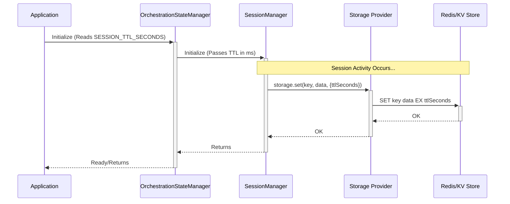

# 编排状态管理

本文介绍 AgentDock 中编排状态管理的实现细节，重点说明如何处理“会话级状态”，以控制智能体行为与工具使用。

## Core Concepts

- **会话级状态（Session-Scoped State）：** 所有编排状态（当前激活步骤、工具序列进度、最近使用的工具等）都绑定到某个 `SessionId`，并对每个会话分别管理。
- **状态接口（`OrchestrationState`）：** 定义在 `agentdock-core/src/orchestration/state.ts`。该接口扩展基础 `SessionState`，包含：
  - `activeStep?: string`：当前激活的编排步骤名；
  - `recentlyUsedTools: string[]`：该会话中使用过的工具名列表；
  - `sequenceIndex?: number`：在当前 `activeStep` 定义的工具序列中所处的索引位置；
  - `cumulativeTokenUsage?`：累计的 token 使用统计；
  - `lastAccessed: number`：用于 TTL 计算的最近访问时间戳；
  - `ttl: number`：该状态的存活时间（TTL）。

## Implementation (`OrchestrationStateManager`)

`OrchestrationStateManager` 类（`agentdock-core/src/orchestration/state.ts`）是管理 `OrchestrationState` 的核心组件。

### Key Features:

- **复用 `SessionManager`：** 内部会使用专门为 `OrchestrationState` 配置的核心 `SessionManager`，并传入 `createDefaultState` 函数用于初始化新编排状态。
- **存储集成：** 继承 `SessionManager` 的存储能力，使 `OrchestrationState` 可以通过配置的存储 Provider（内存、Redis、Vercel KV 等）持久化到指定命名空间（默认：`orchestration-state`）。
- **工厂函数：** 推荐通过 `createOrchestrationStateManager(options)` 工厂函数创建实例，以便统一配置存储与清理策略。
- **状态访问/修改方法：** 提供一组方法与状态交互：
  - `getState(sessionId)`：获取完整 `OrchestrationState`；
  - `getOrCreateState(sessionId, config?)`：获取已有状态；必要时创建默认状态（且通常要求该智能体确实配置了编排）；
  - `updateState(sessionId, updates)`：对状态做部分、不可变更新；
  - `setActiveStep(sessionId, stepName)`：更新 `activeStep`；
  - `addUsedTool(sessionId, toolName)`：将工具名追加到 `recentlyUsedTools`；
  - `advanceSequence(sessionId)`：递增 `sequenceIndex`；
  - `resetState(sessionId)`：将状态重置回默认值。
- **条件创建：** `getOrCreateState` 会在创建状态前检查智能体配置中是否包含编排步骤，避免为未启用编排的智能体创建状态，从而优化资源使用。
- **TTL 与清理：** 编排状态（以及底层存储中的 session key）的 TTL 可配置。
  - **默认值：** 未显式配置时，默认 TTL 为 24 小时未访问（在 `agentdock-core` 中定义）。
  - **配置方式：** 可通过应用环境变量 `SESSION_TTL_SECONDS`（秒）覆盖默认 TTL，并在初始化时传入。
  - **机制：** 底层 `SessionManager` 使用该 TTL 设置存储键的过期时间（例如 Redis `EXPIRE`）。超过 TTL 且未访问的状态会被自动清除。

### Relationship with `StepSequencer`

`StepSequencer` 高度依赖 `OrchestrationStateManager` 来：
- 获取当前会话的 `sequenceIndex`（通过 `getState`）；
- 当序列步骤完成时更新 `sequenceIndex`（通过 `advanceSequence`）；
- 记录使用过的工具（通过 `addUsedTool`）。

## State Lifecycle

1. **初始化：** 当编排系统首次需要访问或修改某个会话的状态时，通常会通过 `getOrCreateState` 惰性创建（前提是该智能体确实配置了编排）。
2. **更新：** 在交互过程中，`activeStep`、`recentlyUsedTools`、`sequenceIndex`、`lastAccessed` 等字段会通过 `OrchestrationStateManager` 的方法被持续更新。
3. **读取：** 需要编排上下文的组件（例如 `StepSequencer` 或条件检查器）会调用 `getState`。
4. **清理：** 过期状态会由底层 `SessionManager` 的清理流程基于 `ttl` 与 `lastAccessed` 自动移除。

## Session Persistence & Long-Lived Agents

TTL 机制主要面向典型 Web 会话过期场景。对于希望长期存在的智能体（例如个人助理）：

1. **设置很长的 TTL：** 将 `SESSION_TTL_SECONDS` 配置为很大的值（例如按“年”换算成秒）。
2. **保持周期性访问：** 确保会话会被周期性访问（例如定时任务或用户交互）。每次访问都会刷新 `lastAccessed`，从而重置 TTL 倒计时。
3. **禁用 TTL（谨慎）：** 虽然可以通过修改核心代码来禁用 TTL（例如在 `SessionManager` 中令 `ttlSeconds = undefined`），但一般不建议这样做，因为如果从不显式删除，可能导致存储中堆积孤立状态。

## Configuration

可以在实例化时通过 `createOrchestrationStateManager(options)` 配置 `OrchestrationStateManager`：

- `storageProvider`：传入具体的存储实例（例如已配置好的 `RedisStorageProvider`）。
- `storageNamespace`：修改底层存储使用的命名空间。
- `cleanup`：配置清理“检查”间隔，并启用/禁用自动清理定时器。注意：实际的 session **TTL** 主要由初始化时传入的 `SESSION_TTL_SECONDS` 控制。

## Best Practices

- 使用工厂函数 `createOrchestrationStateManager(options)` 进行规范配置。
- 在适用场景下利用“条件创建状态”逻辑。
- 确保底层存储 Provider 针对部署环境正确配置。 