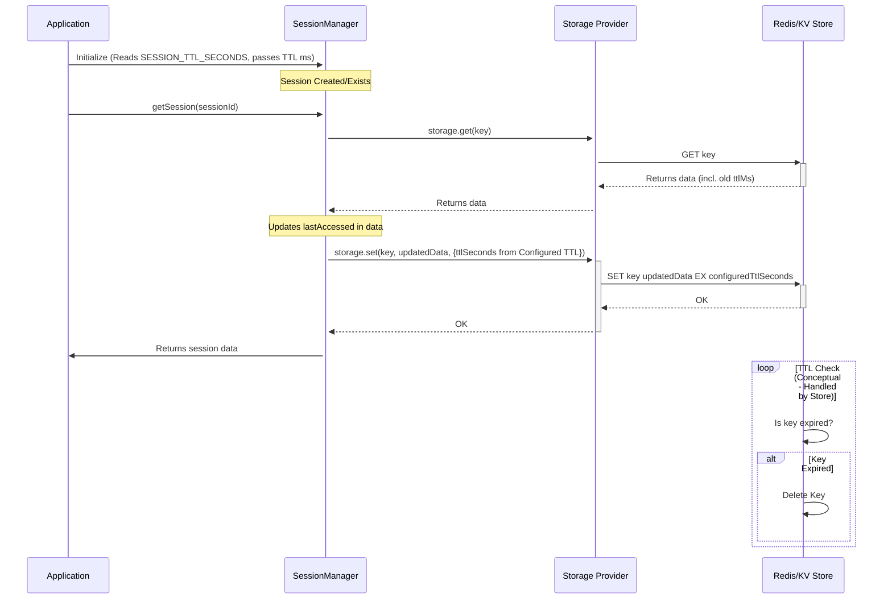

# 会话管理

AgentDock 中的 Session 为用户与 AI 智能体之间的**持续、有状态交互**提供基础支撑。本文档介绍会话管理系统的核心概念、架构、实现细节以及优化策略。

## 核心概念

- **Session：** 表示一次独立的会话，由唯一的 `SessionId` 标识。在多条消息、工具调用之间维护状态，以保留上下文。
- **会话隔离（Session Isolation）：** 确保并发会话之间互不干扰，对多用户环境尤为关键。
- **单一事实来源（Single Source of Truth）：** Session ID 通常由入口层（例如 API 路由处理器）集中生成；对于某一类状态，所有读写都通过同一个 `SessionManager` 实例完成，保证一致性。

## 架构与实现

会话系统围绕泛型类 `SessionManager` 展开，其实现位于 `agentdock-core/src/session/index.ts`。

### `SessionManager<T extends SessionState>`

- **泛型：** 通过扩展基础接口 `SessionState`，可以管理不同类型的会话状态（基础状态、编排状态、工具状态等）。
- **持久化：** 使用 [存储抽象层（Storage Abstraction Layer）](./storage-abstraction.md) 进行持久化。默认使用内存存储，也可以通过构造函数配置为 Redis、Vercel KV 等其他 Provider。
- **命名空间：** 使用存储命名空间（如 `sessions`、`orchestration-state`）将不同类型的会话数据在底层存储中隔离开。
- **状态工厂：** 实例化时需要传入 `defaultStateGenerator` 函数，用于定义新建 Session 时初始状态 `T` 的结构。

### 关键操作

- `createSession(options)`：当给定或生成的 `SessionId` 尚不存在时，使用 `defaultStateGenerator` 创建并存储一个新 Session，返回 `SessionResult<T>`。
- `getSession(sessionId)`：从存储中读取指定 Session 的当前状态，返回 `SessionResult<T>`。
- `updateSession(sessionId, updateFn)`：以不可变方式更新 Session。流程为：读取当前状态 → 调用 `updateFn` 生成新状态对象 → 原子性写回，最终返回 `SessionResult<T>`。
- `deleteSession(sessionId)`：从存储中删除该 Session。

### Session ID 生成

通常由应用入口（例如 API 路由处理器）负责生成 Session ID，以保证“单一事实来源”。虽然核心库可以自己生成 UUID（`generateSessionId`），但更推荐在上层显式传入 ID。常见做法是为 Session ID 添加前缀，便于追踪。

### 会话生命周期与清理

1. **创建（Creation）：** 由 `createSession` 处理；通常在第一次交互且未提供 `SessionId` 时触发。
2. **访问与更新（Access & Update）：** 在智能体处理流程中反复调用 `getSession` 与 `updateSession`。
3. **过期（TTL）：** 每个会话状态都包含 `lastAccessed`（时间戳）与 `ttl`（毫秒）字段。TTL 可配置（默认 30 分钟）。  
   - **默认值：** 在 `agentdock-core` 中，默认是**24 小时**未访问即过期。  
   - **配置：** 可通过应用环境变量 `SESSION_TTL_SECONDS`（秒）覆盖默认值，该 TTL 会在创建或更新存储键时被使用。
4. **自动清理（Automatic Cleanup）：** `SessionManager` 包含可选的周期性清理机制（`setupCleanupInterval`、`cleanupExpiredSessions`），定期检查 `lastAccessed + ttl` 是否早于当前时间，并自动调用 `deleteSession` 删除已过期条目。在 Node.js 中，这个定时器会调用 `unref()`，避免阻塞进程退出。

### 持久化与长生命周期 Session

对于需要比普通 Web 会话更长寿命的场景（例如长期存在的个人助理）：

1. **配置较长 TTL：** 在应用环境变量中设置 `SESSION_TTL_SECONDS` 为较大数值（例如一年为 `31536000` 秒）。
2. **保持活跃：** 只要通过 `getSession` 或 `updateSession` 访问 Session，其 `lastAccessed` 时间戳就会更新，从而重置底层存储键的 TTL 计时。
3. **关闭 TTL：** 将 `SESSION_TTL_SECONDS` 设为 `0` 或负数，通常会让存储 Provider 不再设置过期时间，使 Session 无限期存在，直到显式删除。应谨慎使用，以免堆积孤立数据。

## 优化技巧

- **按需创建状态：** 组件或管理器（如 `OrchestrationStateManager`）应在调用 `createSession` 或 `getSession` 前先判断是否真的需要会话状态。例如未启用编排的智能体无需创建编排状态。
- **精简状态结构：** 会话状态接口（`T extends SessionState`）中只保留必要数据，避免存放大对象或重复数据。
- **惰性加载：** 仅在某个操作确实需要时才获取 Session 状态。
- **高效更新：** 使用不可变更新模式（`updateSession` + `{ ...state, ...updates }`）既高效又能避免竞态。
- **利用 `lastAccessed`：** 在 `getSession` 或 `updateSession` 时刷新 `lastAccessed`，让活跃会话得以存活，同时依靠 TTL 自然清理长时间未访问的会话。
- **选择合适的存储 Provider：** 开发环境可使用内存存储，生产环境则推荐 Redis/Vercel KV 等，性能与扩展性差异明显。
- **合理设置 TTL：** 根据应用需求设置合适的 `SESSION_TTL_SECONDS`（如 Web 会话较短、长期代理较长），借助自动清理减少运维负担。

## 集成点

- **LLM：** 会话状态（尤其是消息历史）为 LLM 调用提供上下文。
- **工具：** 工具可以（通过专用管理器等）访问 Session 状态，以维护上下文或在多次调用之间共享数据。
- **编排：** `OrchestrationStateManager` 通过 `SessionManager` 为每个 Session 存储其专属的 `OrchestrationState`，从而实现步骤跟踪、序列管理等能力。
- **Next.js：** 参见 [Next.js 集成](./nextjs-integration.md)，了解在 API 路由与前端组件中如何管理 Session ID。

## 最佳实践

1. **单一事实来源：** 在入口（API 路由等）统一生成/管理 Session ID。
2. **传递而非生成：** 下游组件接收并使用 Session ID，而不是自己生成。
3. **配置合适的存储：** 根据环境选择合适的存储 Provider。
4. **精简状态：** 只在 Session 状态对象中存必要数据。
5. **用好 TTL：** 利用 TTL 自动清理过期会话。
6. **做好错误处理：** 检查 `SessionResult.success`，妥善处理会话不存在等错误。