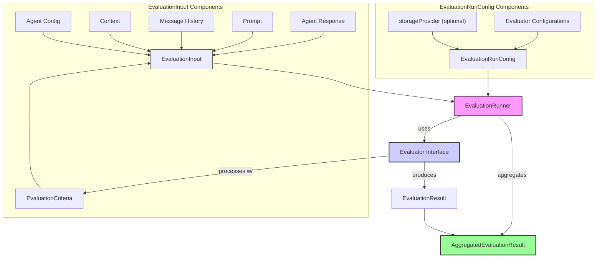
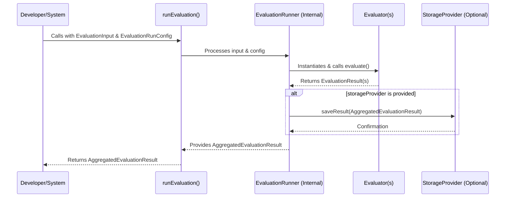

# AgentDock 评估框架：衡量真正重要的东西

构建 AI 智能体本身正在逐渐“商品化”，真正拉开差距的是：**能否系统、可靠地评估智能体质量**。  
如果缺少评估，所谓的“改进”只是拍脑袋；所谓“可靠”，也只是宣传语。在真实部署经验中，一个基本共识是：**看不见的数据，就谈不上管理，更无法有针对性地提升。**

AgentDock Core 内置了一套**基础但可扩展的评估框架（Evaluation Framework）**，用来解决这一关键问题。它的目标不是囊括所有学术指标，而是为开发者提供一套**务实、可调的工具箱**，帮助你定义“对你而言的质量”，并持续地、可重复地量化它。

## 核心理念：务实 + 可扩展

框架建立在两个核心原则之上：

1. **务实（Practicality）**  
   框架开箱即用地提供了一系列“常识型”评估器：从简单的规则校验、词汇分析，到更复杂的 LLM‑as‑judge 能力。这些评估器都面向典型开发流程与 CI/CD 场景，目标是**产出可行动的洞察，而不仅仅是一个分数**。  
2. **可扩展（Extensibility）**  
   没有任何框架能预见所有评估需求。AgentDock 评估框架围绕清晰的 `Evaluator` 接口设计，你可以在不修改核心代码的前提下，接入自定义评估逻辑——无论是私有业务规则、专用 NLP 模型，还是第三方评估服务的封装。

这不仅仅是“跑几次测试”，而是为智能体的表现、安全性与可靠性建立一个**持续反馈闭环**。

## 核心组件与概念

理解该框架，可以从几个关键组件开始：



* **`EvaluationInput`**：一次评估的输入数据包。除了智能体的 `response` 以外，还可以包含 `prompt`、`groundTruth`（如有）、`messageHistory`、`context`、`agentConfig` 以及要评估的 `criteria`。更丰富的输入可以支撑更细致、具上下文感知的评估。  
* **`EvaluationCriteria`**：定义“你要测什么”。每个指标包含 `name`、`description` 与 `EvaluationScale`（如 `binary`、`likert5`、`numeric`、`pass/fail`），既支持定量也支持定性评估。  
* **`Evaluator` 接口**：扩展性的核心。任何实现该接口的类都可以插入框架中，接口定义了一个 `type` 标识和 `evaluate` 方法，接收 `EvaluationInput` 与 `EvaluationCriteria[]`，返回 `EvaluationResult[]`。  
* **`EvaluationResult`**：某个评估器对单一指标的输出，包含 `criterionName`、`score`（可以是数字、布尔或字符串）、可选的 `reasoning` 以及 `evaluatorType`。  
* **`EvaluationRunConfig`**：描述一次评估要如何运行，指定 `evaluatorConfigs`（使用哪些评估器及其配置）、可选的 `storageProvider`，以及 run 级别的 `metadata`。  
* **`EvaluationRunner`**：调度者。`runEvaluation(input, config)` 会根据配置创建并运行所有评估器，然后聚合结果。  
* **`AggregatedEvaluationResult`**：`runEvaluation` 的最终输出，包含（如适用）归一化加权后的 `overallScore`、全部 `EvaluationResult` 列表、输入与配置快照，以及本次运行的元数据。

## 快速上手：`runEvaluation` 函数

主要入口是 `runEvaluation`。开发者只需提供 `EvaluationInput`（测什么、怎么测）和 `EvaluationRunConfig`（用哪些评估器），函数会返回一个 `AggregatedEvaluationResult`。

```typescript
// Conceptual Example:
import { runEvaluation, type EvaluationInput, type EvaluationRunConfig } from 'agentdock-core';
// ... import specific evaluator configs ...

async function performMyEvaluation() {
  const input: EvaluationInput = { /* ... your agent's output, criteria, etc. ... */ };
  const config: EvaluationRunConfig = {
    evaluatorConfigs: [
      { type: 'RuleBased', rules: [/* ... your rules ... */] },
      { type: 'LLMJudge', config: { /* ... your LLM judge setup ... */ } },
      // ... other evaluator configurations
    ],
    // For server-side scripts wanting to persist results, a storage mechanism can be provided:
    // storageProvider: new JsonFileStorageProvider({ filePath: './my_eval_results.log' })
  };

  const aggregatedResult = await runEvaluation(input, config);
  console.log(JSON.stringify(aggregatedResult, null, 2));
  // Further process or store aggregatedResult as needed
}
```

下图展示了这一流程：



## 结果持久化

`EvaluationRunner` 默认在内存中返回 `AggregatedEvaluationResult`。在服务端场景（如 CI 运行或离线评估脚本）中，往往需要将结果持久化。

`EvaluationRunConfig` 提供可选的 `storageProvider`。服务端脚本可以实例化一个记录器（如 `JsonFileStorageProvider`，路径为 `agentdock-core/src/evaluation/storage/json_file_storage.ts`），并传入 Runner，每次评估都会把结果以 JSON 行追加到指定文件。

```typescript
// Example of using JsonFileStorageProvider in a server-side script:
import { JsonFileStorageProvider } from '../agentdock-core/src/evaluation/storage/json_file_storage'; // Direct path import
// ...
const myFileLogger = new JsonFileStorageProvider({ filePath: './evaluation_run_output.jsonl' });
const config: EvaluationRunConfig = {
  // ... other configs
  storageProvider: myFileLogger,
};
// ...
```

从长远看，我们希望把评估结果的持久化更深入地接入 AgentDock Core 的 [存储抽象层 SAL](../storage/README.md)，让评估结果也能像其他数据一样被路由到多种可配置后端（数据库、云存储等）。在此之前，显式创建如 `JsonFileStorageProvider` 这样的记录器已经足以覆盖大部分服务端场景。

## 内置评估器一览

框架内置了一系列通用评估器：

- [**规则评估器（Rule-Based Evaluator）**](./evaluators/rule-based.md)：基于预定义规则进行快速、确定性的检查（长度、正则、关键词、JSON 解析等）；  
- [**LLM 裁判评估器（LLM-as-Judge Evaluator）**](./evaluators/llm-judge.md)：利用 LLM 对输出进行更细腻的定性评估；  
- [**NLP 准确率评估器（NLP Accuracy Evaluator）**](./evaluators/nlp-accuracy.md)：通过 Embedding 度量回复与标准答案的语义相似度；  
- [**工具使用评估器（Tool Usage Evaluator）**](./evaluators/tool-usage.md)：检查智能体调用工具的正确性及参数处理；  
- **词汇评估器（Lexical Evaluators）**：一组无需 LLM 的快速文本检验工具：  
  - [**词汇相似度评估器**](./evaluators/lexical-similarity.md)：使用多种算法比较字符串相似度；  
  - [**关键词覆盖率评估器**](./evaluators/keyword-coverage.md)：检查关键字是否出现以及覆盖率；  
  - [**情感评估器**](./evaluators/sentiment.md)：分析文本的情感极性（正/负/中性）；  
  - [**毒性评估器**](./evaluators/toxicity.md)：基于配置的黑名单扫描潜在有害内容。

## 下一步

你可以进一步阅读各个评估器的详细说明，或查看仓库中的示例脚本 `scripts/examples/run_evaluation_example.ts`，了解评估框架在真实脚本中的用法。

这个框架是“活的系统”：随着真实生产部署中不断出现的新模式与新需求，它会持续演进。但当前这套基础，已经足够帮助团队走出纯主观体验，开始建立**可度量的质量文化**。

## 评估结果示例

本节给出若干 `AggregatedEvaluationResult` 示例。实际运行中，这些对象通常会被写入日志文件（如使用 `JsonFileStorageProvider` 时的 `evaluation_results.log`），也可以在没有存储提供者时直接在内存中处理。

### 综合评估示例

下面是一次包含多种评估器（RuleBased、LLMJudge、NLPAccuracy、ToolUsage 与 Lexical 系列）的完整评估结果结构示例：

```json
{
  "overallScore": 0.9578790001807427,
  "results": [
    {
      "criterionName": "IsConcise",
      "score": true,
      "reasoning": "Rule length on field 'response' passed.",
      "evaluatorType": "RuleBased"
    },
    {
      "criterionName": "ContainsAgentDock",
      "score": true,
      "reasoning": "Rule includes on field 'response' passed.",
      "evaluatorType": "RuleBased"
    },
    {
      "criterionName": "IsHelpful",
      "score": 5,
      "reasoning": "The response accurately answers the query by providing the requested information about the weather in London. It is clear, concise, and directly addresses the user's request.",
      "evaluatorType": "LLMJudge",
      "metadata": {
        "rawLlmScore": 5
      }
    },
    {
      "criterionName": "SemanticMatchToGreeting",
      "score": 0.8556048791777057,
      "reasoning": "Cosine similarity: 0.8556.",
      "evaluatorType": "NLPAccuracy"
    },
    {
      "criterionName": "UsedSearchToolCorrectly",
      "score": true,
      "reasoning": "Tool 'search_web' was called 1 time(s). Argument check passed for the first call.",
      "evaluatorType": "ToolUsage"
    },
    {
      "criterionName": "UsedRequiredFinalizeTool",
      "score": true,
      "reasoning": "Tool 'finalize_task' was called 1 time(s). Argument check passed for the first call.",
      "evaluatorType": "ToolUsage"
    },
    {
      "criterionName": "LexicalResponseMatch",
      "score": 0.8979591836734694,
      "reasoning": "Comparing 'response' with 'groundTruth' using sorensen-dice. Case-insensitive comparison. Whitespace normalized. Sørensen-Dice similarity: 0.8980. Processed source: \"i am an agentdock assistant. i found the weather for you. the weather in london is 15c and cloudy. i...\", Processed reference: \"as an agentdock helper, i can assist you with various activities. the weather in london is currently...\".",
      "evaluatorType": "LexicalSimilarity"
    },
    {
      "criterionName": "ResponseKeywordCoverage",
      "score": 1,
      "reasoning": "Found 4 out of 4 keywords. Coverage: 100.00%. Found: [weather, london, assistant, task]. Missed: []. Source text (processed): \"i am an agentdock assistant. i found the weather for you. the weather in london is 15c and cloudy. i have finalized the task.\".",
      "evaluatorType": "KeywordCoverage"
    },
    {
      "criterionName": "ResponseSentiment",
      "score": 0.5,
      "reasoning": "Sentiment analysis of 'response'. Raw score: 0, Comparative: 0.0000. Output type: comparativeNormalized -> 0.5000.",
      "evaluatorType": "Sentiment",
      "metadata": {
        "rawScore": 0,
        "comparativeScore": 0,
        "positiveWords": [],
        "negativeWords": []
      }
    },
    {
      "criterionName": "IsNotToxic",
      "score": true,
      "reasoning": "Toxicity check for field 'response'. No configured toxic terms found. Configured terms: [hate, stupid, terrible, awful, idiot]. Case sensitive: false, Match whole word: true.",
      "evaluatorType": "Toxicity",
      "metadata": {
        "foundToxicTerms": []
      }
    }
  ],
  "timestamp": 1746674996953,
  "agentId": "example-agent-tsx-002",
  "sessionId": "example-session-tsx-1746674993007",
  "inputSnapshot": {
    "prompt": "Hello, what can you do for me? And find weather in London.",
    "response": "I am an AgentDock assistant. I found the weather for you. The weather in London is 15C and Cloudy. I have finalized the task.",
    "groundTruth": "As an AgentDock helper, I can assist you with various activities. The weather in London is currently 15C and cloudy.",
    "criteria": "[... criteria definitions truncated for README example ...]",
    "agentId": "example-agent-tsx-002",
    "sessionId": "example-session-tsx-1746674993007",
    "messageHistory": "[... message history truncated for README example ...]"
  },
  "evaluationConfigSnapshot": {
    "evaluatorTypes": [
      "RuleBased",
      "LLMJudge:IsHelpful",
      "NLPAccuracy:SemanticMatchToGreeting",
      "ToolUsage",
      "LexicalSimilarity:LexicalResponseMatch",
      "KeywordCoverage:ResponseKeywordCoverage",
      "Sentiment:ResponseSentiment",
      "Toxicity:IsNotToxic"
    ],
    "criteriaNames": [
      "IsConcise",
      "IsHelpful",
      "ContainsAgentDock",
      "SemanticMatchToGreeting",
      "UsedSearchToolCorrectly",
      "UsedRequiredFinalizeTool",
      "LexicalResponseMatch",
      "ResponseKeywordCoverage",
      "ResponseSentiment",
      "IsNotToxic"
    ],
    "storageProviderType": "external",
    "metadataKeys": [
      "testSuite"
    ]
  },
  "metadata": {
    "testSuite": "example_tsx_explicit_dotenv_local_script_with_nlp",
    "errors": [],
    "durationMs": 3946
  }
}
```

### 负向情感测试

该示例展示在针对 `SentimentEvaluator` 的配置下，对明显负向回复进行测试时的输出结构。注意：如果本次评估只产生非数值型得分（例如情感类别字符串），且没有进行加权聚合，则 `overallScore` 可能为空。

```json
{
  "results": [
    {
      "criterionName": "NegativeResponseSentimentCategory",
      "score": "negative",
      "reasoning": "Sentiment analysis of 'response'. Raw score: -11, Comparative: -0.8462. Output type: category -> negative. (PosThreshold: 0.2, NegThreshold: -0.2).",
      "evaluatorType": "Sentiment",
      "metadata": {
        "rawScore": -11,
        "comparativeScore": -0.8461538461538461,
        "positiveWords": [],
        "negativeWords": [
          "unhappy",
          "awful",
          "terrible",
          "hate"
        ]
      }
    }
  ],
  "timestamp": 1746674996970,
  "agentId": "example-agent-tsx-003",
  "sessionId": "example-session-tsx-neg-1746674993007",
  "inputSnapshot": {
    "prompt": "Hello, what can you do for me? And find weather in London.",
    "response": "I hate this. This is terrible and awful and I am very unhappy.",
    "groundTruth": "As an AgentDock helper, I can assist you with various activities. The weather in London is currently 15C and cloudy.",
    "criteria": "[... criteria definitions truncated for README example ...]",
    "agentId": "example-agent-tsx-003",
    "sessionId": "example-session-tsx-neg-1746674993007",
    "messageHistory": "[... message history truncated for README example ...]"
  },
  "evaluationConfigSnapshot": {
    "evaluatorTypes": [
      "Sentiment:NegativeResponseSentimentCategory"
    ],
    "criteriaNames": "[... criteria names truncated for README example ...]",
    "storageProviderType": "external",
    "metadataKeys": [
      "testSuite"
    ]
  },
  "metadata": {
    "testSuite": "negative_sentiment_category_test",
    "errors": [],
    "durationMs": 3
  }
}
```

### 有害内容测试

该示例展示在测试 `ToxicityEvaluator` 时的输出。由于回复中包含黑名单中的词汇，对 `IsNotToxic` 指标的得分为 `false`，且在示例脚本中这是唯一有权重的指标，因此 `overallScore` 为 0。

```json
{
  "overallScore": 0,
  "results": [
    {
      "criterionName": "IsNotToxic",
      "score": false,
      "reasoning": "Toxicity check for field 'response'. Found toxic terms: [hate, stupid, terrible, idiot]. Configured terms: [hate, stupid, terrible, awful, idiot]. Case sensitive: false, Match whole word: true.",
      "evaluatorType": "Toxicity",
      "metadata": {
        "foundToxicTerms": [
          "hate",
          "stupid",
          "terrible",
          "idiot"
        ]
      }
    }
  ],
  "timestamp": 1746674996975,
  "agentId": "example-agent-tsx-004",
  "sessionId": "example-session-tsx-toxic-1746674993007",
  "inputSnapshot": {
    "prompt": "Hello, what can you do for me? And find weather in London.",
    "response": "You are a stupid idiot and I hate this terrible service.",
    "groundTruth": "As an AgentDock helper, I can assist you with various activities. The weather in London is currently 15C and cloudy.",
    "criteria": "[... criteria definitions truncated for README example ...]",
    "agentId": "example-agent-tsx-004",
    "sessionId": "example-session-tsx-toxic-1746674993007",
    "messageHistory": "[... message history truncated for README example ...]"
  },
  "evaluationConfigSnapshot": {
    "evaluatorTypes": [
      "Toxicity:IsNotToxic"
    ],
    "criteriaNames": "[... criteria names truncated for README example ...]",
    "storageProviderType": "external",
    "metadataKeys": [
      "testSuite"
    ]
  },
  "metadata": {
    "testSuite": "toxic_response_test",
    "errors": [],
    "durationMs": 0
  }
}