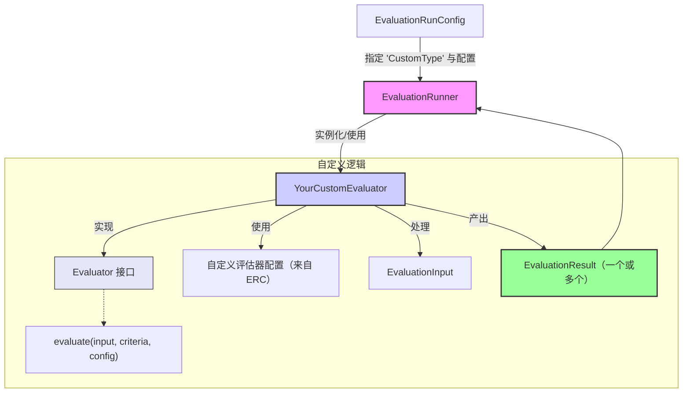

# 创建自定义评估器

AgentDock 评估框架（Evaluation Framework）是为**可扩展性**而设计的。虽然内置评估器覆盖了许多常见用例，但你在实际项目中不可避免会遇到需要为你的智能体任务、数据或业务规则量身定制评估逻辑的场景。框架的核心设计理念之一是：**框架真正的力量在于它的可适配性**。

这种可扩展性的核心是 `Evaluator` 接口。通过实现该接口，你可以将自定义评估逻辑无缝接入 `EvaluationRunner`，并复用框架提供的其它能力。

## `Evaluator` 接口

要创建自定义评估器，你需要定义一个类来实现 `Evaluator<ConfigType, ResultType>` 接口。该接口概念上如下（以实际 `agentdock-core` 类型为准）：

```typescript
// 概念性表示（请以 agentdock-core 中的实际类型定义为准）
interface Evaluator<ConfigType = any, InputType = any, ResultType = any> {
  /** 
   * 当前评估器类型的唯一字符串标识。
   * 在 EvaluationRunConfig 中通过它指定要使用哪个评估器。
   */
  type: string;

  /**
   * 核心评估逻辑。
   * @param input 本次运行的完整 EvaluationInput。
   * @param criteria 此评估器应评估的 EvaluationCriteria 列表。
   * @param config 从 EvaluationRunConfig 中取出的该评估器实例配置。
   * @returns 返回 Promise，resolve 为 EvaluationResult 对象数组。
   */
  evaluate(
    input: EvaluationInput<InputType>, 
    criteria: EvaluationCriteria[], 
    config: ConfigType
  ): Promise<EvaluationResult<ResultType>[]>;
}
```

关键点：

* **`type`（string）**：这是非常关键的静态或实例属性。它必须是一个**唯一字符串**，用于标识你的自定义评估器。用户会在 `EvaluationRunConfig` 中通过该 `type` 字符串选择你的评估器。
* **`evaluate(input, criteria, config)`（方法）**：异步方法，包含你的核心评估逻辑。它会接收：
  * `input: EvaluationInput`：评估所需的完整输入数据（智能体响应、提示词、历史、上下文等）。
  * `criteria: EvaluationCriteria[]`：该评估器实例负责评估的一组标准。你的评估器应遍历这些标准，并为它能处理的每一项产出一个结果。
  * `config: ConfigType`：该评估器的具体配置对象，来自 `EvaluationRunConfig` 的 `evaluatorConfigs` 数组，用于对评估器进行参数化。
  * 该方法必须返回一个 `Promise`，resolve 为 `EvaluationResult` 数组。

## 自定义评估器的核心工作流

下图展示了当 `EvaluationRunner` 调用自定义评估器时的一般工作流：



## 示例：一个简单的自定义“长度精确匹配”检查器

假设我们要做一个自定义评估器：检查某段响应文本长度是否**恰好**等于某个值（不同于内置 `RuleBasedEvaluator` 的最小/最大长度区间检查）。

```typescript
// my-custom-evaluators.ts
import type { 
  Evaluator, 
  EvaluationInput, 
  EvaluationCriteria, 
  EvaluationResult 
} from 'agentdock-core'; // 视情况调整路径
// 假设 getInputText 由 agentdock-core 或某个已知 utils 路径导出
// 例如：import { getInputText } from 'agentdock-core/evaluation/utils';
// 或如果 getInputText 变成 agentdock-core 的主导出：
// import { getInputText } from 'agentdock-core';

// 从框架中导入工具函数
import { getInputText } from 'agentdock-core/evaluation/utils';

// 自定义评估器的配置类型
interface ExactLengthConfig {
  expectedLength: number;
  sourceField?: string; // 例如：'response'、'context.someField'
}

class ExactLengthEvaluator implements Evaluator<ExactLengthConfig> {
  public readonly type = 'ExactLengthCheck'; // 唯一类型标识

  async evaluate(
    input: EvaluationInput,
    criteria: EvaluationCriteria[],
    config: ExactLengthConfig
  ): Promise<EvaluationResult[]> {
    const results: EvaluationResult[] = [];
    // 用工具函数抽取要评估的文本
    const textToEvaluate = getInputText(input, config.sourceField);

    // 遍历 criteria 并检查长度
    for (const criterion of criteria) {
      if (textToEvaluate === undefined) {
        results.push({
          criterionName: criterion.name,
          score: false,
          reasoning: `Source field '${config.sourceField || 'response'}' not found, not a string, or not extractable.`,
          evaluatorType: this.type,
        });
        continue;
      }

      const actualLength = textToEvaluate.length;
      const passed = actualLength === config.expectedLength;

      results.push({
        criterionName: criterion.name,
        score: passed,
        reasoning: passed 
          ? `Response length is exactly ${config.expectedLength}.` 
          : `Expected length ${config.expectedLength}, got ${actualLength}.`,
        evaluatorType: this.type,
      });
    }
    return results;
  }
}

// 要对外提供该评估器，你可以导出它，或在你的应用中注册到某个集中注册表里。
export { ExactLengthEvaluator };

// 测试自定义评估器
// --------------------------
// 自定义评估器一定要做充分测试。下面给出一个使用 Jest 为 `ExactLengthEvaluator` 编写测试的基础示例。

/*
import { ExactLengthEvaluator } from './my-custom-evaluators';
import type { EvaluationInput, EvaluationCriteria, ExactLengthConfig } from './my-custom-evaluators'; // 假设类型也被导出或在测试中本地定义

describe('ExactLengthEvaluator', () => {
  let evaluator: ExactLengthEvaluator;
  const mockCriteria: EvaluationCriteria[] = [{ name: 'ExactLength', description: 'Test', scale: 'binary' }];
  const mockConfig: ExactLengthConfig = { expectedLength: 10 };

  beforeEach(() => {
    evaluator = new ExactLengthEvaluator(); // 假设构造函数无需参数，按需调整
  });

  it('当文本长度与期望长度一致时应通过', async () => {
    const input: EvaluationInput = { 
      response: '1234567890', // 正好 10 个字符
      criteria: mockCriteria 
    };
    const results = await evaluator.evaluate(input, mockCriteria, mockConfig);
    expect(results.length).toBe(1);
    expect(results[0].score).toBe(true);
    expect(results[0].reasoning).toContain('Response length is exactly 10.');
  });

  it('当文本长度与期望长度不一致时应失败', async () => {
    const input: EvaluationInput = { 
      response: '12345', // 只有 5 个字符
      criteria: mockCriteria 
    };
    const results = await evaluator.evaluate(input, mockCriteria, mockConfig);
    expect(results.length).toBe(1);
    expect(results[0].score).toBe(false);
    expect(results[0].reasoning).toContain('Expected length 10, got 5.');
  });

  it('应能优雅处理 textToEvaluate 为 undefined 的情况', async () => {
    const input: EvaluationInput = { 
      response: { complex: 'object' }, // 不是字符串，getInputText 可能返回 undefined
      criteria: mockCriteria 
    };
    // 假设 config.sourceField 未设置，则 getInputText 默认读取 'response'
    const results = await evaluator.evaluate(input, mockCriteria, mockConfig);
    expect(results.length).toBe(1);
    expect(results[0].score).toBe(false);
    expect(results[0].reasoning).toContain('Source field \'response\' not found, not a string, or not extractable.');
  });
});
*/
```

## 使用你的自定义评估器

定义完成后，你可以在 `EvaluationRunConfig` 中通过它的 `type` 以及必要的配置来使用该自定义评估器：

```typescript
// 在你的评估脚本中
// import { ExactLengthEvaluator } from './my-custom-evaluators'; // 假设是本地文件
// import { EvaluationRunner, type EvaluationRunConfig ... } from 'agentdock-core';

// 如果 EvaluationRunner 不能仅通过 type 自动发现你的自定义评估器，
// 你可能需要在 Runner 支持的情况下直接传入实例，
// 或者在采用“按 type 实例化”的机制时确保打包结果中包含该评估器。
// 当前 EvaluationRunner 是通过 'type' 字符串匹配一组已知的内置评估器来实例化。
// 若要支持真正的外部自定义评估器，Runner 需要提供注册机制或接收已实例化评估器的能力。
// 这里先假设：可以通过改造 EvaluationRunner 或在同一项目作用域内使用来实现。

const runConfig: EvaluationRunConfig = {
  evaluatorConfigs: [
    // ... 其他内置评估器配置
    {
      type: 'ExactLengthCheck', // 你的自定义评估器的唯一 type 字符串
      // criteriaNames: ['MustBeSpecificLength'], // 关联到特定 criteria 名称
      config: { // 该实例的 ExactLengthConfig
        expectedLength: 50,
        sourceField: 'response'
      }
    }
  ],
  // ... 其他运行配置
};

// const results = await runEvaluation(myInput, runConfig);
```

构建自定义评估器可以让你按需精确地定制 AgentDock 评估框架，确保你的智能体质量被衡量在**对你的应用真正重要的指标**上。