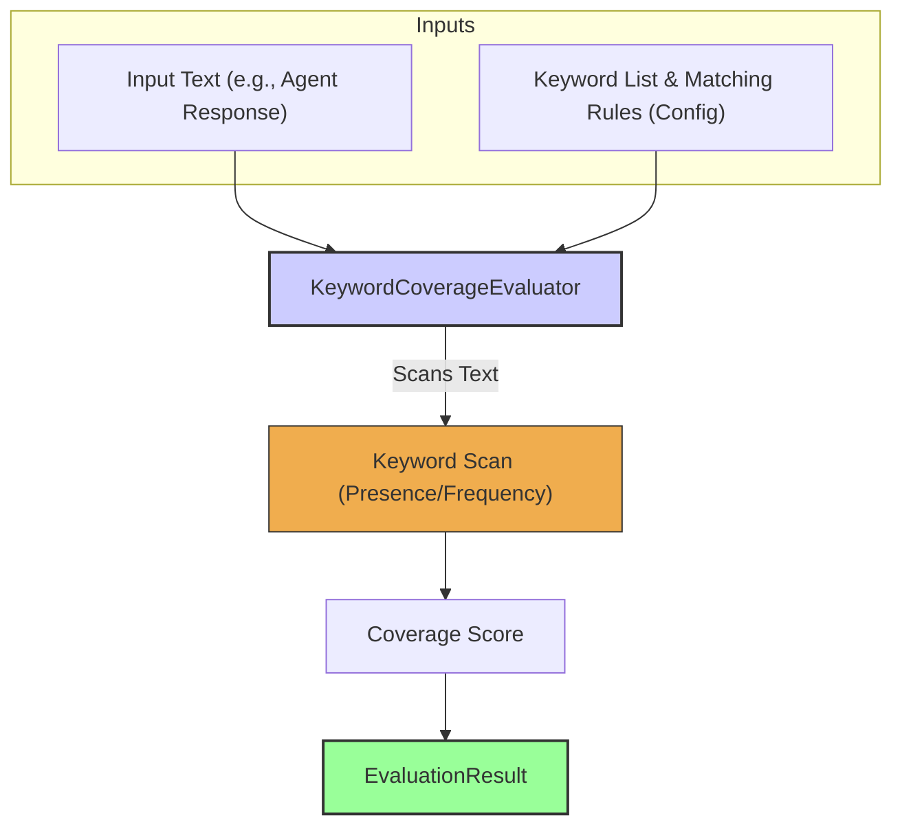

# 关键词覆盖率评估器

`KeywordCoverageEvaluator` 用于检查给定文本中指定关键词或短语的**出现情况、出现频次或覆盖率**。这是一种直接但非常有效的方法，用于确保智能体回复包含必要信息，或反向确保不出现不希望出现的词语。实践经验表明，它很适合用于快速检查“信息是否覆盖到位”或“是否符合策略要求”。

## 核心工作流

`KeywordCoverageEvaluator` 接收一段输入文本（通常是智能体回复）以及一份配置，配置中包含关键词列表与匹配规则（例如是否区分大小写、期望的匹配结果等）。随后它会扫描文本以确定关键词的出现情况/频次/覆盖率，并生成一个反映该结果的分数，写入 `EvaluationResult`。



## 使用场景

`KeywordCoverageEvaluator` 的典型用途包括：

* 确保产品名称、免责声明或特定指令被提及。
* 验证清单中的所有主题都被覆盖。
* 基础的禁用词检查（更专门的场景可使用 `ToxicityEvaluator`）。
* 统计特定术语的出现次数，用于分析目的。

## Configuration

配置主要用于定义关键词与匹配逻辑：

* `keywords`：要查找的字符串或模式（pattern）数组。
* `caseSensitive`：是否区分大小写，布尔值，默认 `false`。
* `expectedOutcome`：定义何种情况算通过（例如：找到“任意”关键词、找到“全部”关键词、一个都不应出现、或满足特定计数/频率）。
* `sourceField`：指定从 `EvaluationInput` 的哪个字段读取文本（默认 `'response'`）。

```typescript
// Example configuration structure (to be detailed)
// {
//   type: 'KeywordCoverage',
//   keywords: ['important disclaimer', 'AgentDock Core'],
//   caseSensitive: false,
//   expectedOutcome: 'all', // e.g., requires both to be present
//   sourceField: 'response.textBlock'
// }
```

## Output (`EvaluationResult`)

`KeywordCoverageEvaluator` 产生的 `EvaluationResult` 通常包含：

* **`criterionName`**：反映当前进行的关键词检查（例如 `"IncludesMandatoryTerms"`）。
* **`score`**：通常为布尔值（`true`/`false`）或数值（例如：找到的关键词占比、出现次数）。
* **`reasoning`**：说明哪些关键词被找到/缺失，或给出计数细节。
* **`evaluatorType`**：`'KeywordCoverage'`。
* **`error`**：用于表示配置错误或读取文本失败等问题。

该评估器提供了一种基于关键词出现情况来约束内容要求的简单方式。