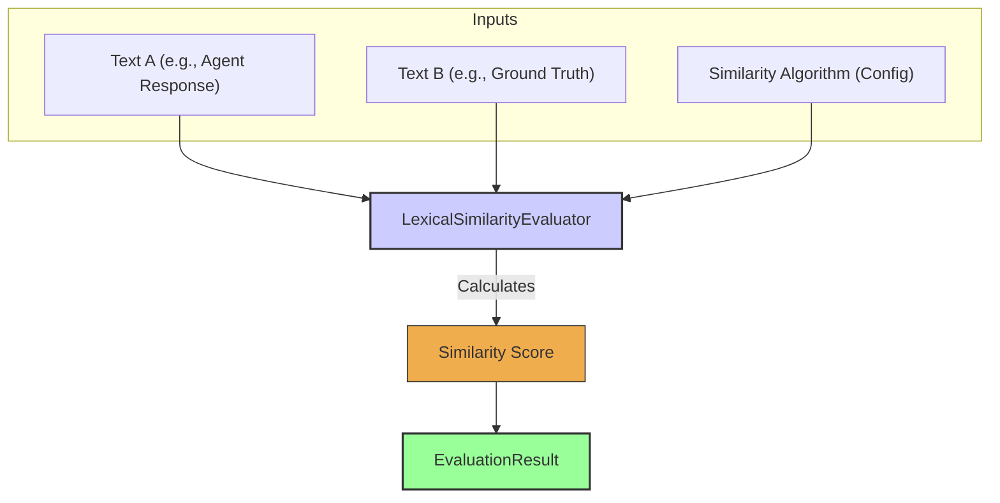

# 词汇相似度评估器

`LexicalSimilarityEvaluator` 用于比较两段字符串，并计算一个代表它们**文本相似度**的分数。这与“语义相似度”（由 `NLPAccuracyEvaluator` 处理）不同：它关注的是字符串在**字符层面**或**分词/Token 层面**的组成。实践中，这在“需要特定措辞或结构，但允许小幅变化”的场景很有用，也适合用来与已知文本模式进行对比。

它通常会使用多种字符串相似度算法，例如 Levenshtein 距离、Jaro-Winkler，或其它库中提供的算法。

## 核心工作流

`LexicalSimilarityEvaluator` 接收两段文本输入（例如智能体回复与标准答案/参考文本），以及在配置中指定的相似度算法。评估器会应用该算法对两段文本进行比较，计算出一个数值型相似度分数，并写入 `EvaluationResult`。



## Use Cases

`LexicalSimilarityEvaluator` 适用于：

* 检查智能体回复与期望模板或已知答案的接近程度（允许一定灵活性）。
* 评估是否遵循特定措辞规范。
* 在与知识库对比时识别用户输入中的小拼写错误或细微差异。
* 衡量同一文本的两个版本之间的差异。

## Configuration

配置主要包括：选择算法，并指定从 `EvaluationInput` 中取哪两段文本进行对比：

* `sourceField`：字符串（例如 `'response'`、`'context.someData'`），表示 `EvaluationInput` 中作为“主文本”的字段路径。
* `referenceField`：字符串（例如 `'groundTruth'`、`'context.expectedAnswer'`），表示 `EvaluationInput` 中作为“参考文本”的字段路径。
* `algorithm`：要使用的字符串相似度算法（例如 `'levenshtein'`、`'jaroWinkler'`、`'sorensenDice'`）。
* 可能还包含算法相关参数，例如 `caseSensitive`、`normalizeWhitespace`。

```typescript
// Example configuration structure (to be detailed)
// {
//   type: 'LexicalSimilarity',
//   algorithm: 'jaroWinkler', // Or other supported algorithm
//   sourceField: 'response', 
//   referenceField: 'groundTruth.answer', // Example path to a nested field
//   caseSensitive: false
// }
```

## Output (`EvaluationResult`)

`LexicalSimilarityEvaluator` 产生的 `EvaluationResult` 通常包含：

* **`criterionName`**：反映正在进行的对比项名称（例如 `"ResponseTemplateSimilarity"`）。
* **`score`**：代表相似度的数值，通常会被归一化（例如 0 到 1，其中 1 表示完全匹配）。
* **`reasoning`**：可包含算法的原始分数（若与归一化分数不同）或所使用的算法信息。
* **`evaluatorType`**：`'LexicalSimilarity'`。
* **`error`**：用于表示如算法不支持或读取源/目标文本失败等问题。

当“完全一致匹配”过于严格、但又不需要语义理解时，该评估器提供了一个量化的“文本接近程度”指标。