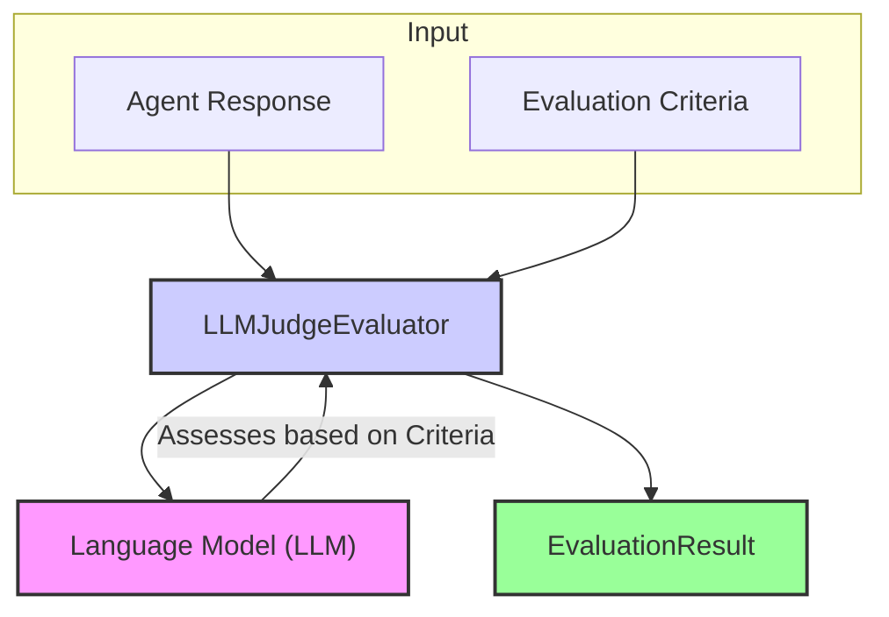

# LLM 裁判评估器（LLM-as-Judge Evaluator）

`LLMJudgeEvaluator` 利用大语言模型（LLM）的能力，对智能体输出做更细腻的**定性评估**。  
与只检查“是否匹配某个模式”的规则系统不同，LLM 裁判可以从连贯性、相关性、帮助程度、安全性、复杂指令的执行情况等多个维度来整体判断回复质量。在实践中，针对复杂智能体行为，LLM 裁判往往是捕捉“质量细节”不可或缺的工具。

## 核心流程

`LLMJudgeEvaluator` 会把智能体回复和评估指标作为输入，整理成一段发给指定 LLM 的 Prompt，并要求 LLM 依据每个指标给出**分数和理由**。评估器再解析这段结构化输出，生成最终的 `EvaluationResult`。



## 适用场景

`LLMJudgeEvaluator` 特别适合：

* 评价开放式文本回复的整体质量；  
* 检查智能体对复杂/细腻指令的执行情况；  
* 评估风格维度（语气、正式程度等）；  
* 识别简单规则难以发现的安全风险或有害内容；  
* 在语义层面将回复与标准答案（golden / ground truth）进行对比。

## 配置

配置 `LLMJudgeEvaluator` 时通常需要：

* 指定所用 LLM（模型名、provider 等）；  
* 为裁判 LLM 准备合适的 system prompt / 模板；  
* 决定如何向 LLM 表达各项评估指标。

```typescript
// Example configuration structure (to be detailed)
// {
//   type: 'LLMJudge',
//   llmConfig: { /* ... CoreLLM configuration ... */ },
//   judgePromptTemplate?: string, // Optional: Custom prompt template
//   // ... other LLM judge specific settings
// }
```

## 输出结构（`EvaluationResult`）

`LLMJudgeEvaluator` 会为它负责的每个指标产生一个 `EvaluationResult`：

* **`criterionName`**：被评估的指标名称；  
* **`score`**：LLM 给出的得分，通常在预设量表上（数值、Likert 等）；  
* **`reasoning`**：LLM 给出的打分理由——往往是最有价值的部分；  
* **`evaluatorType`**：固定为 `'LLMJudge'`；  
* **`error`**：如果调用 LLM 或解析结果出错，会在此填充。

该评估器提供了一种更接近人工评审的方式，用来补充规则评估等确定性方法。 