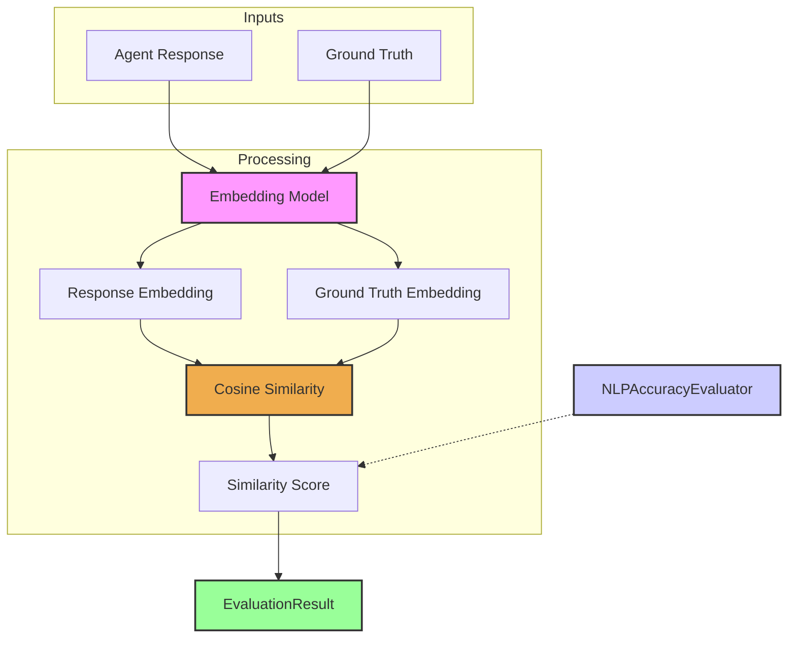

# NLP 准确率评估器（NLP Accuracy Evaluator）

`NLPAccuracyEvaluator` 用于度量智能体回复与标准答案（ground truth）之间的**语义相似度**。  
在很多场景下，字面是否完全一致并不重要，更关键的是“表达的意思是否一致”。在问答、摘要等需要语义理解的任务中，基于语义的评估往往比纯词面匹配更有价值。

典型做法是：先为回复和标准答案分别生成 Embedding（向量表示），再计算它们之间的余弦相似度；相似度越高，语义越接近。

## 核心流程

`NLPAccuracyEvaluator` 接收智能体回复与 ground truth 文本作为输入，使用指定的 Embedding 模型分别生成向量，然后计算它们的余弦相似度，得到一个量化语义接近程度的分数，这个分数就是 `EvaluationResult` 的核心。



## 适用场景

`NLPAccuracyEvaluator` 非常适合：

* 评估问答系统中答案的相关性与准确性；  
* 将生成的摘要与参考摘要做对比；  
* 度量回复在多大程度上捕捉了目标文本的含义；  
* 对不同表述是否在语义上等价进行比较。

## 配置

配置该评估器时，主要是声明 Embedding 的生成方式：

*   The embedding model to use (via `CoreLLM` or a dedicated embedding service configuration).
*   Potentially, parameters for the embedding generation.

```typescript
// Example configuration
// NOTE: The `embeddingAdapter` needs to be an instance of a class
// that implements the `EmbeddingAdapter` interface.
// The instantiation below is conceptual.
// You would typically import and configure a specific adapter (e.g., for OpenAI, Google, etc.).

// Conceptual: const myOpenAIAdapter = new OpenAIEmbeddingAdapter({ apiKey: 'YOUR_API_KEY', model: 'text-embedding-ada-002' });
// Conceptual: const myGoogleAdapter = new GoogleEmbeddingAdapter({ apiKey: 'YOUR_API_KEY', model: 'embedding-001' });

// Example using a conceptual adapter instance:
{
  type: 'NLPAccuracy',
  criterionName: 'SemanticClosenessToAnswer',
  // embeddingAdapter: myOpenAIAdapter, // Pass the instantiated adapter
  embeddingAdapter: {} as any, // Placeholder for a real adapter instance in a real setup
  sourceTextField: 'response',       // Text to evaluate (e.g., agent's answer)
  referenceTextField: 'groundTruth', // Text to compare against (e.g., ideal answer)
  similarityThreshold: 0.75          // Optional: score >= this is considered a pass
}
```

## 输出结构（`EvaluationResult`）

`NLPAccuracyEvaluator` 的输出包括：

* **`criterionName`**：通常为 `"SemanticSimilarity"`、`"NLPAccuracy"` 等；  
* **`score`**：数值分数（通常在 0–1 或 -1–1 区间，取决于余弦相似度），值越大语义越相近；  
* **`reasoning`**：可包含实际相似度值、是否做过缩放、以及 Embedding 过程说明；  
* **`evaluatorType`**：固定为 `'NLPAccuracy'`；  
* **`error`**：在生成 Embedding 或计算相似度时出错时填充。

该评估器可以量化“智能体是否真正理解并复现了目标含义”，是衡量高级智能体表现的重要一环。 