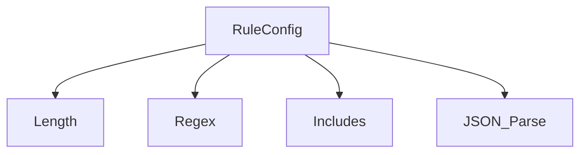

# 规则评估器（Rule-Based Evaluator）

`RuleBasedEvaluator` 为智能体输出提供一组**成本极低但非常关键的基础检查**。  
目的很直接：在**不调用 LLM** 的前提下，对回复施加确定性的约束与验证。实践表明，越早建立这些“硬护栏”，越容易获得可预期的智能体行为。

可以把它视作“第一道防线”：  
回复是否满足最小长度？是否包含必须的关键词？结构是否合法？这些虽然不是复杂语义判断，却能迅速过滤掉大量基础错误。

## 适用场景

该评估器特别适用于：

* **格式校验**：确保输出为合法 JSON、满足长度上下限、或匹配指定正则；  
* **关键词约束**：验证是否包含/不包含某些关键术语、产品名或标识符；  
* **基础安全/合规**：拦截包含黑名单词汇的回复（更细粒度可交给 `ToxicityEvaluator`）；  
* **简单指令遵循**：例如检查是否按要求包含某个短语。

它的特性是**快、便宜且确定性强**，非常适合作为高频运行、甚至集成到 CI/CD 流水线中的基础检查。

## 配置

在 `EvaluationRunConfig.evaluatorConfigs` 中加入如下配置即可启用 `RuleBasedEvaluator`：

```typescript
// In your EvaluationRunConfig
{
  // ... other evaluator configs
  {
    type: 'RuleBased';
    rules: EvaluationRule[]; // Array of rules to apply
  },
  // ... other evaluator configs
}
```

配置的核心在于 `rules` 数组，其中包含若干 `EvaluationRule`：

### `EvaluationRule` 接口

每条规则会把一次检查与某个评估指标绑定：

```typescript
interface EvaluationRule {
  /** The name of the criterion this rule evaluates (must match a name in EvaluationInput.criteria). */
  criterionName: string;
  /** The specific configuration defining the check to perform. */
  config: RuleConfig;
}
```

### `RuleConfig` 联合类型

`EvaluationRule.config` 决定了实际要执行的检查，是以 `type` 为鉴别字段的联合类型：



**通用可选字段：**

* `sourceField?: 'response' | 'prompt' | 'groundTruth' | string;`  
  - 指定从 `EvaluationInput` 的哪个字段读取文本；  
  - 默认值为 `'response'`；  
  - 嵌套字段可使用点号，如 `'context.extractedData'`。若字段不存在或非字符串，则该规则通常视为失败。

**支持的规则类型：**

1. **`length`**：检查 `sourceField` 的字符串长度：
    ```typescript
    type LengthRuleConfig = {
      type: 'length';
      min?: number; // Minimum allowed length (inclusive)
      max?: number; // Maximum allowed length (inclusive)
      sourceField?: string; 
    };
    ```
    *Example:* `{ type: 'length', min: 10, max: 150, sourceField: 'response' }`

2. **`regex`**：检查 `sourceField` 是否匹配给定正则：
    ```typescript
    type RegexRuleConfig = {
      type: 'regex';
      pattern: string; // The regex pattern (as a string)
      flags?: string; // Optional regex flags (e.g., 'i' for case-insensitive)
      sourceField?: string;
    };
    ```
    *Example:* `{ type: 'regex', pattern: '^\{.*\}$', flags: 's', sourceField: 'response' }` (Checks if response is a JSON object)

3. **`includes`**：检查 `sourceField` 中关键词的出现情况：
    ```typescript
    type IncludesRuleConfig = {
      type: 'includes';
      keywords: string[]; // Array of keywords to check for
      caseSensitive?: boolean; // Defaults to false
      expectedOutcome: 'any' | 'all' | 'none'; // 'any': at least one keyword present, 'all': all keywords present, 'none': no keywords present
      sourceField?: string;
    };
    ```
    *Example:* `{ type: 'includes', keywords: ['AgentDock', 'API key'], caseSensitive: true, expectedOutcome: 'all', sourceField: 'response' }`

4. **`json_parse`**：检查 `sourceField` 是否为可解析的 JSON 字符串：
    ```typescript
    type JsonParseRuleConfig = {
      type: 'json_parse';
      sourceField?: string;
    };
    ```
    *Example:* `{ type: 'json_parse', sourceField: 'response' }`

### 配置示例

下面示例展示如何为两个指标 `IsConcise` 与 `MentionsProductName` 配置 `RuleBasedEvaluator`：

```typescript
import type { EvaluationRunConfig, EvaluationRule, RuleConfig } from 'agentdock-core';

// Assume EvaluationInput.criteria includes criteria named 'IsConcise' and 'MentionsProductName'

const ruleBasedRules: EvaluationRule[] = [
  {
    criterionName: 'IsConcise',
    config: {
      type: 'length',
      max: 200,
      // sourceField defaults to 'response'
    } as RuleConfig, // Type assertion sometimes helpful
  },
  {
    criterionName: 'MentionsProductName',
    config: {
      type: 'includes',
      keywords: ['AgentDock Framework'],
      caseSensitive: false,
      expectedOutcome: 'any'
    } as RuleConfig,
  },
];

const runConfig: EvaluationRunConfig = {
  evaluatorConfigs: [
    // ... other evaluators
    {
      type: 'RuleBased',
      rules: ruleBasedRules,
    },
  ],
  // ... other config properties
};
```

## 输出结构（`EvaluationResult`）

`RuleBasedEvaluator` 会为每一条 `EvaluationRule`（且其 `criterionName` 存在于 `EvaluationInput.criteria` 中）生成一个 `EvaluationResult`：

* **`criterionName`**：来自对应的 `EvaluationRule`；  
* **`score`**：规则检查通过为 `true`，否则为 `false`；  
* **`reasoning`**：简单说明规则类型与检查结果（如 “Rule length passed” / “Rule regex failed”）；  
* **`evaluatorType`**：固定为 `'RuleBased'`；  
* **`error`**：仅在规则本身处理出错（例如配置了非法正则）时填充，普通规则失败不会写入这里。

虽然该评估器不涉及语义理解或复杂推理，但它提供了**高性价比的基础护栏**，对于保证系统稳定与输出质量非常重要。 