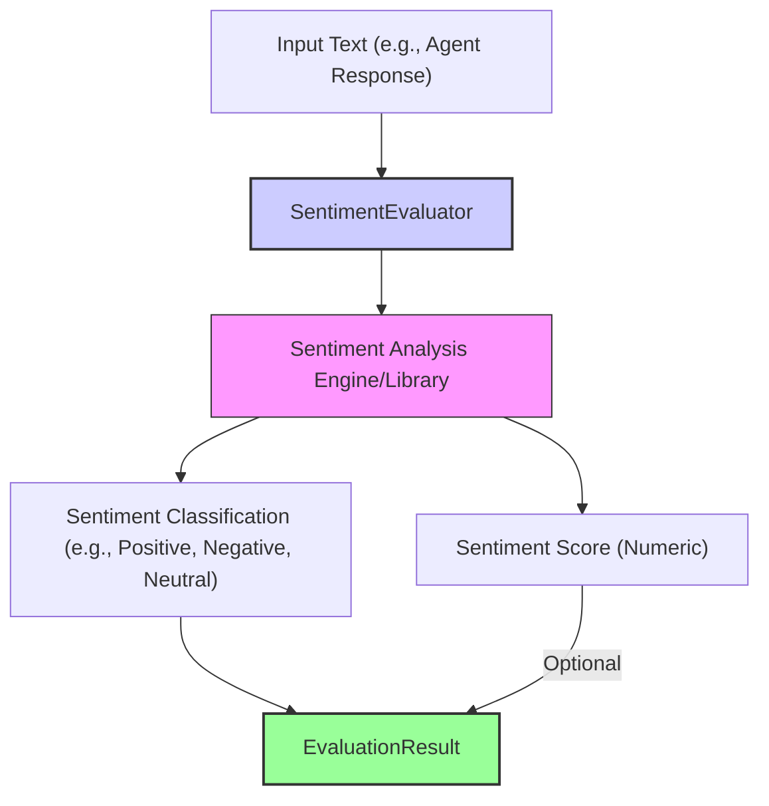

# 情感评估器

`SentimentEvaluator` 用于分析给定文本的情绪/情感基调，通常会将其分类为正向、负向或中性。它也可能输出一个数值分数，用来表示情感强度。这对于确保智能体保持合适语气、或标记“过于负面/过于正面”的回复非常有帮助。实践中，它是检查智能体“表达风格/情绪状态”的一个很好的第一道关卡。

它通常依赖预训练的情感分析模型或现成库（例如 VADER、AFINN 等）。

## 核心工作流

`SentimentEvaluator` 使用底层情感分析引擎/库来处理输入文本（例如智能体回复）。分析通常会得到一个类别结果（正向/负向/中性）和/或一个数值型情感分数，然后将这些结果写入 `EvaluationResult`。



## 使用场景

`SentimentEvaluator` 常见用途包括：

* 监控智能体回复的整体语气（例如确保友好、避免攻击性表达）。
* 标记可能需要人工介入审核的对话（例如出现强烈负面情绪的客服场景）。
* 分析用户反馈中的情绪内容。
* 确保营销文案或智能体人格与期望的情绪画像一致。

## Configuration

配置通常包括：

* `sourceField`：指定从 `EvaluationInput` 的哪个字段读取要分析的文本（默认 `'response'`）。
* 如果支持多种情感分析引擎/模型，可能还可选择具体模型或向底层库传参。

```typescript
// Example configuration structure (to be detailed)
// {
//   type: 'Sentiment',
//   sourceField: 'response.text',
//   // modelConfig: { /* optional: specify model or library params */ }
// }
```

## Output (`EvaluationResult`)

`SentimentEvaluator` 产生的 `EvaluationResult` 通常包含：

* **`criterionName`**：反映情感检查项（例如 `"ResponseSentiment"`）。
* **`score`**：可以是类别标签（例如 `"positive"`/`"negative"`/`"neutral"`），也可以是数值分数（例如 -1 到 1）。
* **`reasoning`**：若主 `score` 为类别标签，可能会补充原始数值分数；也可能包含对情绪影响最大的词列表。
* **`evaluatorType`**：`'Sentiment'`。
* **`error`**：用于表示读取文本失败或底层情感分析引擎出错等问题。

该评估器提供了一种快速衡量文本情绪基调的方法，而这在“人机交互”的体验与安全性中非常重要。