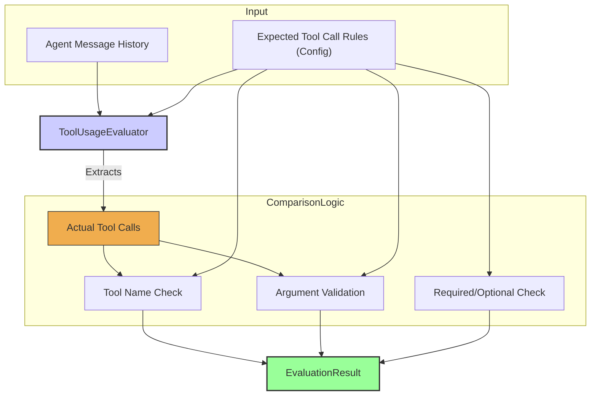

# 工具使用评估器（Tool Usage Evaluator）

`ToolUsageEvaluator` 用于评估智能体调用工具是否正确。在现代智能体系统中，**稳定、准确地使用工具**至关重要。  
该评估器会检查智能体是否调用了正确的工具、是否传入了正确的参数，以及调用方式是否符合预期。实践表明，工具调用经常是故障高发点，因此在这一环节做系统化评估非常关键。

评估器通常会遍历 `EvaluationInput.messageHistory`，从中找到工具调用消息，并与预先定义的“工具调用期望规则”进行对比。

## 核心流程

`ToolUsageEvaluator` 会处理智能体的消息历史，识别出实际发生的工具调用，并与配置中提供的期望调用规则对比。  
对比内容通常包括：

- 工具名称是否匹配；  
- 传入参数是否符合要求；  
- 本次工具调用是“必须”还是“可选”，是否满足约束；  

这些检查的结果会最终体现在对应的 `EvaluationResult` 中。



## 适用场景

`ToolUsageEvaluator` 特别适合：

* 验证某个关键工具是否被正确调用；  
* 确认工具参数有效（类型正确、范围合理、满足正则等）；  
* 检查不该调用工具的场景是否被错误调用；  
* 校验调用顺序或调用次数是否符合预期；  
* 在更复杂场景下，配合其他评估器确认工具返回的数据是否被正确使用。

## 配置

配置主要是定义对工具使用的期望：

*   A list of expected tool calls, including the tool `name`.
*   For each expected tool call, validation rules for its `arguments`.
*   Rules for whether a tool call is `required` or `optional`.
*   Potentially, checks for the `order` or `frequency` of calls.

```typescript
// Example configuration
{
  type: 'ToolUsage',
  criterionName: 'CorrectToolUse',
  expectedToolCalls: [
    {
      toolName: 'search_knowledge_base',
      required: true,
      argumentChecks: {
        'query': (value: any) => typeof value === 'string' && value.length > 0,
        'max_results': (value: any) => typeof value === 'number' && value > 0 && value <= 10
      }
    },
    {
      toolName: 'send_email',
      required: false,
      argumentChecks: {
        'recipient': (value: any) => typeof value === 'string' && /^[^\s@]+@[^\s@]+\.[^\s@]+$/.test(value),
        'subject': (value: any) => typeof value === 'string' && value.length > 0
      }
    }
  ]
}
```

## 输出结构（`EvaluationResult`）

`ToolUsageEvaluator` 会针对与工具使用相关的指标生成 `EvaluationResult`：

* **`criterionName`**：可以是针对某个具体工具（例如 `"CorrectlyCalled_example_tool"`），也可以是更通用的名称（如 `"ValidToolArguments"`）；  
* **`score`**：通常是布尔值（通过为 `true`，否则为 `false`）或表示正确程度的数值；  
* **`reasoning`**：说明检查通过/失败的原因（如 “Tool 'example_tool' not called”、“Argument 'arg2' for tool 'example_tool' was not positive”）；  
* **`evaluatorType`**：固定为 `'ToolUsage'`；  
* **`error`**：仅在评估过程中本身出现异常时填充，而不是用来表示普通规则失败。

正确使用工具是高质量智能体行为的基石，而该评估器则提供了一种**系统化验证工具调用**的方式。 