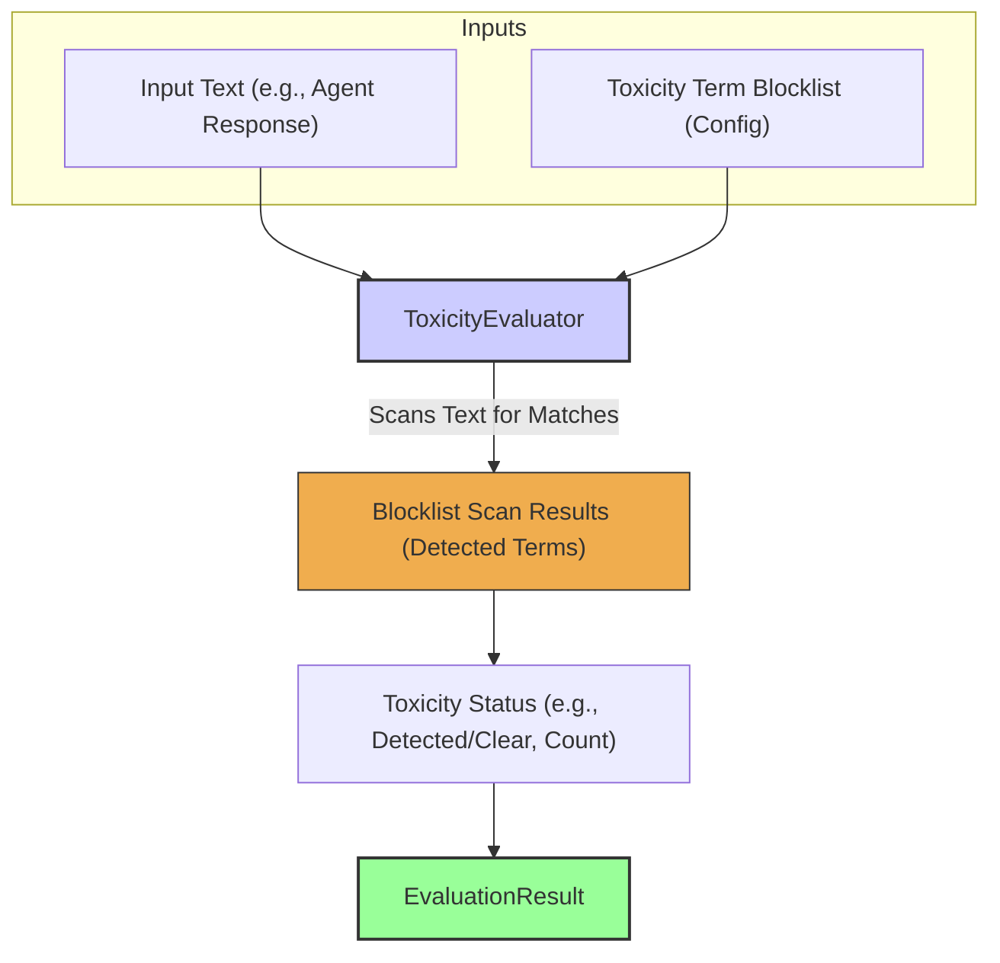

# 毒性评估器

`ToxicityEvaluator` 会基于黑名单（blocklist）扫描文本中是否出现预定义的有害词、冒犯性语言或其它不希望出现的内容。这是一项基础的安全检查，用于帮助确保智能体不会输出有害或不适当的回复。实践经验强调：即便是最基础的黑名单检测，也应当作为负责任的智能体上线部署的第一道防线。

## 核心工作流

`ToxicityEvaluator` 将输入文本（例如智能体回复）与配置的有害词/模式黑名单进行对比，扫描是否存在匹配项。根据扫描结果，它会生成一个“毒性状态”（例如是否检测到有害词，或检测到的数量），并以此作为 `EvaluationResult` 的基础。



## 使用场景

`ToxicityEvaluator` 主要用于：

* 标记包含冒犯性或不适当语言的智能体回复。
* 确保符合内容策略（例如禁止出现某些词/短语）。
* 如果智能体需要以较敏感的方式处理用户输入，也可用于对用户输入做基础安全筛查（不过评估器直接用于此场景相对少见）。

## Configuration

配置通常包括：定义有害词列表以及匹配行为：

* `blockList`：字符串或正则表达式数组，表示有害词/模式。
* `caseSensitive`：是否区分大小写，布尔值，默认 `false`。
* `matchWholeWord`：是否按“整词”匹配，避免在无害词中误报子串。
* `sourceField`：指定从 `EvaluationInput` 的哪个字段读取要检查的文本（默认 `'response'`）。

```typescript
// Example configuration structure (to be detailed)
// {
//   type: 'Toxicity',
//   blockList: ['offensive_word1', 'another_bad_phrase', '^regex_pattern_for_toxicity$'],
//   caseSensitive: false,
//   matchWholeWord: true,
//   sourceField: 'response'
// }
```

## Output (`EvaluationResult`)

`ToxicityEvaluator` 产生的 `EvaluationResult` 通常包含：

* **`criterionName`**：反映毒性检查项（例如 `"IsNonToxic"`）。
* **`score`**：通常为布尔值（未发现有害词时为 `true`，发现时为 `false`），或为检测到的有害词数量。
* **`reasoning`**：说明检测到了哪些有害词（如果有）。
* **`evaluatorType`**：`'Toxicity'`。
* **`error`**：用于表示配置错误或读取文本失败等问题。

该评估器提供了一种基于明确规则集来直接识别并标记潜在有害内容的机制。