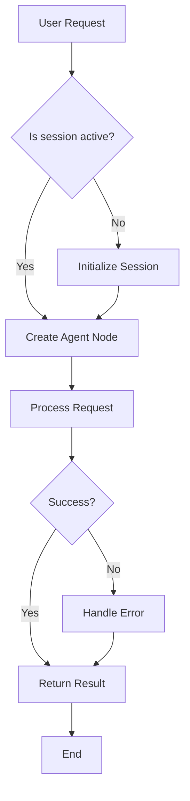
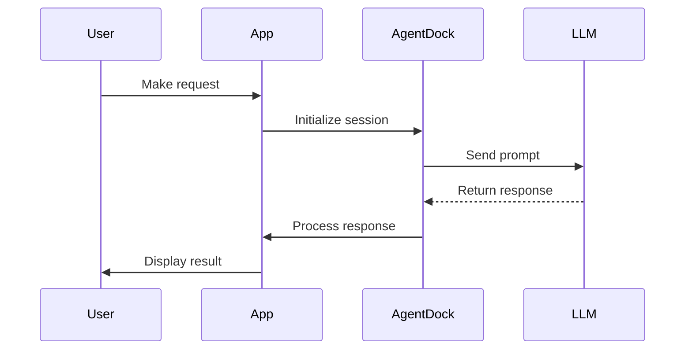
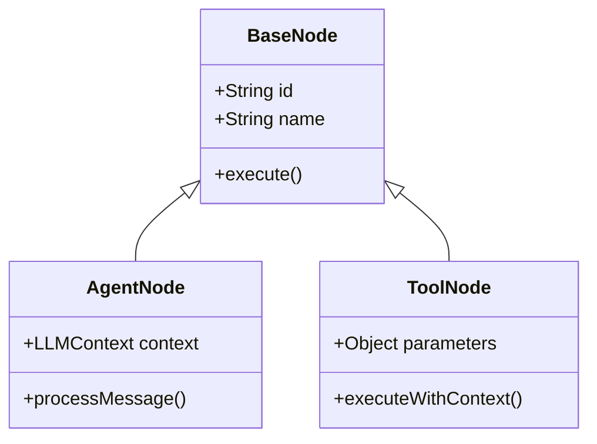
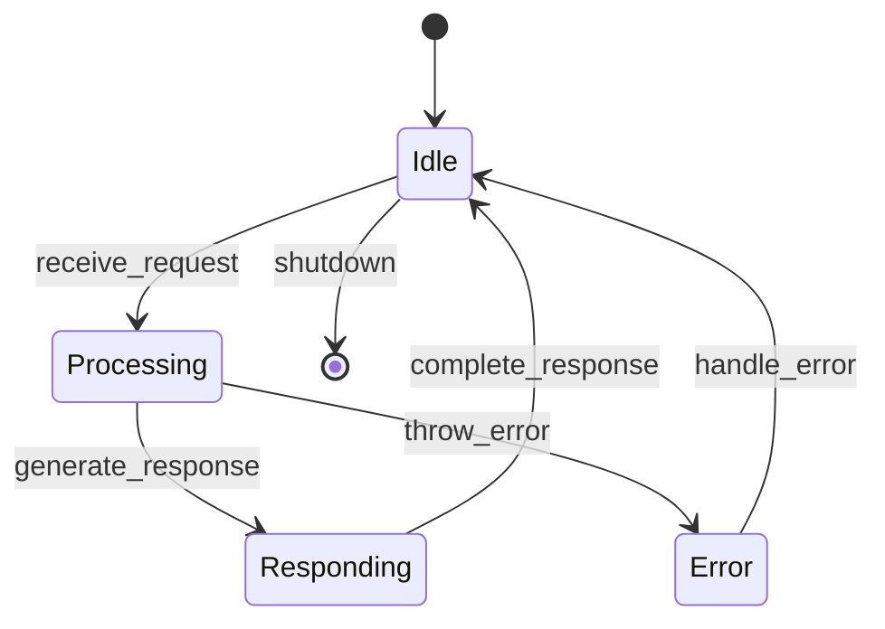
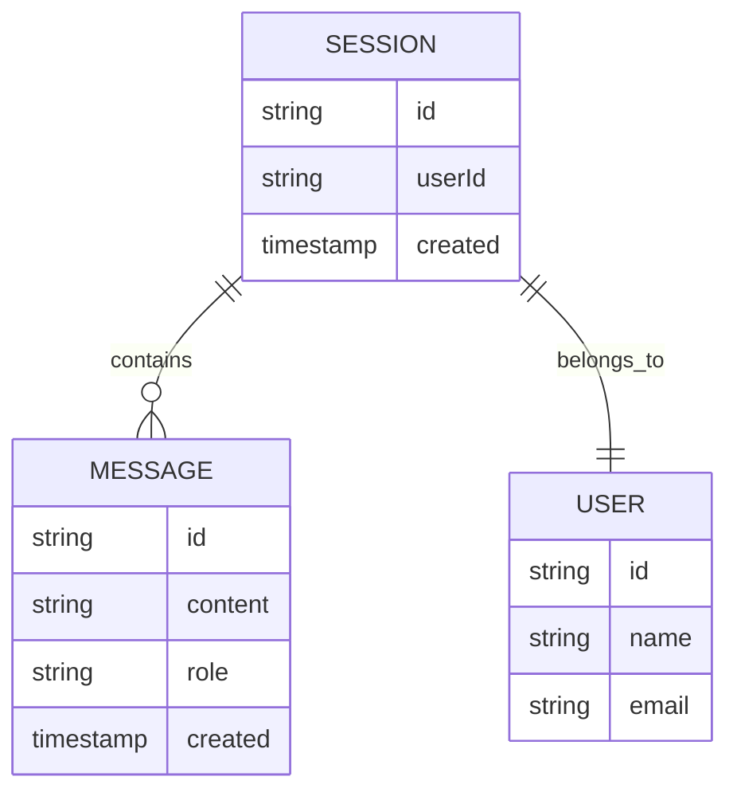
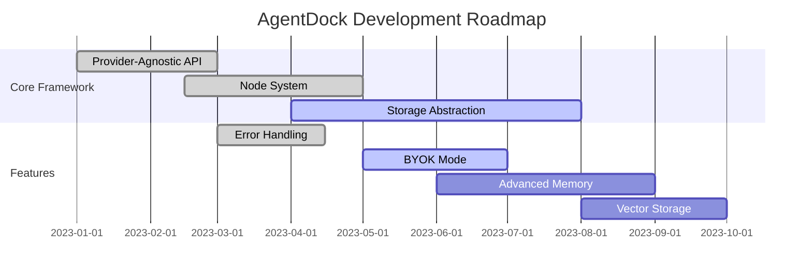
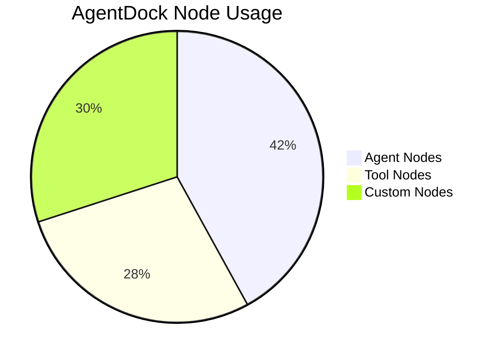
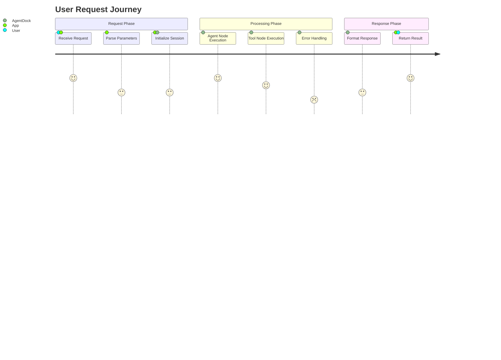
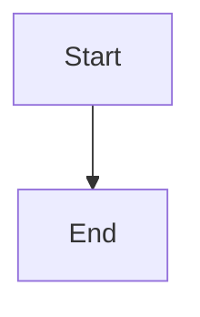

# 开源客户端中的图表示例

本页演示如何在 AgentDock 开源客户端中使用 Mermaid 创建并渲染多种类型的图表。这些示例可用于可视化你在使用 AgentDock 构建应用时的架构、工作流与组件等不同方面。

## AgentDock 架构流程图



## 请求时序图



## AgentDock Core 类图



## AgentDock 状态图



## AgentDock 数据模型 ER 图



## AgentDock 开发路线图



## 节点分布图



## 用户旅程图



## 在你的应用中添加图表

这些图表展示了 AgentDock 开源客户端支持的可视化能力，便于你在构建应用时呈现复杂概念。要在应用的任意 Markdown 内容中添加 Mermaid 图表，可以使用如下语法：

```


更多 Mermaid 语法请参考 [Mermaid 官方文档](https://mermaid.js.org/syntax/flowchart.html)。

## 开源客户端渲染

AgentDock 开源客户端内置 Mermaid 渲染支持，并可在浅色/深色模式下自动渲染。你可以直接把这些示例作为模板，用于在基于 AgentDock 的应用中可视化组件与工作流。