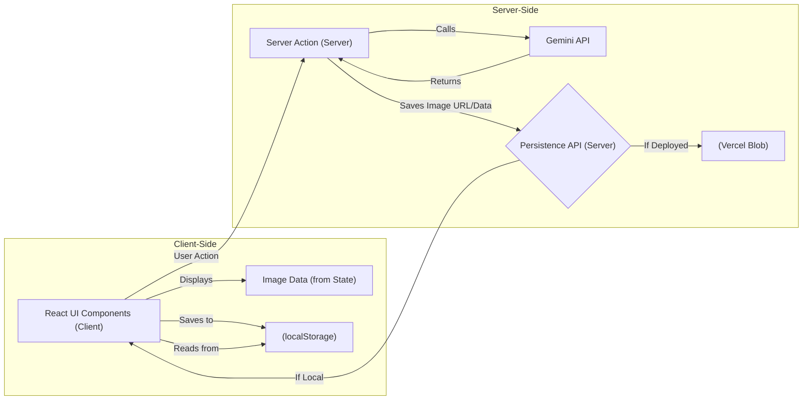

# 图像生成

AgentDock 开源客户端包含一个独立的图像生成功能，用于演示如何将高级 AI 能力集成到基于 AgentDock Core 构建的应用中。

## 概览

图像生成页面提供了一个功能完整的界面，利用 Gemini 的多模态能力来创建与编辑图像。它展示了开源客户端如何在基础聊天之外，进一步实现更丰富的 AI 体验。

## 关键特性

- **文生图（Text-to-Image）**：根据文本提示生成图像
- **图像编辑**：上传并修改已有图像
- **图像图库**：查看与管理历史生成的图像
- **响应式设计**：适配移动端与桌面端
- **与聊天集成**：可从聊天中发送图像到图像页继续编辑

## 实现细节

图像生成功能在开源客户端中作为独立页面实现，展示了以下要点：

1. **客户端-服务端架构**：
   - 客户端 UI 组件负责上传图像、输入提示词、展示结果
   - 服务端 Action 负责调用 Gemini 进行图像生成

2. **有状态 UI**：
   - 使用本地状态管理图像数据与生成流程
   - 进度提示与错误处理

3. **API 集成**：
   - 直接接入 Gemini 多模态能力
   - 图像持久化 API 结合：
       - **Vercel Blob：** 部署到 Vercel 时用于存储图像 URL
       - **浏览器 `localStorage`：** 本地运行时用于存储图像数据（如 base64 或 URL），提供开发阶段的临时持久化

4. **UI 组件**：
   - `ImageUpload`: Handles image file selection and preview
   - `ImagePromptInput`: Provides an interface for entering generation prompts
   - `ImageResultDisplay`: Shows generation results with download/share options
   - `ImageGallerySkeleton`: Loading state for the image gallery

## 技术架构

图像生成功能体现了以下关键模式：

**关键流程：**
1. UI 组件触发服务端 action 进行生成；
2. 服务端 action 调用 Gemini API；
3. 服务端 action 通过持久化 API 路由（`/api/images/store/add`）保存生成结果的图像 URL（部署时来自 Vercel Blob），或将数据返回客户端；
4. 客户端接收图像 URL/数据，并将其写入 `localStorage` 以便本地开发时持久化，同时更新 UI 状态。

## 使用示例

1. 打开“图像生成”页面
2. 输入描述目标图像的文本提示词
3. 可选：上传一张已有图片用于修改
4. 点击 “Generate” 生成图像
5. 查看、下载或继续编辑生成结果
6. 在图库中查看历史生成的图像

## 与 AgentDock Core 的集成

该功能展示了开源客户端如何扩展 AgentDock Core 的能力：

1. 利用 Provider-agnostic API 设计接入 Gemini
2. 为多模态交互实现专用 UI 组件
3. 为复杂 AI 工作流管理状态与持久化
4. 提供一个“高级 AI 功能”的完整参考实现

## 未来增强

图像生成功能未来可能的增强包括：

- 支持更多图像生成模型
- 增强图像编辑能力
- 与应用的其他模块更深度集成
- 支持负面提示词（negative prompting）等高级提示词技巧
- 对生成图像进行合集与组织管理