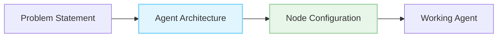

# AGENT 招募（RFA）

> 使用 AgentDock 的节点式架构构建强大的 AI 智能体

## 什么是 RFA？

Requests For Agents（RFA）是一套面向真实世界问题的智能体“需求规格说明”。每个 RFA 都会提供清晰的问题描述、基于 AgentDock 节点系统的实现指导，以及帮助你构建高质量智能体的相关资源。

## Browse RFAs

- [RFA-001：代码审查智能体](/docs/rfa/agents/2025/April/001-code-reviewer)

## 为什么要做这些智能体？

- **解决真实问题**：每个智能体都面向实际用户需求
- **展示你的能力**：优秀实现可能会在我们的 Showcase 中展示
- **加入社区**：与其他构建者交流协作
- **获得奖励**：被选中的实现可能获得特别认可
- **积累作品集**：打造具备真实影响力的系统

## 非开发者也能参与

不是开发者？你依然可以使用 **AgentDock Pro**（可视化智能体构建器）在无需写代码的情况下创建这些智能体：通过直观的拖拽界面与自然语言指令即可实现任意 RFA。

[了解更多：AgentDock Pro →](/docs/agentdock-pro)
