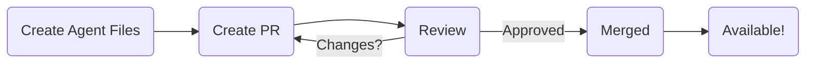

# 贡献社区智能体

AgentDock 欢迎社区贡献有趣且有价值的新智能体！本文将说明如何把你的智能体添加到公开的 `/agents` 目录中，以便有机会在开源客户端中展示并分享给更多人使用。

## 贡献目标

`/agents` 目录是一个公共的、预配置的智能体模板仓库。将你的智能体贡献到这里，能够让其他人更容易发现并在开源客户端中直接使用，或将其作为自己项目的灵感参考。

## 贡献流程

## 贡献步骤

1.  **Create Your Agent Locally:**
    *   按照 [快速上手](../getting-started.md#creating-your-first-agent) 中的步骤创建你的智能体。
    *   这通常意味着在 `/agents/<your-agent-name>/` 下新建一个目录。
    *   在该目录中，你**必须**包含：
        *   `template.json`：核心配置文件，用于定义智能体的 LLM、提示词、工具、编排等。详见 [Agent Templates](../agent-templates.md)。
        *   `README.md`：清晰描述你的智能体用途与使用方式。

2.  **Write a Great `README.md`:**
    *   清楚说明智能体做什么、解决什么问题。
    *   提供示例提示词或用例。
    *   列出所需工具（尤其是自定义工具）。
    *   写明用户需要提供的环境变量或 API Key（例如搜索工具可能需要 `SERPER_API_KEY`）。
    *   内容尽量精炼、格式清晰。

3.  **Add Custom Tools (If Necessary):**
    *   如果你的智能体需要现有工具不具备的能力，你可能需要实现自定义工具。
    *   自定义工具会以节点（node）的形式实现，通常位于 `agentdock-core/src/nodes`（如果在主仓库内开发，常见路径为 `/src/nodes`）。
    *   实现细节参见 [节点系统概览](../nodes/README.md) 与 [自定义工具开发](../nodes/custom-tool-development.md)。
    *   请确保你贡献的自定义工具有合理测试，并遵循项目编码规范。

4.  **Submit a Pull Request (PR):**
    *   在 GitHub 上 Fork AgentDock 主仓库。
    *   为你的贡献创建一个新分支。
    *   将你的智能体目录（`/agents/<your-agent-name>/`）以及（如有）自定义节点代码（`/src/nodes/...`）提交到该分支。
    *   使用清晰的 commit 信息提交变更。
    *   Push 分支到你的 Fork 仓库。
    *   向 AgentDock 主仓库发起 Pull Request。
    *   在 PR 描述中简要说明你的智能体做什么、为什么值得加入。

## 接收标准

为了提高被接受的概率，建议满足以下要求：

- **目标清晰：** 智能体功能明确且有实际价值。
- **README 质量：** `README.md` 清晰、完整且准确。
- **模板配置合理：** `template.json` 格式正确，并定义出合理的智能体配置。
- **功能可用：** 在用户提供必要 API Key 的前提下，智能体应如描述般工作。
- **独特性/价值：** 智能体应有差异化亮点，或展示有趣用例/配置模式；简单的微小变体通常较难被收录，除非体现了特定技巧。
- **代码质量（如含自定义工具）：** 自定义工具/节点需符合项目规范、具备基本测试，并与智能体功能相关。
- **PR 干净：** Pull Request 聚焦、提交历史清晰、描述明确。

感谢你为 AgentDock 社区做出的贡献！