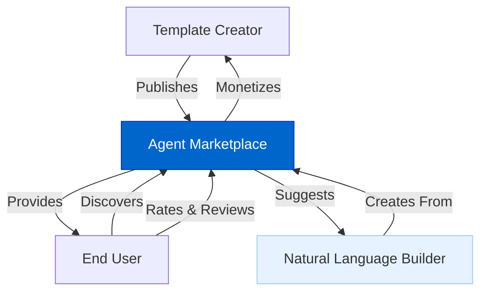
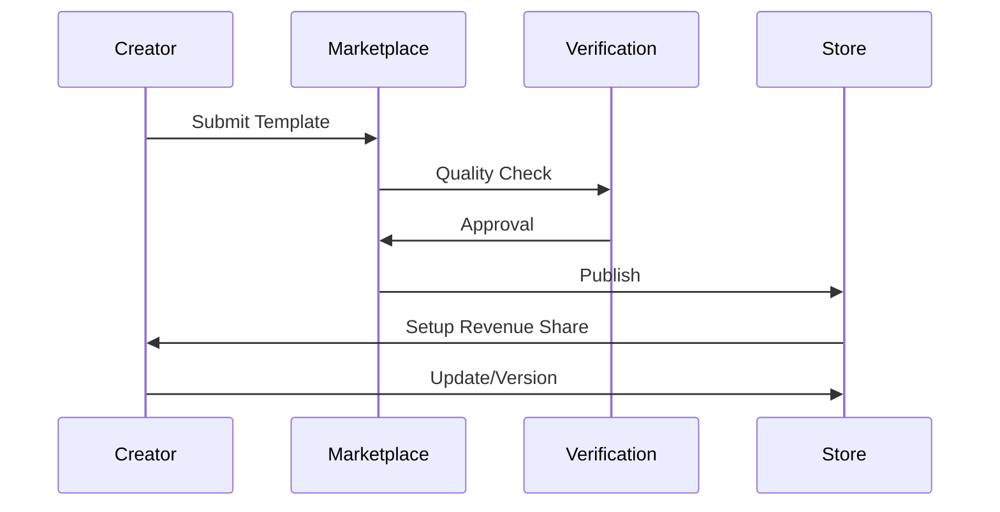
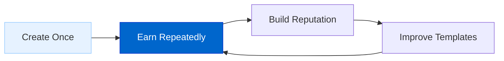
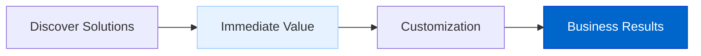
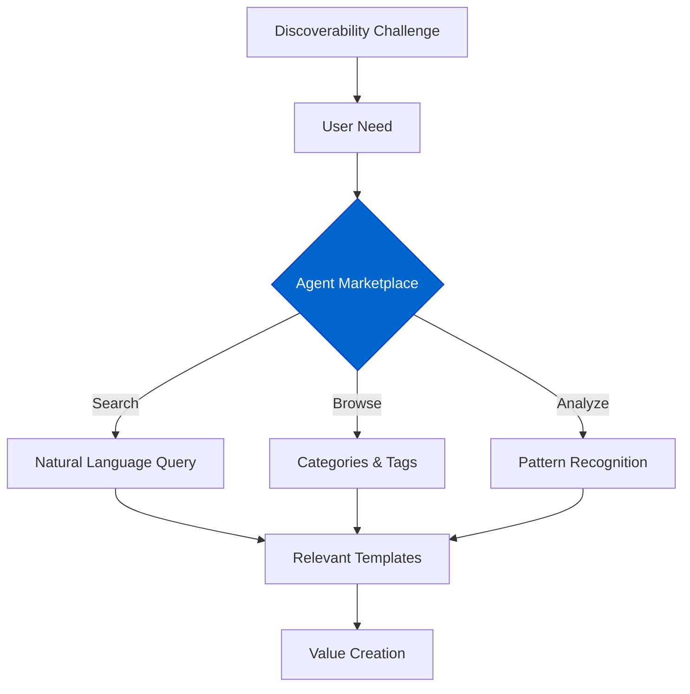
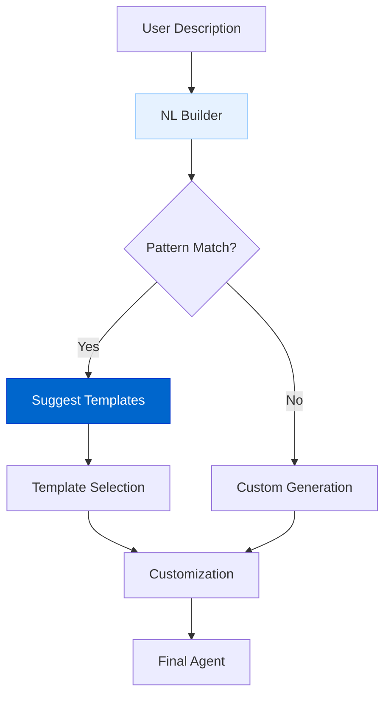

# Agent 市场（Agent Marketplace）

Agent 市场用于让创作者发布、分发并商业化自己的智能体模板与工作流，同时帮助用户发现适合自身需求的高质量方案。

## 当前状态

**状态：规划中（Planned）**

Agent 市场目前处于设计阶段，计划在自然语言智能体构建器之后推进实现。

## 功能概览

Agent 市场将提供：

- **模板发布**：发布智能体模板与工作流供他人使用；  
- **持续收益**：他人使用模板时创作者获得持续收入；  
- **发现系统**：按需求快速找到合适模板；  
- **质量评分**：社区驱动的评分与反馈；  
- **版本管理**：在保持兼容的前提下更新模板；  
- **与 NL Builder 集成**：与自然语言智能体构建器无缝衔接。

## 架构图

### 市场生态

### 发布流程

## 实现细节

Agent 市场计划通过以下模块实现：

### 1. 模板发布系统

创作者可以在发布前完善并提交模板：

- **元数据**：补充描述、分类、用法示例；  
- **版本管理**：控制更新并保持兼容性；  
- **文档工具**：为使用者提供清晰的使用说明；  
- **数据面板**：监控使用量与收益。

### 2. 发现引擎

帮助用户找到合适模板：

- **智能搜索**：支持自然语言检索；  
- **分类导航**：按场景/行业/功能浏览；  
- **推荐系统**：基于需求的 AI 推荐；  
- **相似模板**：对比不同方案；  
- **过滤器**：按特性、评分、热度筛选。

### 3. 商业化框架

让创作者从作品中获得回报：

- **分成模型**：按使用费用分成；  
- **使用追踪**：透明的使用与结算；  
- **灵活定价**：按功能/用量设置价格档位；  
- **推广工具**：帮助模板触达更多用户；  
- **使用分析**：洞察模板的真实使用方式与效果。

## 对生态的价值

### 对模板创作者

1. **Monetize Expertise**: Turn specialized knowledge into recurring revenue
2. **Reach Users**: Access a broader audience than possible independently
3. **Focus on Quality**: Incentive to create better templates for higher earnings
4. **Build Reputation**: Establish yourself as an expert in specific domains
5. **Feedback Loop**: Gain insights from real-world usage to improve offerings

### 对终端用户

1. **Specialized Solutions**: Access templates built by domain experts
2. **Time Savings**: Skip building agents from scratch
3. **Quality Assurance**: Use templates vetted by the community
4. **Customization Options**: Adapt templates to specific needs
5. **Consistent Updates**: Benefit from ongoing improvements by creators

### 对 AgentDock 平台

1. **Expanded Ecosystem**: Growing library of specialized templates
2. **Network Effects**: More creators attract more users and vice versa
3. **Quality Incentives**: Economic rewards for the best templates
4. **Discoverability Solution**: Address the challenge of finding the right agent for specific needs
5. **Ecosystem Growth**: Sustainable model for continuous expansion

## 解决「发现难」问题

A key challenge in AI agent ecosystems is helping users find the right agent for their specific needs:

The Agent Marketplace addresses this challenge by:

1. **Natural Language Understanding**: Converting user needs into relevant template suggestions
2. **Pattern Analysis**: Identifying which templates work best for specific use cases
3. **Community Curation**: Leveraging ratings and reviews to surface quality options
4. **Usage Analytics**: Understanding which templates deliver results in real-world scenarios
5. **Integration with Builder**: Suggesting templates during natural language agent creation

## 典型用户旅程

### 模板创作者
An HR specialist creates an "Employee Onboarding Assistant" template that handles document collection, policy explanations, and IT setup requests. After publishing to the marketplace:

1. The template is discovered by HR departments across multiple organizations
2. Each usage generates revenue for the creator
3. Feedback helps the creator improve the template over time
4. The creator builds a reputation as an HR automation expert
5. The creator develops additional HR templates based on market demand

### 模板使用者
A small business owner needs to automate customer support:

1. Searches the marketplace for "customer support automation"
2. Discovers several templates with ratings and reviews
3. Selects a template that matches their specific needs
4. Customizes the template slightly for their brand voice
5. Deploys a production-ready customer support agent in minutes
6. The original template creator receives compensation

## 与自然语言智能体构建器的联动

The Marketplace and NL Builder work together to enhance the agent creation process:

When a user describes an agent they want to create:

1. The Natural Language Builder analyzes the description
2. Pattern matching identifies relevant marketplace templates
3. The user is offered template suggestions as starting points
4. The user can choose a template and customize it or create a custom solution
5. Template creators earn revenue when their templates are selected

## 时间线

| Phase | Description |
|-------|-------------|
| Design | Create marketplace architecture and economic model |
| Alpha | Limited template publishing with manual curation |
| Beta | Public template submissions with automated quality checks |
| Launch | Full monetization and integration with Natural Language Builder |
| Expansion | Advanced analytics and promotional tools for creators |

## 与其他路线图项的关系

- **Natural Language AI Agent Builder**: Direct integration for template suggestions
- **AgentDock Pro**: Enterprise marketplace features and private template repositories
- **Multi-Agent Collaboration**: Templates for agent networks and team compositions
- **Evaluation Framework**: Quality metrics for marketplace templates 