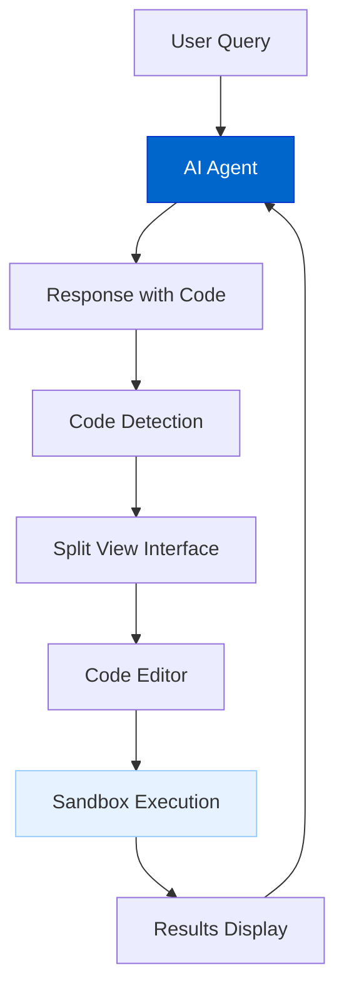
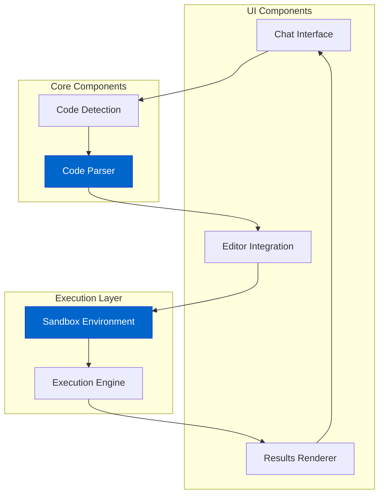
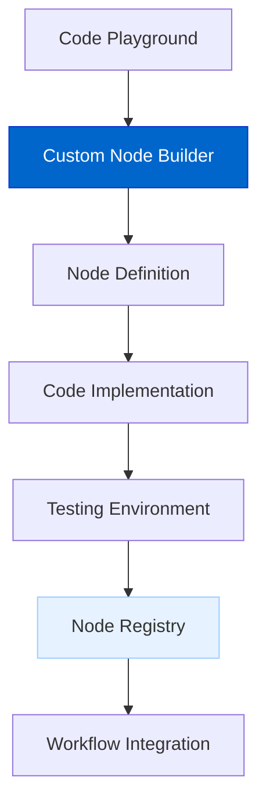
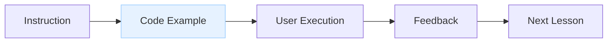
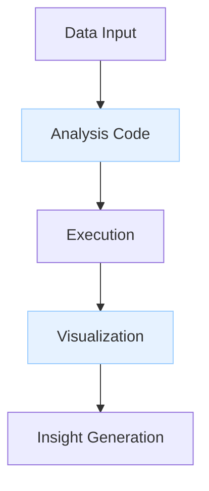
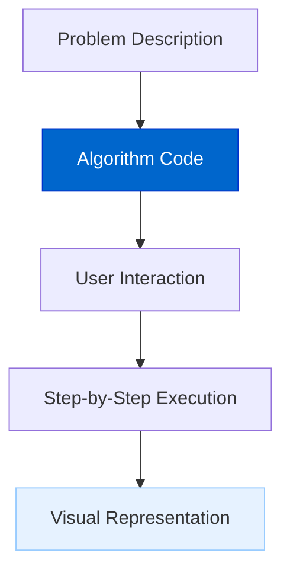
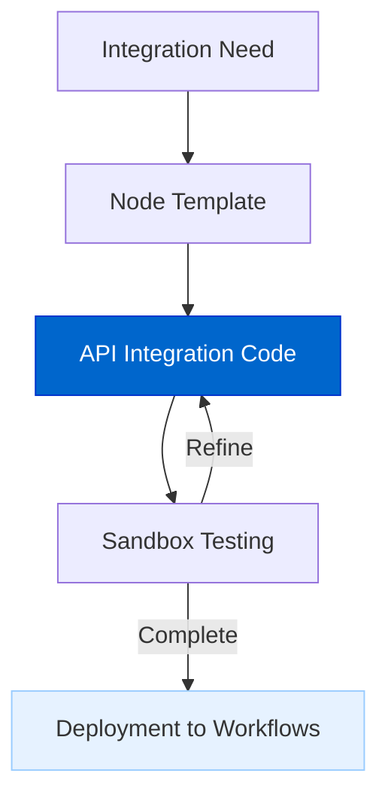

# 代码演练场（Code Playground）

代码演练场让 AI 智能体可以在聊天界面中**生成、执行并可视化代码**，为编码、调试和演示提供一体化体验。

## 当前状态

**状态：规划中（Planned）**

代码演练场目前处于设计阶段，计划在开源版（OSS）与 Pro 版中分别落地相应能力。

## 功能概览

代码演练场将提供：

- **对话内生成代码**：在回复中直接产出可运行代码；  
- **交互式执行**：无需离开聊天即可运行并查看结果；  
- **沙箱环境**：在隔离环境中安全执行代码；  
- **多语言支持**：JavaScript、TypeScript、Python 等；  
- **可视化渲染**：展示图表、表格与更丰富的可视化；  
- **调试辅助**：错误高亮与排查建议；  
- **版本追踪**：在对话过程中跟踪代码变更；  
- **自定义节点构建器**：在 Pro 中用于创建自定义集成节点，扩展平台能力。

## 架构图

### 用户体验流程



### 系统架构



## 实现细节

代码演练场计划通过以下模块实现：

### 1. Core 组件

在 `agentdock-core` 中增加代码解析与代码执行节点：

```typescript
// CodeExecutionNode：安全执行代码
class CodeExecutionNode extends BaseNode {
  async execute({ code, language, timeout = 5000 }) {
    // Execute code in sandbox environment
    // Return results with output/error
  }
}

// CodeParsingNode：从文本中解析代码块
class CodeParsingNode extends BaseNode {
  async execute({ text }) {
    // Parse code blocks from text
    // Return segmented content
  }
}
```

### 2. 沙箱集成

沙箱执行环境可基于 Sandpack 等方案实现：

- **隔离环境**：代码在安全的 iframe 中运行；  
- **资源限制**：防止死循环与过度资源占用；  
- **多语言**：支持 JS/TS/Python 等；  
- **依赖管理**：允许使用常见库与框架。

### 3. UI 实现

UI 侧提供无缝的代码交互体验：

- **分屏界面**：聊天与代码并排；  
- **代码编辑器**：语法高亮、自动补全；  
- **结果面板**：展示输出与可视化；  
- **错误处理**：高亮错误并给出修复建议；  
- **操作控件**：运行、重置、版本控制等。

## 自定义节点构建器（Custom Node Builder）

在 AgentDock Pro 中，一个关键能力是：在代码演练场内创建自定义集成节点，用于扩展平台能力：



### 创建自定义集成

自定义节点构建器可以帮助用户：

1. **构建服务连接器**：连接任意第三方 API / 服务；  
2. **定义自定义逻辑**：实现特定业务场景的专用逻辑；  
3. **扩展平台能力**：补齐内置节点未覆盖的功能；  
4. **打造组织专用工具**：为内部系统开发私有集成。

### 实现流程

```typescript
// Example of a custom integration node created in the Code Playground
export class CustomAPINode extends BaseNode {
  static nodeDefinition = {
    nodeType: 'custom-api-connector',
    title: 'My Custom API',
    description: 'Connects to my organization's API',
    paramSchema: CustomAPISchema
  };
  
  async execute(params) {
    // Connection to custom API
    // Data transformation
    // Error handling
    return processedResults;
  }
}
```

### 关键收益

- **无需外部开发环境**：在 AgentDock 内完成构建、测试与部署；  
- **即时验证**：在沙箱里用真实数据快速测试；  
- **部署更简单**：可直接注册到工作区；  
- **版本管理**：追踪变更并管理版本；  
- **共享**：可在组织内共享，或发布到市场。

## 使用场景

### 1. Interactive Tutorials

Create step-by-step coding tutorials with executable examples:



### 2. Data Analysis

Analyze data with code execution and visualization:



### 3. Algorithm Demonstration

Explain algorithms with interactive demonstrations:



### 4. Custom Integration Development

Build and test specialized integration nodes:



## 安全性考虑

The Code Playground implements several security measures:

1. **Sandboxed Execution**: All code runs in an isolated environment
2. **Resource Limits**: Execution is constrained by time and memory limits
3. **Restricted Access**: No file system or network access by default
4. **Input Validation**: Code is validated before execution
5. **Output Sanitization**: Results are sanitized before display
6. **Permission Controls**: Custom node capabilities restricted by user permissions

## 与 AgentDock 的集成

The Code Playground integrates with the existing AgentDock architecture:

1. **Node Integration**: Added as specialized nodes in the NodeRegistry
2. **Agent Template**: Specialized template for code-focused agents
3. **UI Enhancement**: Enhanced chat interface with code detection and rendering
4. **Tool System**: Available as tools for any AgentNode
5. **Custom Node Registry**: Manages and tracks user-created integration nodes

## 时间线

| Phase | Description |
|-------|-------------|
| Design | System architecture and component definitions |
| Core Implementation | Build code execution and parsing nodes |
| Sandbox Integration | Implement secure code execution environment |
| UI Development | Create enhanced chat interface with code execution |
| Language Support | Add support for additional programming languages |
| Rich Visualization | Implement data visualization capabilities |
| Custom Node Builder | Develop tooling for creating custom integrations |

## 价值

1. **Immediate Execution**: Run code examples directly within the chat
2. **Enhanced Learning**: Interactive coding tutorials and demonstrations
3. **Improved Troubleshooting**: Debug issues with direct code execution
4. **Rapid Prototyping**: Test code snippets quickly in conversation
5. **Live Visualization**: See data and algorithm visualizations in real-time
6. **Platform Extension**: Build custom nodes for specific integration needs
7. **Unified Development**: Create, test, and deploy integrations in one environment

## 与其他路线图项的关系

- **Evaluation Framework**: Integrates for code quality and performance assessment
- **Natural Language AI Agent Builder**: Can generate code-focused agents
- **Agent Marketplace**: Enable sharing of code-focused agent templates and custom nodes
- **AgentDock Pro**: Enhanced features for collaborative code execution and custom integration development 