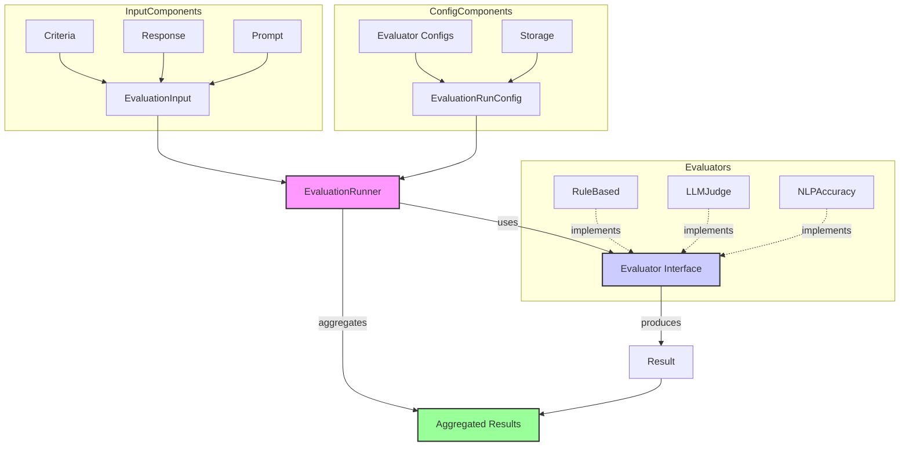
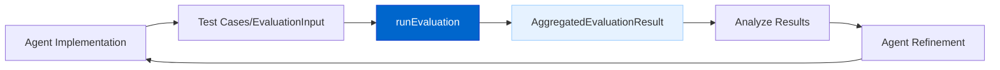

# Agent 评估框架（Agent Evaluation Framework）

Agent 评估框架用于**衡量和提升智能体的表现**，保证在不同场景下的输出质量一致、可对比。

## 当前状态

**状态：Phase 1 已实现**

自定义的 AgentDock Core 评估框架已完成第一阶段实现，包括：

- 核心运行器（Runner）；  
- 评估器接口（`Evaluator`）；  
- 存储提供者抽象；  
- 首批内置评估器：`RuleBased`、`LLMJudge`、`NLPAccuracy`、`ToolUsage`、Lexical 系列等。

## 总览

该框架提供：

- **可扩展架构**：围绕统一的 `Evaluator` 接口构建；  
- **内置评估器套件**：覆盖规则检查、LLM 评审、语义相似度、工具使用情况、词汇分析等；  
- **可配置评估任务**：通过 `EvaluationRunConfig` 选择要启用的评估器和评估指标；  
- **聚合结果输出**：提供包含分数、推理过程与元数据的详细结果；  
- **可选持久化**：已实现基于文件的日志存储（`JsonFileStorageProvider`），后续可与存储抽象层进一步集成。

## 架构（Phase 1 实现）

## 实现选型

Phase 1 选择在 AgentDock Core 内部实现一套**自定义评估框架**，带来的好处包括：

- 对评估流程拥有完全控制权；  
- 与 AgentDock 内部类型（如 `AgentMessage` 等）深度集成；  
- 可以针对智能体场景定制专用评估器（例如 `ToolUsageEvaluator`）；  
- 为后续扩展预留了清晰的基础结构。

为保证架构匹配与可控性，第三方评估系统暂时不做深度集成。

## 核心组件（Phase 1）

- **`EvaluationInput`**：一次评估的输入数据包，包含模型回复、Prompt、历史、标准答案（ground truth）、上下文和评估标准等；  
- **`EvaluationCriteria`**：定义单项评估指标的名称、描述、评分区间以及可选权重；  
- **`Evaluator` 接口**：扩展入口，定义评估器类型与 `evaluate` 方法；  
- **`EvaluationResult`**：每个指标对应的输出结果（分数、理由、类型等）；  
- **`EvaluationRunConfig`**：声明本次评估要用哪些评估器、各自配置以及可选的存储提供者和元数据；  
- **`EvaluationRunner`**：通过 `runEvaluation` 协调整个评估流程；  
- **`AggregatedEvaluationResult`**：聚合后的最终结果，包含整体得分（如适用）、各项评估结果以及快照；  
- **`JsonFileStorageProvider`**：在服务器端将评估结果以 JSONL 形式记录到文件的基础实现。

## 主要特性（Phase 1）

- **规则检查（Rule-Based Checks）**：长度限制、包含/排除检查、正则匹配、JSON 格式校验等；  
- **LLM 评审（LLM-as-Judge）**：通过 LLM 调用配合模板，对输出进行定性打分与说明；  
- **语义相似度**：基于可插拔的 Embedding 模型计算余弦相似度；  
- **工具使用验证**：检查工具调用是否按预期发生、参数是否正确；  
- **词汇分析（Lexical Analysis）**：包括 Levenshtein / Dice 等字符串相似度、关键词覆盖率、情感分析（VADER）、有害内容检测（黑名单）等；  
- **灵活输入来源**：评估器可以从 `response`、`prompt`、`groundTruth` 或嵌套的 `context` 字段中提取文本；  
- **分数归一化与加权聚合**：Runner 会尽量把不同评估器分数归一到 0–1 区间，并根据权重计算总体得分；  
- **基础持久化**：支持可选的 JSONL 文件写入；  
- **完善的单元测试**：为核心组件与评估器都编写了测试用例。

## 已实现价值（Phase 1）

1. **质量基线**：提供一套基础但系统化的质量检查机制；  
2. **可扩展基座**：开发者可以在此之上编写自定义评估器；  
3. **初步 Benchmark 能力**：不同版本/配置的 Agent 之间可以通过评估结果量化对比；  
4. **指标可视化**：将主观体验转化为可度量的数据。

## 时间线

| Phase | Status | Description |
|-------|--------|-------------|
| ~~Approach Evaluation~~ | ~~In Progress~~ Completed | ~~Comparing third-party vs. custom solutions~~ Custom solution chosen. |
| ~~Architecture Design~~ | ~~Planned~~ Completed | Phase 1 architecture designed and implemented. |
| Core Implementation | **Completed (Phase 1)** | Basic framework, runner, interface, initial evaluators, storage provider implemented. |
| **Phase 2 / Advanced Features** | **Planned** | See PRD for details (e.g., Advanced evaluator configs, UI integration, enhanced storage, etc.). |

## 典型用例

### 智能体开发流程中的评估闭环

在开发阶段，通过自动化评估反复迭代智能体：

Phase 1 已经提供了完成上述闭环所需的核心能力。  
关于更详细的使用方式和 Phase 2 计划，可以参考 [Evaluation Framework PRD](../prd/evaluation-framework.md)。 