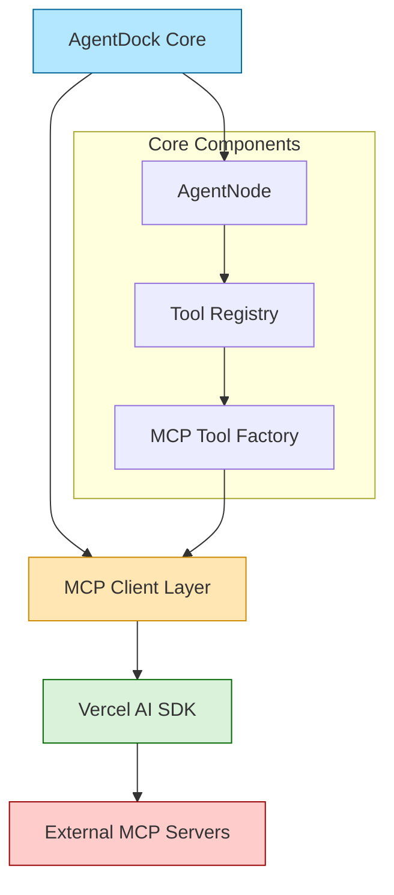
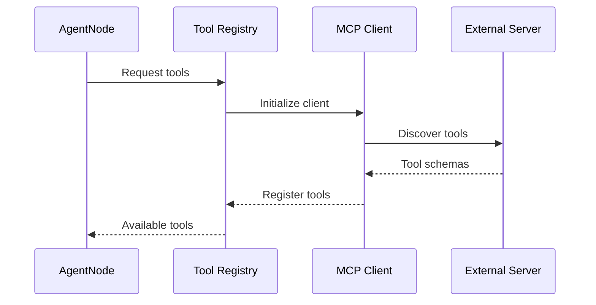
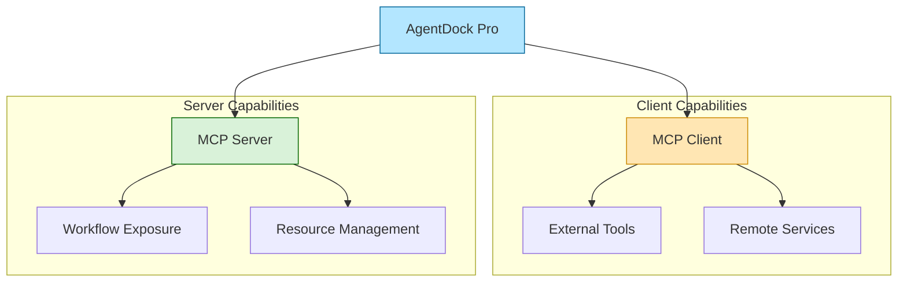

# Model Context Protocol（MCP）集成

## 状态：规划中（Planned）

## 总览

AgentDock Core 计划集成 Model Context Protocol（MCP），以实现跨不同智能体与服务的**标准化工具发现与执行**。  
通过 MCP，AgentDock 智能体可以更容易地接入外部工具，同时保持核心架构的一致性与可扩展性原则。

## 架构



## 实现策略

### Phase 1：在 Core 中接入 MCP Client

1. **MCP Client 层**
   - 利用 Vercel AI SDK 内置的 MCP Client 能力；  
   - 提供统一的工具发现与执行接口；  
   - 与现有节点化架构保持兼容。

2. **与 Tool Registry 集成**
   ```typescript
   interface MCPToolConfig {
     transport: {
       type: 'stdio' | 'sse';
       command?: string;
       args?: string[];
       url?: string;
     };
     schemas?: Record<string, any>;
   }
   ```

3. **Agent 配置方式**
   ```json
   {
     "nodes": ["llm.anthropic", "mcp.cursor"],
     "nodeConfigurations": {
       "llm.anthropic": {
         "model": "gpt-4.1"
       },
       "mcp.cursor": {
         "transport": {
           "type": "stdio",
           "command": "cursor-tools"
         }
       }
     }
   }
   ```

### 工具发现流程



## 核心能力

1. **动态工具发现**
   - 从 MCP Server 自动发现并注册工具；  
   - 对工具输入/输出做 schema 校验；  
   - 在运行时检查工具是否可用。

2. **传输层支持**
   - 本地工具：Standard I/O（stdio）；  
   - 远程工具：Server‑Sent Events（SSE）；  
   - 传输层可扩展。

3. **错误处理**
   - 工具不可用时的优雅降级；  
   - 配置问题的清晰错误提示；  
   - 连接重试机制。

## 使用示例

### 本地工具接入（stdio）
```typescript
// 示例：通过 MCP 使用 Cursor Tools
const config = {
  transport: {
    type: 'stdio',
    command: 'cursor-tools',
    args: ['browser', 'open']
  }
};

await agent.registerMCPTools(config);
```

### 远程工具接入（SSE）
```typescript
// 示例：接入远程 MCP Server
const config = {
  transport: {
    type: 'sse',
    url: 'https://mcp-server.example.com/sse'
  },
  schemas: {
    'get-weather': {
      parameters: {
        location: { type: 'string' }
      }
    }
  }
};

await agent.registerMCPTools(config);
```

## 安全性考虑

1. **工具校验**
   - 对所有工具输入做 schema 校验；  
   - 对命令参数进行净化与约束；  
   - 限制资源使用（时间/内存/并发等）。

2. **传输安全**
   - 远程连接强制 TLS；  
   - 本地工具执行尽量沙箱化；  
   - 对敏感操作进行访问控制。

## 后续增强

1. **工具缓存**
   - 缓存工具 schema 以加快启动；  
   - 定期刷新 schema；  
   - 支持离线模式（如适用）。

2. **进阶能力**
   - 工具组合与链式调用；  
   - 自定义传输层；  
   - 更强的错误恢复能力。

## Pro 能力预览

AgentDock Pro 会在 MCP 集成之上提供更高级的能力，例如：



- **双角色架构**：既可作为 MCP Client，也可作为 MCP Server；  
- **工作流暴露**：将工作流作为 MCP Resource 共享给外部；  
- **资源管理增强**：对暴露能力进行更精细的权限与配额控制；  
- **跨工作流集成**：通过 MCP 协议组合多个工作流。

（更多细节会在 Pro 文档中补充）

## 开发计划

1. **Phase 1：Core 集成**（当前）
   - [x] Design architecture
   - [ ] Implement MCP client layer
   - [ ] Add tool registry support
   - [ ] Basic transport layers

2. **Phase 2：增强特性**
   - [ ] Advanced error handling
   - [ ] Tool caching system
   - [ ] Security improvements

3. **Phase 3：优化与扩展**
   - [ ] Performance improvements
   - [ ] Extended transport options
   - [ ] Developer tooling 