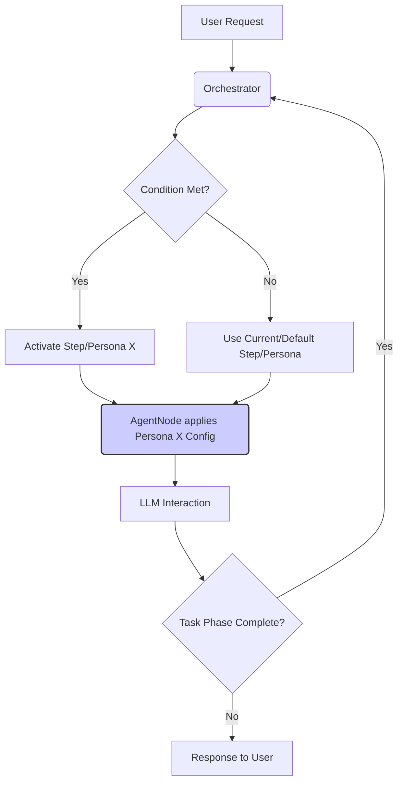
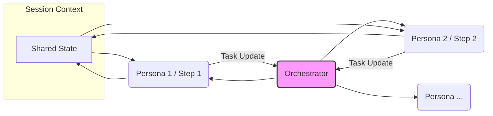

# 多智能体协作（Multi-Agent Collaboration）

## 当前状态

**状态：规划中（Planned）**

本文档描述 AgentDock 未来如何在同一个用户会话中，让多个专长不同的智能体（或多种 persona）**协作完成任务**。

## 目标

让复杂任务可以被拆分为多个阶段，由不同的智能体配置（persona）按顺序接力完成，并由编排框架统一管理，同时保持对话上下文的一致性与连贯性。

## 核心思路（V1：编排驱动的 Persona）

第一版会复用现有的 **编排框架（Orchestration Framework）**。  
编排的「步骤（step）」不再只用来控制工具可用性，还会用来表示不同的 **persona** 或 **任务阶段**：

- **Persona = Step**：一个编排步骤可以代表一个专家角色（例如“研究员”“规划师”“开发者”等）。  
- **动态配置**：当某个 step/persona 被激活（由[条件跳转](../architecture/orchestration/conditional-transitions.md)触发）时，系统会在下一轮交互中动态应用该 persona 的配置，例如：  
  - 使用更符合角色的 system prompt；  
  - 使用一组不同的可用工具；  
  - 在可行时，覆盖部分 LLM 模型参数。  
- **顺序协作**：编排器负责流程推进，按照预设条件将任务上下文（保存在会话状态中）从一个 persona/step 交接到下一个 persona/step。协作是**串行**发生的，任务会随着阶段推进而“换人接力”。

### Simplified Handoff View

## 架构与实现方式

该方案尽量减少对核心框架的改动：

1. **编排配置（`template.json`）**：扩展 step 定义，允许设置 persona 覆盖项（例如 `stepSystemPrompt`，以及更动态的 `availableTools` 覆盖）。  
2. **`AgentNode` 适配**：在调用 `CoreLLM` 之前，`AgentNode`（或使用它的 API 适配层）会：  
   - 通过 `OrchestrationStateManager` 获取当前 `OrchestrationState`（含 `activeStep`）；  
   - 读取 `activeStep` 的配置；  
   - 在构建 Prompt 和最终工具列表时应用 persona 覆盖项。  
3. **状态管理**：继续使用现有的 `OrchestrationStateManager` + `SessionManager` 持久化 `activeStep`，以及 persona 之间共享所需的上下文数据。

## 价值

- 充分复用现有编排框架；  
- 支持按专长拆分任务、按阶段推进；  
- 提供结构化、可控的顺序工作流；  
- 对 `agentdock-core` 的初始改动较小。

## 后续增强方向

- **Agent-as-a-Tool**：允许一个 `AgentNode` 以“工具”的方式直接调用另一个 `AgentNode`，实现更复杂的嵌套交互；  
- **共享草稿纸/共享记忆**：在会话状态中增加一个共享空间，让不同 persona 显式传递中间结果与复杂结构化数据；  
- **并行执行**：探索在特定任务中并行运行多个智能体的模型与调度方式。