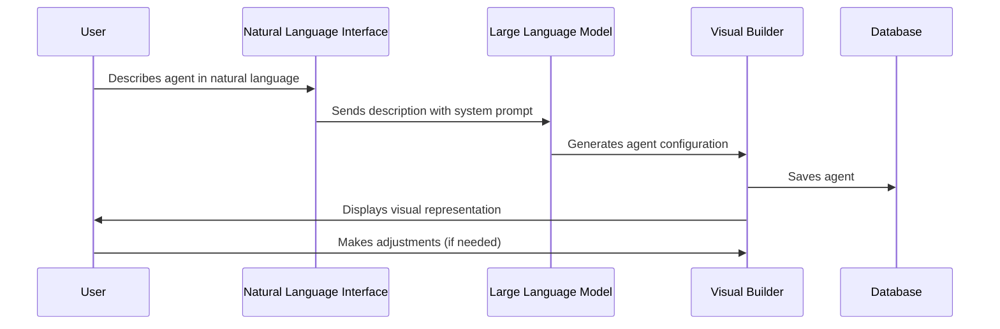
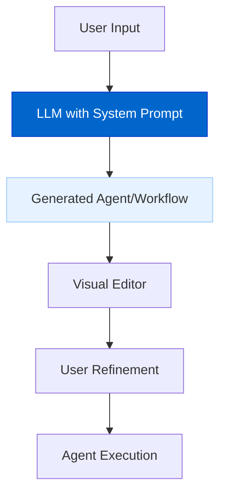
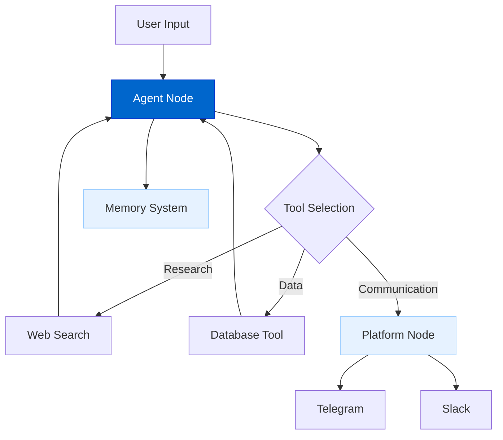
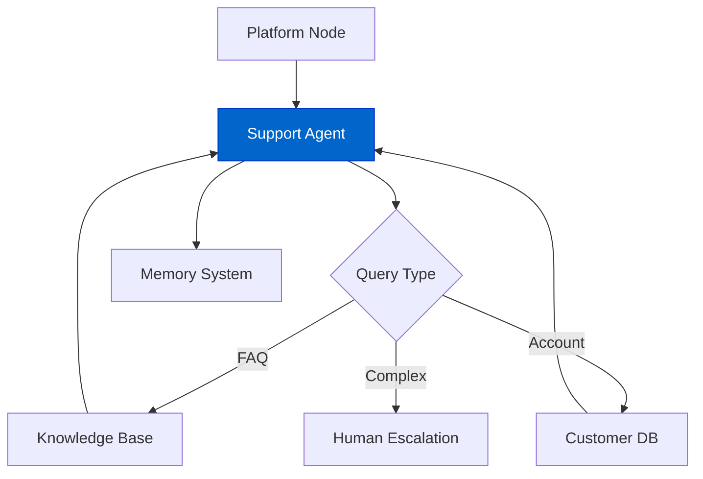
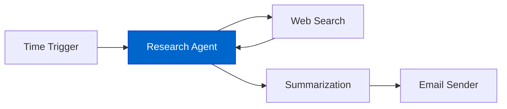
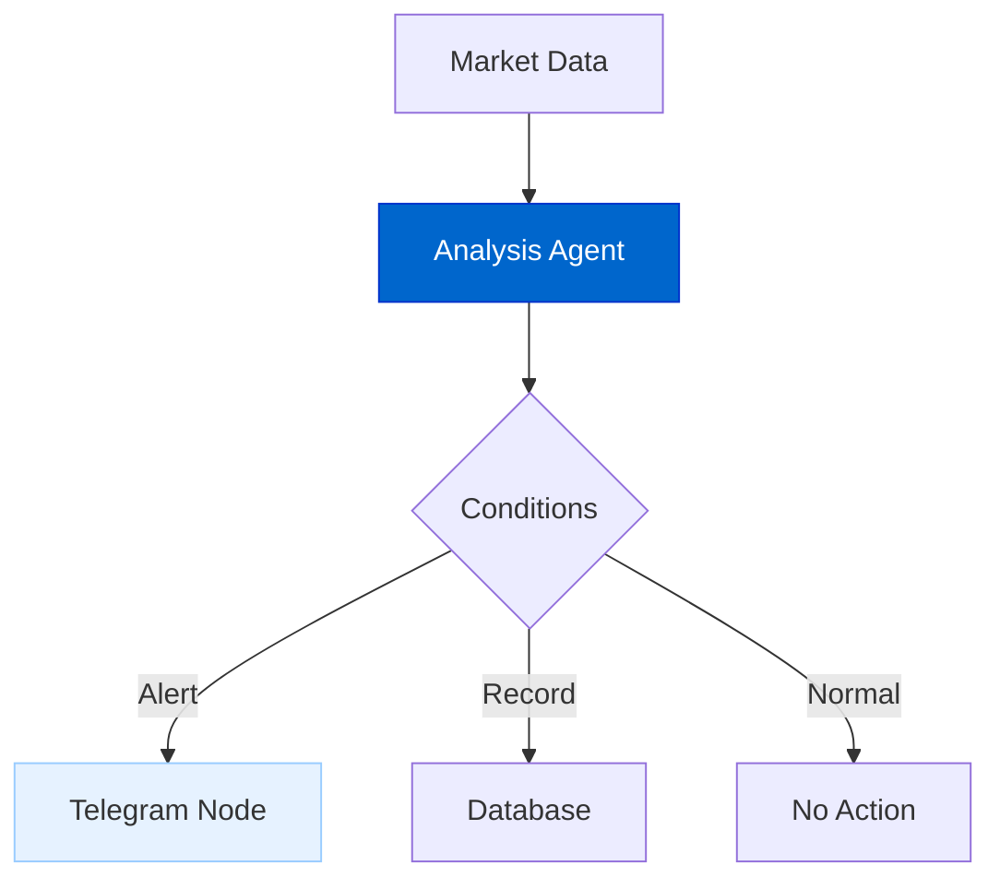
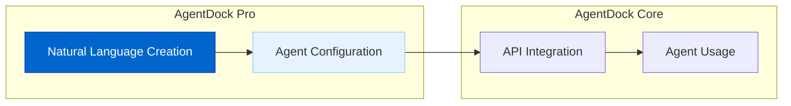

# 自然语言智能体构建器（Natural Language AI Agent Builder）

自然语言智能体构建器允许用户用「自然语言描述」来创建复杂的 AI 智能体与工作流，而不是依赖繁琐编码或纯可视化配置。

## 当前状态

**状态：规划中（Planned）**

该功能目前处于设计阶段，计划优先在 Pro 版本中实现。

## 功能概览

自然语言智能体构建器将提供：

- **自然语言创建**：用自己的话描述想要的智能体/工作流；  
- **即时原型**：创建后即可马上测试；  
- **自动选工具**：智能选择并配置合适的工具；  
- **可视化编辑联动**：自然语言与可视化编辑之间无缝切换；  
- **多语言支持**：不限于英文，支持任意语言创建；  
- **工作流生成**：通过描述生成复杂多步骤流程。

## 架构图

### 创建流程



### 实现架构



### 智能体示例



## 实现细节

自然语言智能体构建器计划包含：

### 1. System Prompt

通过精心设计的 system prompt 向 LLM 提供指令与上下文：

```typescript
const systemPrompt = {
  instruction: `You are an expert agent builder for AgentDock Pro.
  Analyze the user's natural language description and create the optimal agent configuration.`,
  
  availableTools: {
    "webSearch": {
      description: "Searches the web for information",
      inputs: { "query": "string" },
      outputs: { "results": "array" }
    },
    "databaseQuery": {
      description: "Queries databases",
      inputs: { "sql": "string" },
      outputs: { "results": "array" }
    },
    // More tools...
  },
  
  outputFormat: {
    type: "AgentConfiguration",
    example: {
      name: "Research Assistant",
      description: "Helps with research tasks",
      systemPrompt: "You are a research assistant...",
      tools: ["webSearch", "fileSummarizer"]
    }
  }
};
```

### 2. LLM 处理逻辑

LLM 会解析用户描述并推导：

- 智能体的目标与 persona；  
- 所需工具与能力；  
- 最优 system prompt；  
- 记忆系统需求；  
- 需要连接的平台与连接器。

### 3. 可视化构建器联动

生成的智能体会自动出现在可视化构建器中，便于检查与微调：

- 自动创建节点连接；  
- 预填工具配置；  
- 展示 system prompt 供编辑；  
- 按需挂载记忆系统。

## 工作流示例

### 客服智能体

**自然语言输入：**
"Create an agent that handles customer support requests, can search our knowledge base, and escalates to human agents when necessary."



### 研究助手工作流

**自然语言输入：**
"I need a workflow that researches topics, summarizes findings, and sends daily reports by email."



### 交易监控工作流

**自然语言输入：**
"Build a workflow that monitors stock prices, analyzes market trends, and alerts me on Telegram when specific conditions are met."



## 关键特性

### 1. 多语言支持

支持使用任意语言创建：

```
English: "Create a customer support agent with knowledge base access"
Spanish: "Crea un agente de atención al cliente con acceso a la base de conocimientos"
Japanese: "ナレッジベースにアクセスできるカスタマーサポートエージェントを作成する"
```

### 2. 画布选区增强

可选中已有工作流的一部分并用自然语言进行修改：

```
"Add error handling to this section of the workflow"
"Improve the response formatting for better readability"
"Make this agent more creative in its responses"
```

### 3. 模板联动

系统会根据描述推荐合适模板：

```
Input: "Create an agent that helps with scheduling meetings"
System: "I found these templates that match your needs:
  1. Calendar Assistant
  2. Meeting Coordinator
  3. Executive Assistant"
```

## 与 AgentDock Core 的关系

Core users can access Pro-created agents with API keys:



## 价值

1. **Accessibility**: Create agents without coding or technical knowledge
2. **Rapid Prototyping**: Move from idea to working agent in minutes
3. **Iterative Development**: Refine your agent through natural conversation
4. **Reduced Cognitive Load**: Focus on what you want, not implementation details
5. **Enhanced Productivity**: Build complex workflows with simple descriptions

## 时间线

| Phase | Status | Description |
|-------|--------|-------------|
| Design | In Progress | System architecture and prompt design |
| Simple Agent Creation | Planned | Basic agent creation from descriptions |
| Tool Integration | Planned | Smart tool selection and configuration |
| Visual Builder Integration | Planned | Combined natural language and visual editing |
| Advanced Workflow Generation | Future | Complex multi-step workflow creation |
| Pattern Learning | Future | Improving generation through successful patterns |

## 与其他路线图项的关系

- **Platform Integration**: Easily configure agent connections to platforms
- **Advanced Memory Systems**: Natural language setup of memory requirements
- **Multi-Agent Collaboration**: Describe complex agent interactions
- **Tool Integration**: Automatic tool selection and configuration 