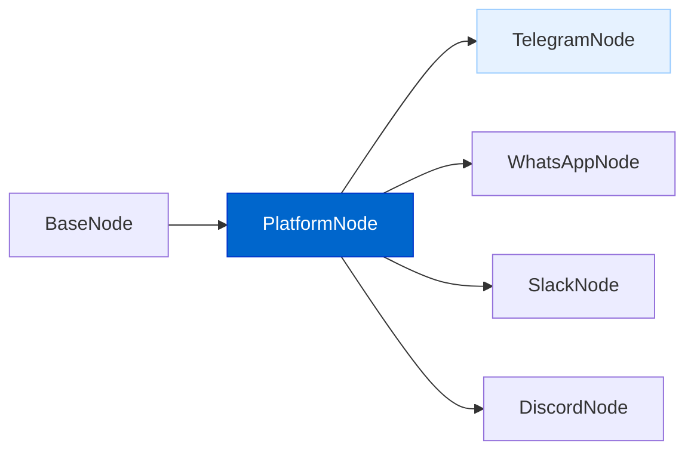
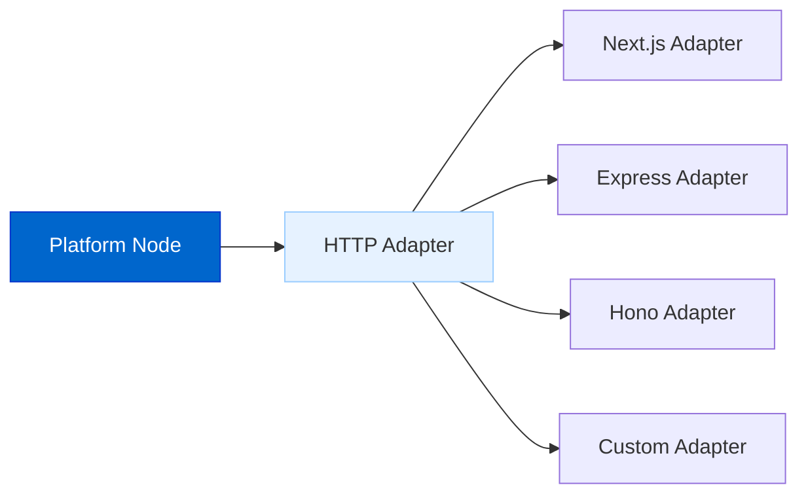
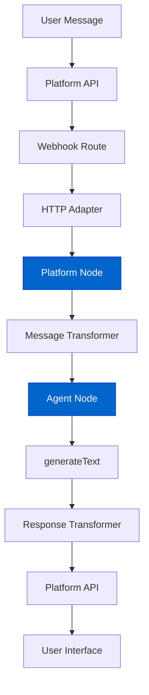

# 平台集成（Platform Integration）

平台集成功能旨在让 AgentDock 智能体通过外部消息平台与用户交互，例如 Telegram、WhatsApp、Slack 等。

## 当前状态

**状态：阻塞中（Blocked）— 依赖 HTTP 适配器框架**

平台集成的开发目前被 **阻塞**，需要先完成「HTTP Adapter Framework Abstraction」。  
在统一的 HTTP 适配层完成之前，平台 Webhook 能力无法稳定、通用地落地。

**关键依赖**：[HTTP Adapter Framework Abstraction](./http-adapter-framework-abstraction.md)

**依赖原因**：平台集成需要「与框架无关」的 HTTP 处理能力，才能同时支持 Next.js（开源参考实现）与 Hono（商业平台）等不同运行环境。当前以 Next.js 为中心的实现方式无法直接扩展为通用的 Webhook 基础设施，因此必须先补齐统一的 HTTP 适配层。

## 功能概览

平台集成将提供：

- **框架无关设计**：核心逻辑可运行在不同 HTTP 框架上；  
- **平台节点抽象**：用统一接口实现不同平台的集成；  
- **Webhook 处理**：可靠的 Webhook 处理与实时更新；  
- **消息转换**：平台消息格式与 AgentDock 消息格式之间的双向转换；  
- **会话管理**：跨用户交互的状态追踪与管理；  
- **HTTP 适配器**：面向不同部署环境的框架适配层（Next.js / Express / Hono / 自定义等）。

除常见消息平台外（Telegram、WhatsApp、Slack），也可以基于 `PlatformNode` 抽象或基于 `BaseNode` 的自定义节点，扩展到更多平台，例如 X（原 Twitter）、TikTok、LinkedIn 等。具体交互方式可以是：

- 直接调用平台 API（在平台条款允许且提供 API 的情况下）；  
- 对于无 API 或复杂交互场景，结合浏览器自动化工具实现。

## 架构图

### 平台节点架构



### HTTP 框架适配器



### 消息流转



## 实现细节

平台集成系统计划包含以下核心组件：

```typescript
// 所有平台集成的抽象基类
abstract class PlatformNode extends BaseNode {
  // 平台消息 -> Agent 消息
  abstract transformMessageToAgent(message: unknown): Promise<Message>;
  
  // Agent 响应 -> 平台消息
  abstract transformResponseToPlatform(response: Message): Promise<unknown>;
  
  // 发送消息到平台
  abstract sendMessageToPlatform(message: unknown): Promise<void>;
  
  // 处理 webhook payload
  async handleWebhookPayload(payload: unknown): Promise<void>;
}

// 面向不同框架的 HTTP 适配器接口
interface HttpAdapter {
  parseWebhookRequest(request: unknown): Promise<unknown>;
  createSuccessResponse(): unknown;
  createErrorResponse(error: Error, statusCode?: number): unknown;
  getParams(request: unknown): Record<string, string>;
}
```

## 首批支持的平台

第一版计划优先支持：

1. **Telegram**：作为参考实现，提供完整示范；  
2. **WhatsApp**：基于 WhatsApp Business API 的基础接入；  
3. **Slack**：基于 Slack Bot API 的集成。

## Telegram 集成示例

Telegram 会作为第一版的参考实现：

```typescript
// Example of creating a Telegram node
import { createTelegramNode } from '@/lib/platforms/telegram-factory';

// Create a Telegram node with an existing agent
const telegramNode = createTelegramNode('telegram-1', agentNode, {
  token: process.env.TELEGRAM_BOT_TOKEN!
});

// Set up the webhook
await telegramNode.setupWebhook();
```

## 平台集成的关键特性

### 框架无关

平台集成的核心逻辑与 HTTP 框架解耦，因此可以：

- 在 Next.js 中用于开源参考客户端；  
- 在 Hono / Express.js 等框架中用于自建后端部署；  
- 通过实现 `HttpAdapter` 接口，轻松扩展到其他框架。

### 单次消息交换

平台消息交互通常以“单次交换”为单位：

```typescript
async handleMessage(chatId: number, message: string): Promise<void> {
  // Process message with AgentDock Core
  const response = await this.agentNode.generateText({
    messages: [
      { role: 'user', content: message }
    ]
  });
  
  // Send single complete response back to user
  await this.sendMessageToPlatform({
    chat_id: chatId,
    text: response,
    parse_mode: 'Markdown'
  });
}
```

### Type Safety

Comprehensive TypeScript definitions ensure type safety:

```typescript
// Platform-specific types (example for Telegram)
interface TelegramMessage {
  message_id: number;
  from: TelegramUser;
  chat: TelegramChat;
  date: number;
  text?: string;
  // Other message properties
}

// Configuration types
interface PlatformConfig {
  name: string;
  description?: string;
}
```

## 收益

平台集成带来：

1. **覆盖范围更广**：智能体不再局限于 AgentDock UI；  
2. **用户更熟悉**：在用户已有的平台里直接对话；  
3. **统一开发**：同一个智能体可复用到多个平台；  
4. **框架更灵活**：可按需选择不同 HTTP 框架部署；  
5. **体验一致**：跨平台保持一致的能力与行为。

## 时间线

| Phase | Status | Description | Dependencies |
|-------|--------|-------------|--------------|
| **PREREQUISITE: HTTP Adapter Framework** | **Required** | **Must complete first** | **[HTTP Adapter Framework](./http-adapter-framework-abstraction.md)** |
| Design & Architecture | Complete | Core architecture design | ✅ Complete |
| Platform Node Abstract Class | Blocked | Base class implementation | HTTP Adapter Framework |
| HTTP Adapter Interface | Blocked | Framework adapter design | HTTP Adapter Framework |
| Telegram Reference | Blocked | First complete implementation | HTTP Adapter Framework |
| WhatsApp Integration | Blocked | Business API integration | HTTP Adapter Framework |
| Slack Integration | Blocked | Slack Bot implementation | HTTP Adapter Framework |
| Additional Platforms | Future | Discord, Teams, etc. | All above phases |

**关键点：在 HTTP Adapter Framework 完成之前，平台集成的所有阶段都会保持阻塞。**

## 与其他路线图项的关系

The Platform Integration connects with other roadmap items:

- **HTTP Adapter Framework Abstraction**: **CRITICAL PREREQUISITE** - Must be implemented first
- **Storage Abstraction Layer**: Uses storage for conversation state
- **Advanced Memory Systems**: Provides long-term memory across platforms
- **Multi-Agent Collaboration**: Enables collaboration via messaging platforms
- **Voice AI Agents**: Foundation for voice platform integration

## 对开源参考客户端的影响

**在 HTTP Adapter 实现完成后，需要进行的改动：**

1. **Route Simplification**
   - `src/app/api/chat/[agentId]/route.ts` - Replace with HTTP adapter usage
   - Remove `src/lib/agent-adapter.ts` (logic moves to agentdock-core)
   - Remove `src/lib/orchestration-adapter.ts` (logic moves to agentdock-core)

2. **Platform Webhook Support**
   - Add new routes: `/api/platforms/telegram/[nodeId]`
   - Add new routes: `/api/platforms/whatsapp/[nodeId]`
   - Add new routes: `/api/platforms/slack/[nodeId]`

3. **Configuration Updates**
   - Update environment variables for platform integrations
   - Add platform-specific configuration management

## 快速上手（预览）

功能发布后，使用步骤将非常直接：

1. Obtain API credentials for your chosen platform
2. Create a platform node with an existing agent
3. Set up webhook routes in your application
4. Deploy or use tunneling for development

```typescript
// Example webhook route in Next.js
export async function POST(request: NextRequest, { params }) {
  const adapter = createHttpAdapter('nextjs');
  const nodeId = params.nodeId;
  const telegramNode = NodeRegistry.getNode(nodeId);
  
  const update = await adapter.parseWebhookRequest(request);
  telegramNode.handleWebhookPayload(update);
  
  return adapter.createSuccessResponse();
}
``` 