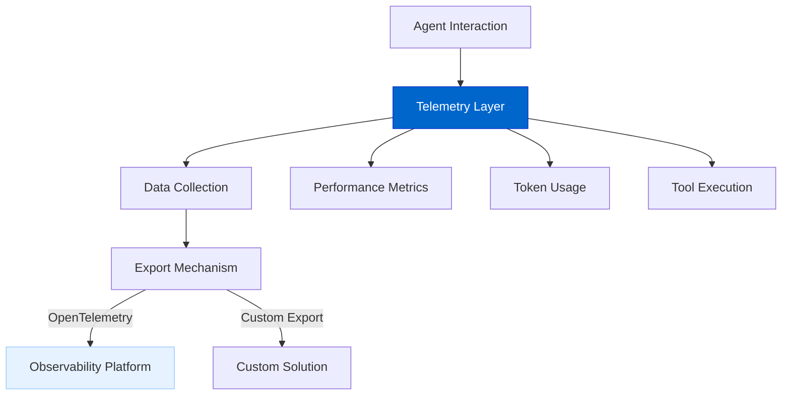
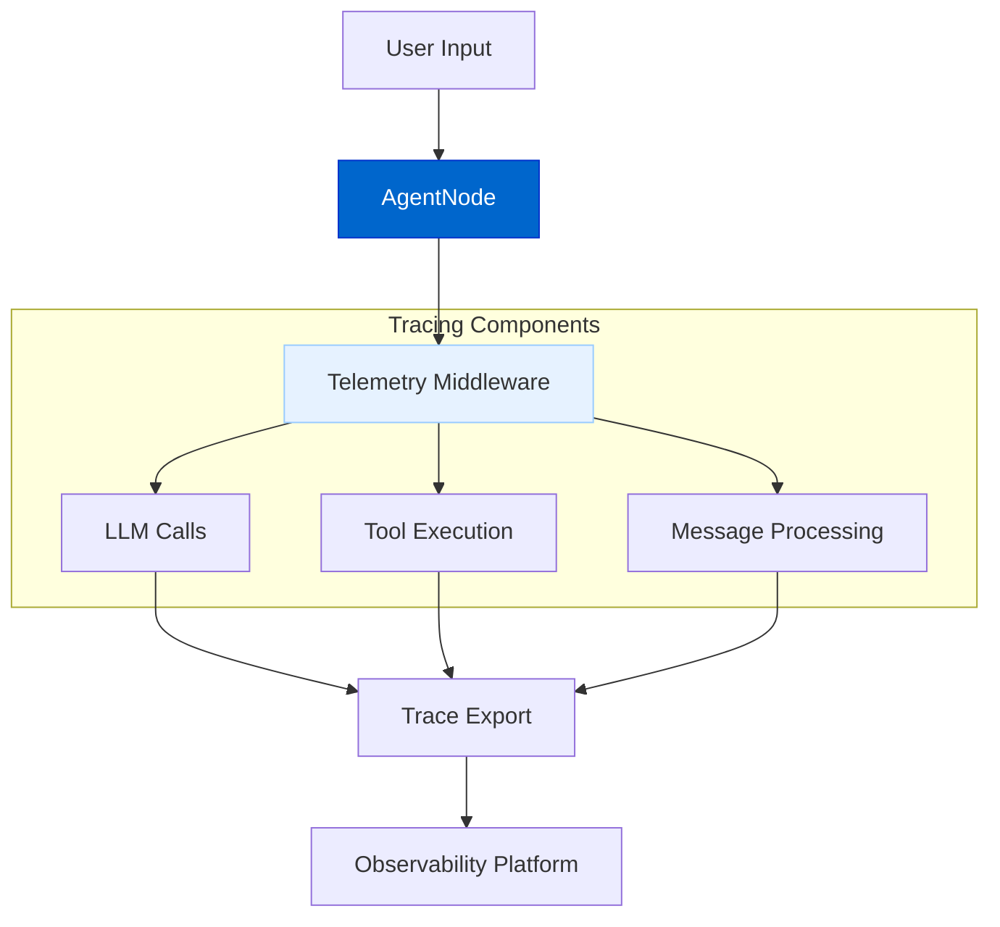
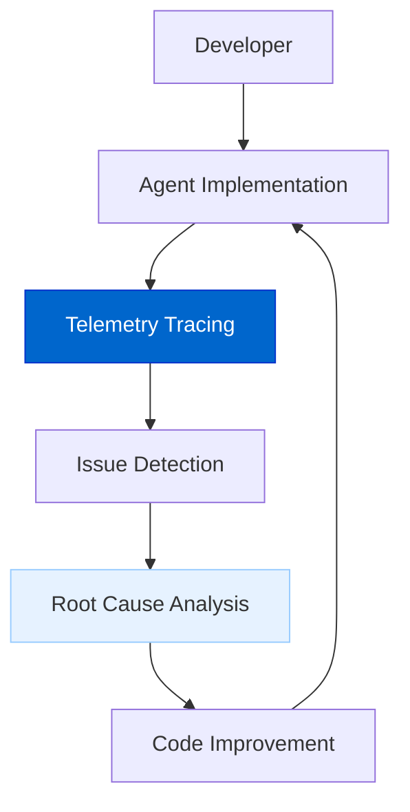
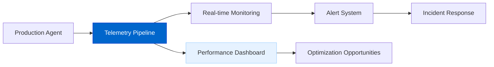

# 遥测与可观测性（Telemetry & Observability）

遥测与可观测性功能为 AgentDock 智能体提供**监控、链路追踪与评估**能力，帮助开发者洞察智能体行为并持续优化性能、成本与质量。

## 当前状态

**状态：规划中（Planned）**

我们正在评估多种实现路径：包括集成第三方开源方案与自研实现。无论采用哪一种路线，最终目标都是提供完整的监控与追踪能力。

## 功能概览

关键能力包括：

- **链路追踪（Tracing）**：追踪智能体交互、LLM 调用与工具执行；  
- **性能指标（Performance Metrics）**：监控延迟、token 使用量与资源占用；  
- **成本统计（Cost Tracking）**：按提供商维度量化 API 调用成本；  
- **评估（Evaluations）**：用可配置指标评估输出质量（详见[评估框架](./evaluation-framework.md)）；  
- **会话监控（Session Monitoring）**：将相关交互按 session 聚合，便于整体分析；  
- **可视化（Visualization）**：在直观的仪表盘中展示 trace 与指标数据。

## 架构图

### 遥测总体架构

### 追踪流水线

### 评估流（与遥测集成）

The evaluation system is integrated with telemetry for comprehensive agent assessment. For detailed information on the evaluation architecture and components, please refer to the [Evaluation Framework](./evaluation-framework.md) document.

## 实现方案

目前主要评估两类方案：

### 1. 第三方集成

使用 Laminar、基于 OpenTelemetry 的可观测平台等开源方案：

- 标准化的追踪协议与数据格式；  
- 现成的可视化与分析工具；  
- 开发成本更低；  
- 社区生态扩展更丰富。

### 2. 自研实现

构建更贴合 AgentDock 的定制方案：

- 对数据采集与存储拥有完全控制；  
- 面向 LLM 智能体场景的定制化可视化；  
- 与现有 AgentDock 组件更紧密的集成；  
- 针对智能体评估的专用能力。

## 关键特性

### 全链路追踪

系统将提供对智能体运行过程的细粒度可见性：

- **LLM 调用追踪**：记录 prompt 构建、模型调用与响应处理；  
- **工具执行监控**：记录工具调用、参数与结果；  
- **消息流可视化**：展示完整对话链路及耗时；  
- **错误追踪**：捕获错误并保留完整上下文以便定位。

### 性能指标

监控并优化智能体性能：

- **延迟拆解**：定位处理流水线中的瓶颈；  
- **Token 使用**：按组件/操作维度统计 token 消耗；  
- **资源占用**：监控 CPU、内存、网络等；  
- **成本分析**：按提供商定价规则估算与汇总费用。

## 时间线

| Phase | Status | Description |
|-------|--------|-------------|
| Approach Evaluation | In Progress | Comparing third-party vs. custom solutions |
| Architecture Design | Planned | Core design based on selected approach |
| Basic Implementation | Planned | Initial tracing capabilities |
| Evaluation Framework | Planned | Tools for assessing agent output quality |
| Advanced Features | Future | Enhanced analytics and visualization |

## 与其他路线图项的关系

The Telemetry & Observability feature connects with other roadmap items:

- **Advanced Memory Systems**: Trace memory operations and retrieval effectiveness
- **Platform Integration**: Monitor cross-platform interactions and performance
- **Voice AI Agents**: Measure voice processing latency and quality
- **Evaluation Framework**: Provides data for the [Agent Evaluation Framework](./evaluation-framework.md)

## 使用场景

### 开发与调试

Accelerate agent development with comprehensive tracing:

### 生产监控

Ensure reliability and performance in production:

### 质量保障

Continuously evaluate and improve agent outputs. This use case is shared with the Evaluation Framework - see the [Evaluation Framework](./evaluation-framework.md) document for more details on assessment criteria and methods.

## 技术考量

### 数据隐私与安全

Regardless of the implementation approach, the telemetry system will:

- Allow sensitive data masking and redaction
- Support local-only tracing for development
- Provide configurable sampling rates to control data volume
- Ensure compliance with privacy regulations

### 性能影响

The telemetry system is designed to have minimal overhead:

- Asynchronous processing where possible
- Configurable sampling rates to reduce impact
- Batched exports to minimize API calls
- Memory-efficient trace storage

最终架构会基于对现有开源方案（如 Laminar）的进一步评估来确定，并结合 AgentDock 智能体的实际需求做取舍。  
无论选择自研还是第三方集成，遥测系统都会提供足够完整的可观测能力，用于持续优化智能体的性能、稳定性与成本。 