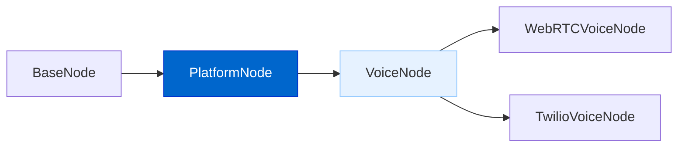
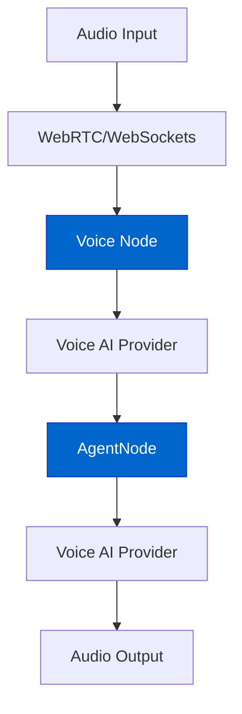
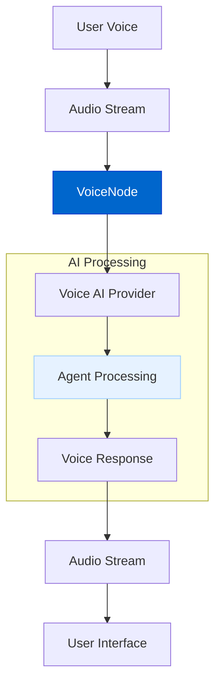
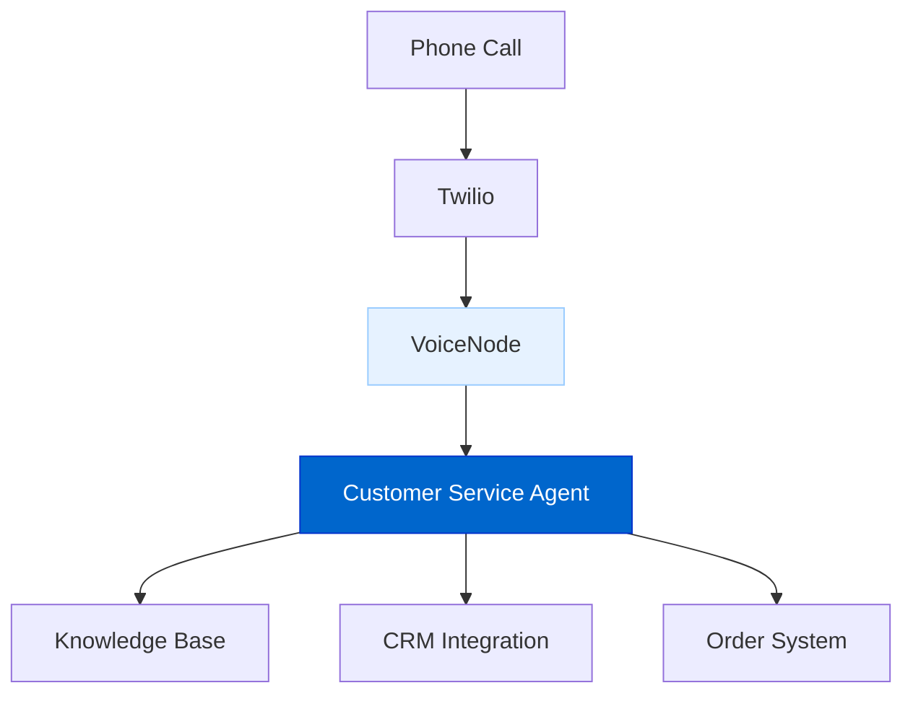
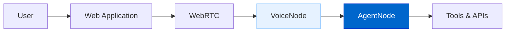

# 语音智能体（Voice AI Agents）

语音智能体功能旨在通过先进的「端到端语音（speech‑to‑speech）」能力，让 AgentDock 智能体实现**实时语音对话**，并可在 Web 应用或电话系统中提供自然、交互式的体验。

## 当前状态

**状态：规划中（Planned）**

语音智能体系统的设计重点是：利用前沿的实时语音模型，并与现有 AgentDock 架构无缝集成。

## 功能概览

语音智能体将提供：

- **实时语音交互**：近乎即时的语音输入与语音输出对话；  
- **WebRTC 集成**：为 Web 应用提供低延迟音频流；  
- **电话接入**：通过 Twilio 连接到传统电话网络；  
- **多提供商支持**：可选择 OpenAI Realtime API、ElevenLabs 等语音提供商；  
- **语音节点抽象**：在 `PlatformNode` 架构基础上扩展标准语音接口。

## 架构图

### 语音节点架构



### 语音处理流水线



### 实时语音通信



## 实现细节

语音智能体系统计划包含以下组件：

```typescript
// 面向语音交互的抽象节点
abstract class VoiceNode extends PlatformNode {
  // 处理输入音频流
  abstract processAudioStream(audioStream: ReadableStream): Promise<void>;
  
  // 将 Agent 响应合成为语音流
  abstract generateSpeech(response: Message): Promise<ReadableStream>;
  
  // 处理实时音频会话
  abstract handleAudioSession(sessionId: string): Promise<void>;
  
  // 初始化语音提供商
  abstract initializeVoiceProvider(config: VoiceProviderConfig): Promise<void>;
}

// 语音提供商配置
interface VoiceProviderConfig {
  provider: 'openai' | 'elevenlabs' | 'sesame';
  apiKey: string;
  modelId?: string;
  voice?: string;
}
```

## 语音提供商支持

计划接入主流语音 AI 提供商：

1. **OpenAI Realtime API**：基于 GPT‑4.1 的端到端语音对话能力；  
2. **ElevenLabs**：高质量语音合成与语音到语音能力；  
3. **Sesame AI**：更自然的对话式语音模型。

## 接入方式

### WebRTC（浏览器端）

```typescript
// Example of creating a WebRTC voice node
import { createWebRTCVoiceNode } from '@/lib/voice/webrtc-factory';

// Create a WebRTC voice node with an existing agent
const voiceNode = createWebRTCVoiceNode('voice-1', agentNode, {
  provider: 'openai',
  apiKey: process.env.OPENAI_API_KEY!,
  modelId: 'gpt-4.1-realtime'
});

// Set up audio stream
await voiceNode.setupAudioStream(webrtcConnection);
```

### Twilio（电话接入）

```typescript
// Example of creating a Twilio voice node
import { createTwilioVoiceNode } from '@/lib/voice/twilio-factory';

// Create a Twilio voice node with an existing agent
const twilioNode = createTwilioVoiceNode('phone-1', agentNode, {
  accountSid: process.env.TWILIO_ACCOUNT_SID!,
  authToken: process.env.TWILIO_AUTH_TOKEN!,
  phoneNumber: process.env.TWILIO_PHONE_NUMBER!,
  voiceProvider: {
    provider: 'elevenlabs',
    apiKey: process.env.ELEVENLABS_API_KEY!,
    voice: 'Josh'
  }
});

// Set up webhook for incoming calls
await twilioNode.setupWebhook();
```

## 关键特性

### 端到端语音交互

系统将利用前沿语音模型实现顺畅对话：

- **直接语音处理**：通过提供商 API 完成 speech‑to‑speech；  
- **连续流式处理**：实时处理音频，保证自然的对话节奏；  
- **低延迟**：尽可能降低等待时间，提高交互响应性。

### 提供商灵活选择

可按需求选择合适的语音技术：

- **OpenAI Realtime**：端到端语音模型，擅长实时对话；  
- **ElevenLabs**：语音质量更高，合成更自然；  
- **Sesame**：更拟人化的停顿、语调与韵律。

### 电话系统集成

将智能体接入传统电话系统：

- **Twilio 集成**：为智能体绑定电话号码；  
- **外呼**：由智能体主动发起电话；  
- **呼入**：接收并处理用户来电；  
- **通话分析**：统计通话时长、质量与关键指标。

## 价值

语音智能体带来：

1. **更自然的交互**：语音是最直觉的人机接口；  
2. **更强可达性**：服务不擅长使用复杂 UI 的用户；  
3. **多模态体验**：可与文本和视觉输出结合；  
4. **覆盖更广**：通过电话网络触达更多用户；  
5. **企业沟通**：形成更专业的语音品牌形象。

## 时间线

| Phase | Status | Description |
|-------|--------|-------------|
| Design & Architecture | Planned | Core architecture design |
| Voice Node Abstract Class | Planned | Base class implementation |
| WebRTC Integration | Planned | Browser-based voice support |
| OpenAI Realtime Integration | Planned | Initial voice provider |
| ElevenLabs Integration | Planned | Additional voice provider |
| Twilio Phone Integration | Planned | Phone number access |
| Advanced Voice Features | Future | Voice customization options |

## 与其他路线图项的关系

The Voice AI Agents feature connects with other roadmap items:

- **Platform Integration**: Extends the platform node architecture for voice
- **Advanced Memory Systems**: Provides context for personalized voice interactions
- **Natural Language AI Agent Builder**: Create voice-enabled agents with natural language
- **Agent Marketplace**: Share voice agent templates

## 使用场景

### 客服语音智能体

Provide 24/7 voice-based customer service:



### 应用内语音助手

Enhance applications with conversational voice capabilities:

