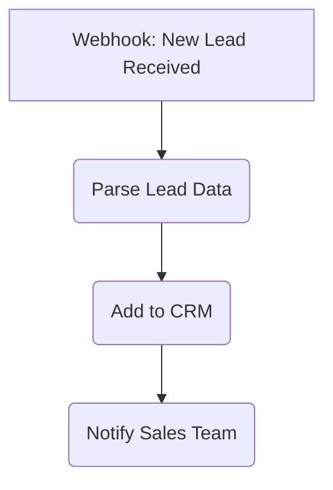
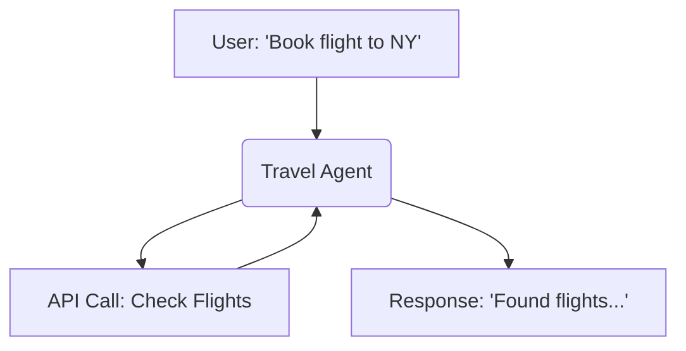
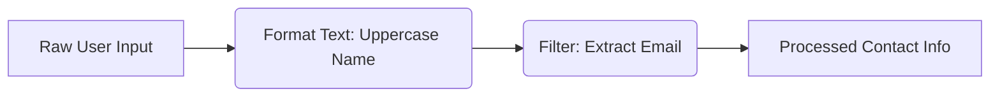
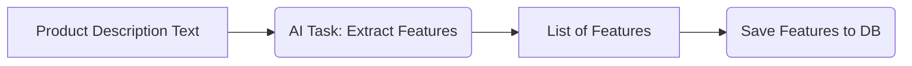
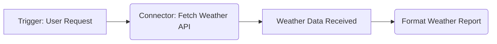
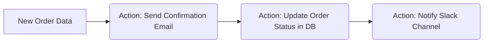
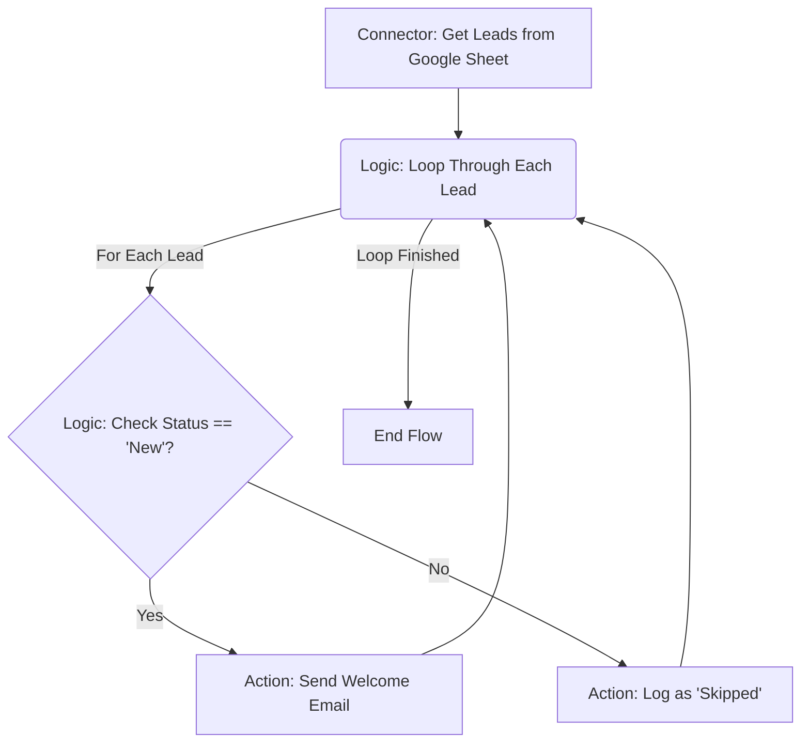

# AgentDock 工作流与节点类型：自动化复杂任务

AgentDock 正在从“仅对话式智能体”扩展到「通用自动化平台」。目标是：通过结构化的节点系统，让用户以低代码/零代码的方式，编排复杂流程、连接多种工具、嵌入 AI 逻辑，而不必为常见的自动化模式编写大量自定义代码。

这一能力基于灵活的 **节点化架构（node-based architecture）**。可以把节点理解为不同职能的积木：
- 有的负责根据**事件**触发工作流；
- 有的负责**处理或转换数据**；
- 有的连接**外部服务**；
- 有的执行特定的 **AI 任务**。

真正的威力来自这些节点的组合，尤其是将具备对话能力的 **Agent 节点** 与专门执行推理任务的 **AI 推理节点** 结合，构建出结构化的工作流。

本文档概述了计划中的核心节点类型，为自动化从数据处理、客服流程到复杂研究和运营决策等多种任务打下基础。

## 开发思路：稳定性优先

包括可视化工作流编辑器在内的这些高级能力，目前正在 AgentDock Pro 环境中持续迭代。我们的首要目标是：在复杂、真实的生产场景中充分验证其稳定性与可用性，再逐步向更广泛的社区开放。

因此，我们优先关注稳定性、可靠性和易用性。**AgentDock Pro 是这些能力的试验场**，我们会在企业级用例中反复打磨这些功能。当工作流相关组件在这些环境下表现稳定、达到内部质量标准后，再集成到开源的 `agentdock-core` 中。

这种以稳定性为中心的路径，确保当这些特性进入核心库时，已经足够成熟，真正可以用于生产环境。

## 规划中的工作流节点类型

在 AgentDock 中，工作流是通过连接多个节点构建的。每一类节点在自动化流程中承担不同职责，下面是当前规划的几大类：

### 1. 事件节点（Event Nodes）
   - **作用**：基于 *外部触发*、*定时任务* 或 *系统事件* 启动工作流。
   - **特点**：通常作为自动化流程的起点，仅有输出没有输入，由触发器（如 Webhook、定时器、数据库变更等）激活，而不是由工作流内部交互触发。
   - **示例**：`Webhook Trigger`、`Time Trigger`、`Database Watcher`。

### 2. Agent 节点（Agent Nodes）
   - **作用**：在工作流中嵌入 *交互式对话 AI* 能力。
   - **特点**：处理双向沟通（用户输入/输出），维护会话记忆与上下文，调用工具并使用 LLM。这类节点本质上是 *非确定性* 的。
   - **示例**：`Conversational Agent`、`Customer Support Agent`、`Research Assistant` 等。

### 3. 变换节点（Transform Nodes）
   - **作用**：在数据在节点之间流动时，对其进行处理和转换。
   - **特点**：接收输入数据，执行预定义操作（如格式化、解析、过滤、运算），并将结果传递给下一个节点。其影响仅体现在工作流内部状态，通常是 *确定性* 的。
   - **示例**：`Text Formatter`、`JSON Parser`、`Data Filter`、`Math Operations`。

### 4. AI 推理节点（AI Inference Nodes）
   - **作用**：在工作流中执行特定的 *非对话式 AI 任务*。
   - **特点**：完成聚焦型的推理任务，例如摘要、分类等。与 Agent 节点不同，它们不负责管理对话。根据配置（如 temperature 设置），通常是 *半确定性* 的。
   - **示例**：`Text Summarization`、`Image Classification`、`Sentiment Analysis`、`Data Extraction`。

### 5. 连接器节点（Connector Nodes）
   - **作用**：与 *外部服务和 API* 交互，主要负责 **拉取数据**。
   - **特点**：对接第三方系统（CRM、数据库、各类 API 等），通常负责认证并将外部数据拉入工作流。
   - **示例**：`Google Sheets Reader`、`Salesforce Query`、`Weather API Fetcher`、`Database Connector`。

### 6. 动作节点（Action Nodes）
   - **作用**：执行对 *工作流外部世界* 产生影响的操作。
   - **特点**：使用工作流中的数据去修改外部系统（如发送邮件、更新数据库记录、调用外部 API）。通常代表某个分支的结束或产生副作用的步骤。
   - **示例**：`Email Sender`、`Slack Notifier`、`Database Writer`、`API POST Request`。

### 7. 逻辑节点（Logic Nodes）
   - **作用**：控制工作流内部的 *执行流与分支*。
   - **特点**：根据预设条件决定接下来应走哪条路径，实现分支、合流与循环等控制结构，通常是完全 *确定性* 的。
   - **示例**：`Conditional (If/Else)`、`Switch/Case`、`Parallel Branch`、`Loop Construct`。

## 实现进度与后续计划

构建这一整套节点系统与可视化工作流编辑器是一项工程量巨大的工作，目前主要在 AgentDock Pro 环境中推进。我们会优先保证这些能力在真实生产场景中足够稳定可靠，然后再逐步开放到开源的 `agentdock-core`。

后续会在文档与版本说明中，持续更新这些能力向开源核心库集成的进展。*** End Patch