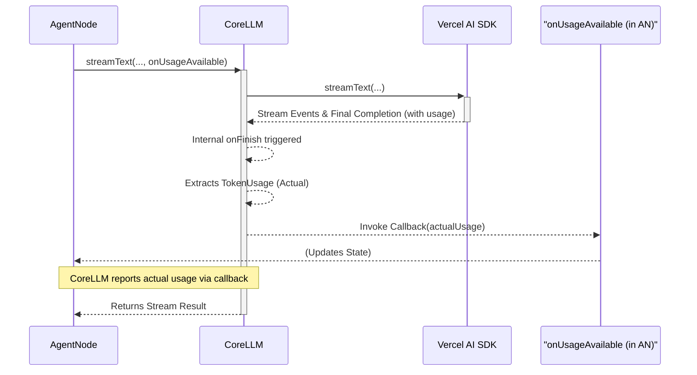
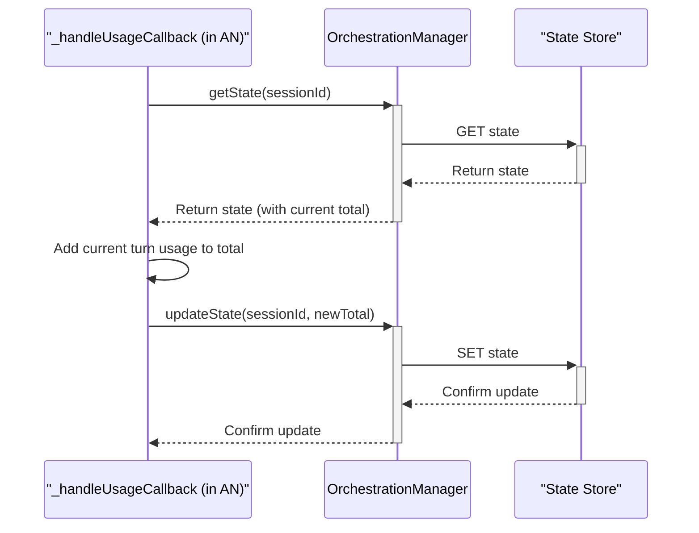
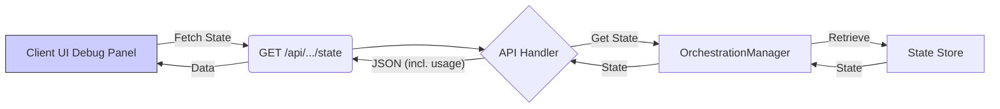
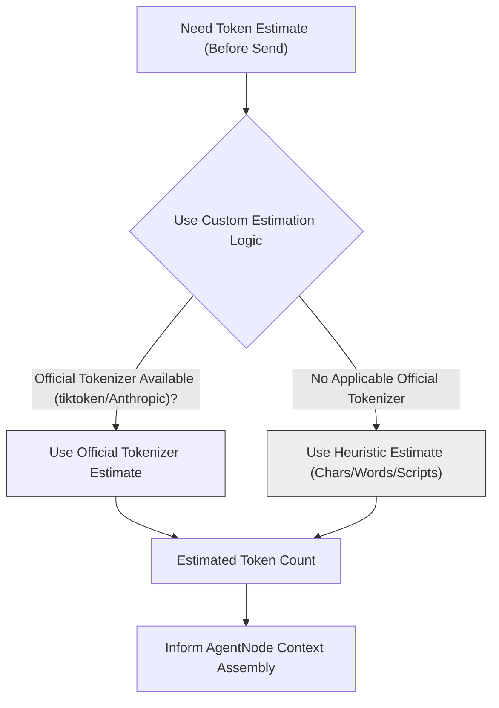
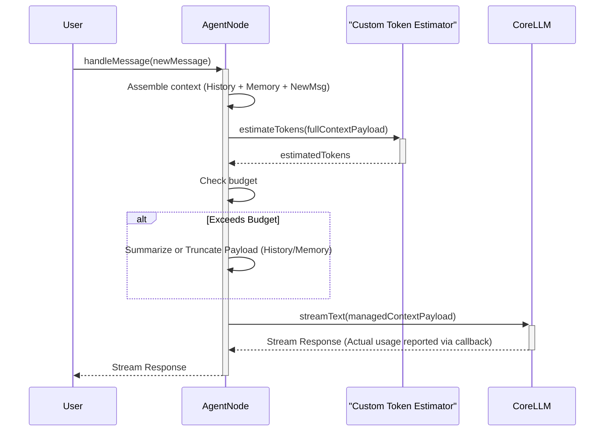

# Token 使用统计与智能上下文管理

AgentDock Core 提供用于跟踪 LLM Token 使用量的机制，并规划了更高级的能力，用于更智能地管理上下文窗口（context window）。

## 当前实现：统计实际使用量

当前系统聚焦于跟踪一次 LLM 调用中**实际消耗的 token**，并将其累加到会话状态中。

### 1) `CoreLLM`：从 AI SDK 上报使用量

`CoreLLM` 类与 Vercel AI SDK 对接。

- **回调机制：** `streamText` 等方法支持传入 `onUsageAvailable` 回调。
- **提取：** 一次 LLM 交互完成后，`CoreLLM` 会从 AI SDK（如有提供）中提取 `usage` 数据（`promptTokens`、`completionTokens`）。
- **回调触发：** `CoreLLM` 调用传入的 `onUsageAvailable`（通常由 `AgentNode` 提供），把该轮的 `TokenUsage` 传出去。



### 2) `AgentNode` 与状态：存储累计使用量

`AgentNode` 接收来自 `CoreLLM` 的实际用量上报，并更新会话状态。

- **处理回调：** `AgentNode` 会把内部方法作为 `onUsageAvailable` 传给 `CoreLLM`。
- **状态更新：** 当回调收到该轮的实际 `TokenUsage` 时：
  1. `AgentNode` 通过 `OrchestrationManager` 读取当前 `AIOrchestrationState`；
  2. 读取已有的 `cumulativeTokenUsage`；
  3. 将本轮实际用量累加到累计值；
  4. 通过 `OrchestrationManager.updateState()` 保存更新后的状态。
- **持久化数据：** `cumulativeTokenUsage: { promptTokens, completionTokens, totalTokens }` 会持久化在 `AIOrchestrationState` 中（例如存入 Redis）。



### 3) 开源客户端集成（当前状态）

- **调试面板展示：** 开源客户端目前会在**调试面板**等诊断视图中展示当前会话的累计 token 使用量（`promptTokens`、`completionTokens`、`totalTokens`）。
- **数据获取：** 客户端通过调用后端 API（概念上类似 `GET /api/session/[sessionId]/state`）获取状态；后端使用 `OrchestrationManager` 读取 `AIOrchestrationState` 并返回，其中包含 `cumulativeTokenUsage` 字段，客户端再将其渲染出来。



## 规划增强：智能上下文管理

基于“实际用量统计”能力，未来的**主要目标**是在向 LLM 发请求之前就主动管理上下文大小。

### 1) Token 预估策略（规划/概念）

在调用 LLM **之前**做预计算，需要较准确的 token **预估值**。由于 AI SDK 只能在调用结束后提供**实际值**，因此 AgentDock Core 需要实现自己的预估逻辑。

- **自定义预估：** 依赖工具（例如概念上的 `TokenCounter`）来估算 token 数量。
- **方法：**
  - 在可用且适用时，使用官方 tokenizer（如 OpenAI/DeepSeek 兼容模型的 `tiktoken`，或 `@anthropic-ai/tokenizer`）。
  - 作为兜底或面对不支持的模型/内容（如代码片段、特定数据格式）时，使用启发式方法（基于字符/单词数量、对 CJK 等文字体系的脚本分析等）。
- **目标：** 在发送请求前尽可能得到更可信的 prompt payload token 预估值。



### 2) `AgentNode`：智能上下文组装逻辑（规划）

`AgentNode` 将利用 token **预估值**，在调用 `CoreLLM` 之前管理**完整上下文 payload**（包括消息历史、注入的记忆内容等）。

- **配置：** 使用 `ContextManagementOptions`（如 `maxTokens`、`reserveTokens` 等）。
- **预计算与裁剪：** 在生成回复前：
  1. 组装潜在上下文 payload（系统提示词、历史消息、相关记忆片段、摘要等）；
  2. 使用预估逻辑估算该 payload 的 token 总量；
  3. 计算可用预算（`maxTokens - reserveTokens`）；
  4. 若 `estimatedTokens > budget`：
     - **摘要（Summarization）：** 可选，对较老的历史或不关键的记忆元素做摘要（可能需要内部再调用一次 LLM）；
     - **截断（Truncation）：** 移除最不相关的元素（如最早的消息、优先级最低的记忆项），直到估算值落入预算内。
- **LLM 调用：** 只把“已管理、已适配预算”的上下文 payload 发送给 `CoreLLM`。



## 下游应用（由“实际用量统计”解锁）

虽然智能上下文管理是未来演进的核心方向，但当前对“累计实际用量”的持久化统计已经能支持：

- **报表展示：** 在客户端调试面板展示用量（当前已实现）。
- **未来成本估算：** 将累计 token 映射到费用。
- **未来预算/限制：** 基于累计实际用量做额度限制。
- **未来分析：** 聚合实际用量数据做统计分析。

*(Conceptual diagrams for Cost Estimation, Budgeting, Reporting UI remain valid for these applications based on tracked actual usage).* 

## 总结

AgentDock 当前会在调用结束后跟踪 **实际** token 使用量（`CoreLLM` 从 SDK 数据中提取并上报），并将其累加到会话状态里，客户端调试面板可见。后续规划的增强重点是：在调用前通过 **自定义 token 预估**（如 `tiktoken` 或启发式方法）进行 `AgentNode` 的智能上下文组装，按模型限制对历史与记忆进行管理与裁剪。已统计的实际用量也为监控、成本追踪与预算控制等能力奠定数据基础。
-   **Internal Callback:** `CoreLLM` now maintains an internal callback (`_onUsageDataAvailable`). This callback can be set by consuming code (like `AgentNode`).
-   **`generateText` & `streamText` Integration:** Both methods, upon completion (in `onFinish` for streaming or after the call for non-streaming), extract the `usage` data (containing `promptTokens`, `completionTokens`, `totalTokens`) provided by the underlying LLM provider (e.g., OpenAI, Anthropic via Vercel AI SDK).
-   **Callback Invocation:** If the internal callback is set, `CoreLLM` invokes it immediately after processing a response, passing the `TokenUsage` object.

```typescript
// Simplified example from CoreLLM
private async _handleCompletion(completionResult: any, options: any) {
  // ... extract usage data ...
  const usageData: TokenUsage = { /* ... extracted tokens ... */ };

  // Invoke the internal callback if it exists
  if (this._onUsageDataAvailable) {
    try {
      await this._onUsageDataAvailable(usageData);
    } catch (error) {
      logger.error(/* ... */);
    }
  }
  
  // ... handle original onFinish or return result ...
}

// Method to set the internal callback
public setOnUsageDataAvailable(handler: ((usage: TokenUsage) => Promise<void>) | null): void {
  this._onUsageDataAvailable = handler;
}
```

## 会话级持久化：`OrchestrationStateManager`

`CoreLLM` 负责每次调用的用量上报，而跨会话的持久化累计统计由 `OrchestrationStateManager` 负责。

-   **`OrchestrationState`:** The state object managed per session includes an optional `cumulativeTokenUsage` field:

```typescript
    interface OrchestrationState extends SessionState {
      // ... other fields
      cumulativeTokenUsage?: {
        promptTokens: number;
        completionTokens: number;
        totalTokens: number;
      };
    }
    ```

-   **Update Handler:** Components like `AgentNode` are responsible for coordinating usage updates. They typically:
    1.  Define an `updateUsageHandler` function.
    2.  Set this handler on the `CoreLLM` instance using `setOnUsageDataAvailable` before making an LLM call.
    3.  The `updateUsageHandler` receives `TokenUsage` data via the callback.
    4.  Inside the handler, it retrieves the current `OrchestrationState` using `OrchestrationStateManager.getState`.
    5.  It calculates the *new* cumulative totals by adding the received usage to the existing totals in the state.
    6.  It calls `OrchestrationStateManager.updateState` to save the updated `cumulativeTokenUsage` back to the session state.
    7.  Clear the handler from `CoreLLM` after the call using `setOnUsageDataAvailable(null)`.

```typescript
// Simplified example from AgentNode or similar
async handleInteraction(...) {
  const stateManager = createOrchestrationStateManager(); // Get configured manager
  const llm = this.llm; // Get CoreLLM instance
  const sessionId = /* ... get session ID ... */;

  const updateUsageHandler = async (usage: TokenUsage) => {
    const currentState = await stateManager.getState(sessionId);
    const currentUsage = currentState?.cumulativeTokenUsage || { promptTokens: 0, completionTokens: 0, totalTokens: 0 };

    const newCumulativeUsage = {
      promptTokens: currentUsage.promptTokens + (usage.promptTokens || 0),
      completionTokens: currentUsage.completionTokens + (usage.completionTokens || 0),
      totalTokens: currentUsage.totalTokens + (usage.totalTokens || 0),
    };

    await stateManager.updateState(sessionId, { cumulativeTokenUsage: newCumulativeUsage });
    logger.debug(
        LogCategory.USAGE, 
        'UsageUpdateHandler', 
        'Updated cumulative session usage', 
        { sessionId, newTotal: newCumulativeUsage.totalTokens }
    );
  };

  // Set handler before LLM call
  llm.setOnUsageDataAvailable(updateUsageHandler);

  try {
    // Make the LLM call (e.g., streamText)
    const result = await llm.streamText(/* ... */);
    // Process result
  } finally {
    // IMPORTANT: Clear the handler afterwards
    llm.setOnUsageDataAvailable(null);
  }
}
```

## 工具内部的用量统计

该回调机制同样适用于那些在工具内部调用 `CoreLLM` 的场景（例如 `ReflectTool`）：

1.  The tool execution logic obtains the `CoreLLM` instance and the `updateUsageHandler` (passed down through context or parameters).
2.  It sets the handler on its `CoreLLM` instance before making its internal `generateText` or `streamText` call.
3.  When the tool's LLM call finishes, the handler updates the *same* session's `cumulativeTokenUsage` via the `OrchestrationStateManager`.
4.  The handler is cleared within the tool's scope.

这确保“直接的智能体交互调用”和“工具内部触发的 LLM 调用”的 token 使用量都会被汇总到同一个会话累计值中。

## 获取用量数据

- **会话状态：** 获取某会话的累计用量，最直接的方法是通过 `OrchestrationStateManager.getState(sessionId)` 取到 `OrchestrationState`，再读取 `cumulativeTokenUsage`。
- **调试：**
  - `updateUsageHandler` 通常会记录增量更新日志；
  - `AgentNode` 等组件可能仍会记录单次调用用量用于即时调试，但那通常仅代表“上一轮调用”，不等同于会话累计值。
- **API 响应：** 过去实现可能只把“上一轮 LLM 调用用量”写入响应头（`x-token-usage`）。若用于计费或展示，更准确的方式是在 API 路由处理器结束时从会话状态中读取 `cumulativeTokenUsage` 并返回（例如放在响应体或使用 `x-session-cumulative-token-usage` 之类的头部）。

## 总结

Token 使用统计依赖 `CoreLLM` 的回调机制来上报每次 LLM 调用用量，并由 `OrchestrationStateManager` 将会话累计总量持久化在 `OrchestrationState` 中。这为包含多次 LLM 调用与工具执行的复杂交互提供了可靠的用量统计方案。 